# PIU 当前实现：Takeaway、模块说明与复现实验教程

> **归档说明：**本文描述冻结的 `Heuristic V0` 工程基线，不再代表主方法。
> 新的 candidate-conditioned calibrated pipeline 见
> [`research_plan.md`](research_plan.md) 和
> [`ADR-0001`](adr/0001_candidate_conditioned_calibrated_interaction.md)。
> 旧系统不再增加权重、词表或 selector 规则。

> 日期：2026-08-22
> 仓库基线：`e7db12b7f35d9be416fc3ed57d36b12560e40cf0`（本文也覆盖随新流水线提交归档的 V0 可视化证据）
> 当前结论：信息获取链路已真实运行到 `OPEN_CONTAINER → REVEALED → belief update → replan`；最终 `ACT` 和任务成功仍是 **NOT-GO**。

## 1. 一句话 takeaway

PIU 不是让一个 VLM 看图后自由决定“下一步做什么”，而是把完整用户 prompt 转成一个随观测更新的、对象级的任务相关 belief：系统先用公开双相机 RGB 构造对象与未知区域，再计算“目标可能在哪里、每个区域还缺什么证据”，随后只让 Qwen2.5-VL 比较一组已经注册的物理动作会带来什么观测变化，最后由显式效用函数在 `MOVE_CLOSER / NEXT_BEST_VIEW / REMOVE_OCCLUDER / OPEN_CONTAINER / ACT / STOP` 之间选择，并把选中的语义子任务交给冻结的完整 `pi05_libero` 策略执行。

当前原始抽屉场景已经证明：系统能从完整 prompt `Place the butter in the basket` 出发，在不在线读取抽屉关节、目标位姿、segmentation 或任务 predicate 的条件下选择开中层抽屉；冻结的 π0.5 执行后，六时刻公开 RGB critic 输出 singleton `REVEALED`，系统据此更新 belief 并重新规划。它没有证明最终放置成功：更新后的 V0 belief 仍选择 `MOVE_CLOSER`，而不是可靠地进入 `ACT`。

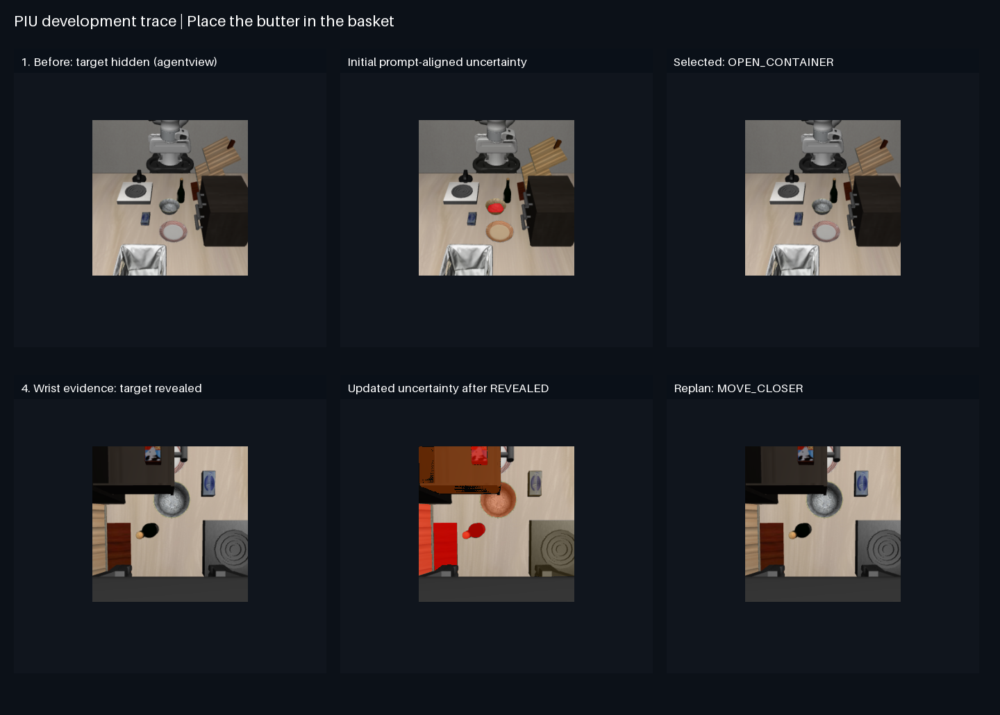

这张图的 endpoint 是 **prompt-relevant target observability**，不是最终任务成功。完整视频位于 [`piu_information_acquisition.mp4`](../results/demos/piu_original_fresh_seed1399_v1/piu_information_acquisition.mp4)，机器可读轨迹位于 [`piu_information_acquisition_trace.json`](../results/demos/piu_original_fresh_seed1399_v1/piu_information_acquisition_trace.json)。

## 2. 一条主线：从用户指令到下一次物理交互

```text
完整用户 prompt + 当前 agentview/wrist RGB + 公开动作历史
        │
        ▼
Grounding DINO：开放词汇框与标签候选
        │
        ▼
SAM：对象 mask 与可见面积
        │
        ▼
DINOv2：mask 内连续视觉特征、跨相机/跨时刻关联
        │
        ▼
Scene Packet：公开、对象级、可追踪的当前场景
        │
        ▼
SigLIP belief frontend：当前 location/identity/graspability/uncertainty
        │
        ▼
动作注册表枚举当前候选动作
        │
        ▼
Qwen2.5-VL：只预测每个候选动作的未来信息效果和语义子任务
        │
        ▼
连续效用优化：信息收益 + 任务进展 - 代价 - 风险 - 错误 ACT 后果
        │
        ▼
类型化子任务 → 冻结的完整 pi05_libero → 连续机器人动作
        │
        ▼
六时刻公开 RGB outcome → belief update → replan
```

系统中有两个明确的职责边界。

第一，Qwen 不重新计算当前 belief，也不能创建动作或对象 ID。当前 belief 在 Qwen 之前由冻结视觉前端产生；候选动作由注册表产生；Qwen 只预测“如果执行这个固定的 action-target pair，结果可能是什么”。

第二，π0.5 不接收 uncertainty map、Scene Packet 或 Qwen 的长推理。它接收与公开 LIBERO 接口一致的两路 RGB、公开 proprioception 和一句可执行的语义子任务；其内部 VLM/语言骨干与 action expert 整体保留并冻结，不是只抽出最后的 action expert。

## 3. 模块一：输入与任务解析

在线输入只有：

- 完整用户 prompt，例如 `Place the butter in the basket`；
- `agentview` RGB；
- `robot0_eye_in_hand`（wrist）RGB；
- 公开机器人状态：末端位置、末端姿态的 axis-angle、夹爪关节，共 8 维；
- 过去已经公开的 RGB、动作和 outcome 历史。

任务解析器把 prompt 编译成：

```json
{
  "target": "butter",
  "destination": "basket",
  "goal_relation": "in",
  "required_facts": [
    "target_identity",
    "target_location",
    "target_visibility",
    "target_accessibility",
    "destination_location",
    "goal_completion"
  ]
}
```

它同时产生视觉查询词：目标及其包装近义词、destination，以及通用的 `drawer / cabinet / refrigerator / container / bottle / box / bowl / package`。这样，即使 butter 完全不可见，前端仍能显式表示可能藏有证据的容器，而不是把“没检测到 butter”误写成“butter 不存在”。

在线明确禁止：simulator segmentation、抽屉 joint、隐藏目标位姿、任务成功 predicate、semantic ID、BEV 或额外全局相机。主场景的 Scene Packet 记录了 `online_oracle_inputs: []`。

## 4. 模块二：Grounding DINO、SAM 和 DINOv2

这三个模型不是三次重复识别，而是分别回答不同问题。

### 4.1 Grounding DINO：哪些区域可能对应查询词？

输入是一张公开 RGB 和 prompt 派生的开放词汇 query 列表。输出是 bounding box、grounding score，以及同一重叠区域上多个 query 的归一化标签候选。当前使用本地 `grounding-dino-tiny`，box threshold 为 0.25、text threshold 为 0.20、NMS IoU 为 0.70。

原始场景中它会把大抽屉区域同时标成 `butter box / package / drawer / container` 的混合候选。这不是最终 identity belief；它只表示文本定位器对这些查询存在响应。重叠近义查询正说明不能把一个 detector score 直接当成“目标置信度”。

### 4.2 SAM：每个候选实际覆盖哪些像素？

Grounding DINO 的框作为 SAM box prompt。前端还加入少量 class-agnostic dense proposals，以免开放词汇检测漏掉与 prompt 间接相关但没有稳定标签的物体。输出包括 mask、mask score、visible area 和 RLE。SAM mask 是在线视觉算法的产物，不是 simulator segmentation。

### 4.3 DINOv2：这个区域的连续外观是什么？

当前使用 `dinov2-small`。图像先形成 patch-token grid，再在每个 SAM mask 内平均池化，得到一个 384 维区域特征。它用于：

- 关联 agentview 与 wrist 中可能是同一物体的 proposal；
- 在动作前后为对象分配稳定 track；
- 为学习式 belief/effect sidecar 提供连续视觉输入。

下面的 DINOv2-PCA 图把高维 patch token 的前三个主成分映射到 RGB；DINOv2-norm 图显示每个 patch 的特征范数。它们是视觉特征诊断，不是不确定度热图，也不能被解释成语义概率。

## 5. 当前唯一场景的原始输入与全部视觉模态

当前只保留原始杂乱中层抽屉场景：原生尺度 butter 位于关闭的中层抽屉，完整用户指令是 `Place the butter in the basket`。双相机前端产生 92 个公开视觉 proposal，每个 proposal 保存 384 维 DINOv2 区域特征。机器可读 Scene Packet 在 [`original_drawer_scene_packet_v1.jsonl`](../results/diagnostics/original_drawer_scene_packet_v1.jsonl)，DINOv2 数值特征在 [`dino_region_features.npz`](../results/assets/original_drawer_frontend_v1/dino_region_features.npz)，可复现输入索引在 [`original_drawer_frontend_input_v1.jsonl`](../results/diagnostics/original_drawer_frontend_input_v1.jsonl)。

| 视角 | 原始 RGB | Grounding DINO | SAM | DINOv2 PCA | DINOv2 norm |
|---|---|---|---|---|---|
| agentview | 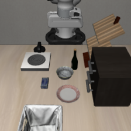 | 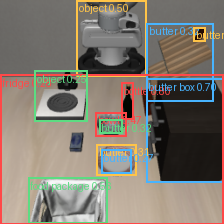 | 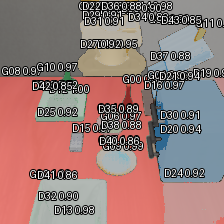 | 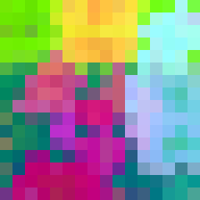 | 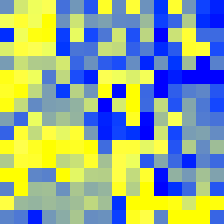 |
| wrist | 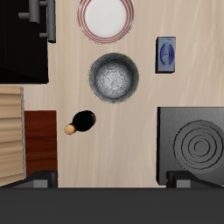 | 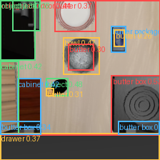 | 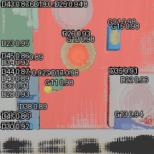 |  | 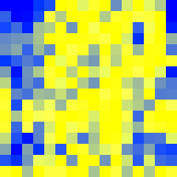 |

不同容器、缩放对象和顶层包装诊断均已从主协议移除；它们不属于当前成功率、训练集或论文结论。

## 6. 模块三：Scene Packet 与 memory 到底是什么

Scene Packet 是“这一时刻，在线控制器从公开视觉中构造出的对象级状态”，不是 simulator scene graph。一个对象节点实际包含：

```json
{
  "object_id": "agentview_bottle_00",
  "display_id": "A00",
  "view": "agentview",
  "label_candidates": {"bottle": 0.733, "object": 0.267},
  "bbox_xyxy": [121.31, 82.77, 133.29, 119.86],
  "grounding_score": 0.799,
  "mask_score": 0.979,
  "visible_area": 250,
  "mask_rle": "stored in JSON",
  "feature_dimension": 384,
  "cross_view_best_match": {
    "object_id": "wrist_butter_09",
    "dino_cosine_similarity": 0.697
  }
}
```

其中最后一个 cross-view match 只是相似度候选，不是“两个节点一定为同一个真实对象”。当前开放前端会产生较多重叠 proposal；主场景共 52 个。这也是 learned node selection 仍需要改进的地方。

Memory 只保存下一步推理真正需要的公开摘要：

- 上一时刻的 task uncertainty；
- 上一时刻最高的若干 location hypotheses；
- 上次选择与实际执行的 action-target；
- 六帧 critic 给出的公开 outcome；
- 已被视觉认证搜索过的 `searched_object_ids`；
- DINOv2 外观与 bbox 共同建立的跨时刻 track association。

它不递归复制所有历史 logits，也不保存目标真实位置、抽屉 joint 或 evaluator segmentation。发生 `FAILED` 时，location hypothesis 不会被排除；发生 `EMPTY` 时，只把对应容器加入 searched set；发生 `REVEALED/EVIDENCE_ACQUIRED` 时，仍要从新 RGB 中重新找到目标证据，再保守融合旧 belief。

## 7. 模块四：不确定度在当前代码中如何计算

当前运行的是冻结 SigLIP 的 V0 belief frontend，不是 Qwen 的口头 confidence，也不是已经校准的最终模型。

对每个 SAM crop，SigLIP 同时比较 11 个文本描述。它们分为四组：目标身份、prompt relevance、graspability、容器状态。代码从这些 logits 构造三个条件分布：

1. `identity_belief = softmax(clear target, similar non-target, ambiguous, unrelated)`；
2. `graspability_belief = softmax(graspable, blocked/not graspable, insufficient evidence)`；
3. `container_state = softmax(closed unobserved interior, open visible interior)`。

身份概率还会与 Grounding DINO 的目标词支持相乘。没有开放词汇定位支持时，系统主动向 `other` 增加概率质量，防止 SigLIP 把任意居中物体过度识别成 butter。

每个区域的 prompt relevance 是 Grounding DINO target score 与半权重 SigLIP relevance 中较大的一个。局部 uncertainty mass 为：

```text
prompt relevance × (
    0.60 × identity entropy
  + 0.20 × resolution uncertainty
  + 0.10 × occlusion uncertainty
  + 0.10 × container-state uncertainty
)
```

这里的 resolution uncertainty 来自 SAM 可见面积：面积达到 1024 pixels 时为 0；occlusion uncertainty 结合 mask 不稳定性和是否贴图像边缘。1024 只是连续归一化尺度，不是决定 ACT/OBSERVE 的硬阈值。

目标位置 belief 的未归一化权重为：

- 可见对象：`identity[target] × prompt_relevance`；
- 未观察容器：`0.55 × P(closed) × container_affordance × unsearched_fraction`；
- 其他未搜索区域：初始先验 0.15；
- ABSENT：初始先验 0.05。

所有权重最后统一归一化成条件分布 `P(location | current public RGB, prompt, public history)`。整体 task uncertainty 取 location normalized entropy 与最大局部 uncertainty mass 的较大值。

原始关闭抽屉时，实际输出为：

- task uncertainty：0.7472；
- `P(wrist_drawer_07)`：0.1540；
- drawer inspectability：0.7126；
- 显式效用最终选择：`OPEN_CONTAINER(wrist_drawer_07)`，utility 0.0618；
- STOP utility：−0.7472。

完整数值在 [`piu_messy_corrected_initial_seed1399_v1.json`](../results/diagnostics/piu_messy_corrected_initial_seed1399_v1.json)。对应热力图如下：

| agentview uncertainty | wrist uncertainty |
|---|---|
| 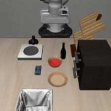 | 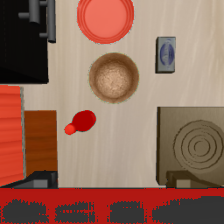 |

热图用每个 SAM mask 的 uncertainty mass 着色，红色更高。重叠 mask 会造成大块覆盖，因此当前图适合诊断，不应被解读成精确像素级 posterior。最终论文版需要以 scene-disjoint 数据训练并校准 node relevance，再生成主结果图。

### 7.1 不确定度如何更新

系统采用“新观测重算 + 有限历史融合”，而不是用动作直接修改隐藏真值。

```text
new public RGB
+ previous compact belief
+ executed action
+ public RGB outcome
→ recompute all region evidence
→ update searched set / revealed track
→ normalize a new location belief
```

如果 outcome 是 `FAILED`，旧 hypothesis 不被消除。如果是 `EMPTY`，只排除已认证的局部容器。如果是 `REVEALED`，系统用双相机语义支持、DINO 跨视角相似度和跨时刻 novelty 链接当前可见 track，再把它写入新 location weights。这个更新形式吸收了 CNABU 的核心思想——动作改变未来 belief——但当前在线 V0 仍以重新观测为主；学习式 future-belief predictor 只用于动作执行前的反事实比较。

本次实际 post-open V0 输出 task uncertainty 0.7740，并选择 `MOVE_CLOSER(wrist_food_package_04)`。这说明新目标证据已进入观测，但 proposal aggregation/identity/graspability 尚未把它变成可靠 ACT-ready singleton。它是当前主要 blocker，不是成功结果。

## 8. 模块五：Qwen2.5-VL 的具体输入、约束和输出

### 8.1 使用哪个 Qwen

当前实际模型是本地 `Qwen2.5-VL-3B-Instruct`，不是早期设计文档中的 7B。它以 bfloat16、SDPA、greedy decoding（`do_sample=False`）运行，最多生成 2400 tokens。视觉前端与 SigLIP 完成后会被释放，再加载 Qwen，因此单张 16 GB GPU 不同时驻留全部模型。

### 8.2 Qwen 精确看到什么

Qwen 每轮看到三张图：

1. 原始 agentview RGB；
2. 原始 wrist RGB；
3. 放大的、带稳定显示 ID 的候选 crop montage。

它还收到一段结构化文本，其中包含：

- 原始用户 prompt；
- 已冻结的当前 task uncertainty；
- 完整 location distribution；
- 每个候选区域的 relevance、identity、graspability、resolution、occlusion、state、closed-container evidence；
- unobserved regions；
- 公开 object table 和 cross-view match；
- 压缩后的公开历史；
- 动作注册表枚举出的完整候选列表；
- 每个候选不可修改的 `candidate_id / action / target_id / execution prior / cost / risk`。

Qwen **不接收 simulator depth、joint、目标真值、segmentation 或 task predicate**。当前可视化 heatmap 也不作为 Qwen 输入；Qwen收到的是原始图像和热图背后的结构化数值，避免颜色渲染反过来污染推理。

### 8.3 推理 prompt 怎样控制它

system prompt 要求只输出合法 JSON，并完整返回所有 candidate ID。user prompt 明确规定：

- 不得重算或改写当前 belief；
- candidate ID 锁定 action-target pair；
- 每个候选都必须预测 likely outcome、uncertainty change、task progress、semantic subtask 和简短理由；
- opening 可以通过 `TARGET_REVEALED` 或局部 `REGION_EMPTY` 降低 uncertainty；
- FAILED 不能降低 belief；
- 关闭容器外部的 MOVE_CLOSER 不能看到内部；
- ACT 子任务必须保留原始 goal，并用可见属性/空间关系细化目标；
- 不允许输出注册表之外的动作。

输出 schema 是：

```json
{
  "ranked_candidate_ids": ["C0", "C1", "..."],
  "effects_by_candidate": {
    "C0": {
      "likely_outcome": "TARGET_REVEALED",
      "uncertainty_change": "MODERATE_DECREASE",
      "task_progress": "INDIRECT",
      "semantic_subtask": "Open the middle drawer and observe its interior.",
      "reason": "..."
    }
  },
  "summary": "..."
}
```

返回后执行三层保护：所有候选必须且只能出现一次；action-target 不能被改写；semantic subtask 必须包含与 primitive 一致的动词。若 Qwen 为 `OPEN_CONTAINER` 生成了不可执行的句子，系统用注册表中的固定 hint 修复措辞，而不是改动作。最多重试三次；仍不合法时，所有物理候选的 applicability 归零，selector 进入受控 STOP。

实际 Qwen 原始/校验后输出保存在 [`qwen_raw.json`](../results/assets/piu_messy_corrected_initial_seed1399_v1/qwen_raw.json)。本次初始 Qwen 文本曾错误声称 butter 已可见，但它没有权限直接触发 ACT；连续 selector 最终仍选择了抽屉。这既展示了分层约束的价值，也说明当前 Qwen effect probabilities 不能视为校准结果。

## 9. 模块六：Action Effect Model 是什么、现在如何实现、以后如何学

Action Effect Model 回答的不是“当前是什么”，而是：

```text
给定当前 belief、公开场景、历史和固定候选动作 a，
执行 a 后最可能出现什么公开 outcome，剩余 uncertainty 是多少？
```

### 9.1 当前在线 V0

当前在线 Action Effect Model 是受 schema 约束的 Qwen 反事实排序，不是已经训练好的概率 world model。Qwen输出的是离散等级，代码再做固定、可审计的数值映射：

- uncertainty decrease：large 0.50、moderate 0.25、small 0.10、none 0、increase −0.10；
- task progress：none 0、indirect 0.15、direct 0.65、complete 1.0；
- 实际 execution success、cost、risk 永远来自 action registry，Qwen 不能改；
- `REGION_EMPTY` 的最小信息收益与该容器当前 location mass 成比例；
- `TARGET_REVEALED` 的最小信息收益与当前 task uncertainty 成比例；
- 排名只作为连续 multiplier，不是 winner-take-all gate。

因此 V0 的“条件概率”主要由注册的 primitive reliability 和 Qwen 的离散 outcome 共同构造，尚未通过 scene-disjoint calibration。它足够用于打通系统和收集 counterfactual 数据，不足以支撑论文主张。

### 9.2 仓库中已有的 learned sidecar

仓库已有一个轻量 object sidecar 原型。输入包括：冻结 π0.5 multimodal prefix 的 256 维固定投影、DINOv2 mask-pooled node feature、box/面积/相机/开放词汇 metadata。网络用 prompt-conditioned global token 对 node token 做 attention，输出：

- 二类 location：`visible_workspace / closed_container`；
- 二类 route：`DIRECT_ACT / OPEN_TO_INSPECT`；
- node relevance；
- action-conditioned semantic effect；
- action-conditioned future location belief。

训练 loss 是 location CE + route CE + 0.5 node BCE + 0.5 effect CE + 0.5 future-belief CE；之后用 class-conditional conformal calibration 生成 prediction set。

必须诚实区分两份结果：`piu_object_sidecar_v2` 把 clean-v4 数据加入了训练，因此其 calibration 数字不能当独立泛化证据；真正 scene-disjoint 的旧 clean evaluation 是 NOT-GO：80 个样本上出现 6 个 false singleton routes，node hit@1 为 0.2375。机器报告见 [`piu_object_sidecar_clean_v1.json`](../results/calibration/piu_object_sidecar_clean_v1.json)。

### 9.3 最终学习范式

最终版保留冻结 Grounding DINO、SAM、DINOv2、Qwen 和 π0.5，训练两个轻量 sidecar：

1. belief sidecar：监督 location、identity、graspability、node relevance，并做 class-conditional conformal calibration；
2. action-effect sidecar：用同一初始状态下执行不同候选动作得到的 counterfactual rollout，监督 outcome distribution、future belief 和 candidate ranking。

训练数据中的 simulator privileged 信息只用于离线 teacher label；模型输入仍是 RGB、prompt、公开 state 和历史。数据必须按场景布局、资产、遮挡方式和 seed 分割，不能按帧随机切。

## 10. 模块七：显式效用选择，没有身份硬阈值

对每个 action-target，selector 计算连续 readiness。ACT readiness 是以下量的几何平均：

```text
target location mass
target identity probability
prompt relevance
graspability probability
projected area quality
unoccluded quality
```

任何一项很弱都会连续压低 ACT，而不是用“identity > 某阈值”直接开门。MOVE_CLOSER/NBV readiness 使用 location、relevance 和 information need；OPEN_CONTAINER readiness 使用 location 与 inspectability。

最终 utility 为：

```text
readiness × applicability × execution_success
          × (expected_information_gain + expected_task_progress)
- action_cost - physical_risk - residual_false_ACT_cost
```

STOP 被视为任务失败而不是免费默认项：`U_stop = -task_uncertainty`。只有所有合法动作的 utility 都低于它时才停止。若 search domain 未穷尽，STOP 语义是 `ABSTAIN/SAFE_STOP`；只有搜索域穷尽且 location argmax 为 ABSENT 时才是 `NOT_FOUND`。

硬约束只用于类型合法性，例如 `OPEN_CONTAINER` 必须指向一个公开识别到的 unobserved container；置信度本身始终进入连续效用。

## 11. 模块八：如何对齐到 π0.5

selector 先输出内部动作：

```json
{
  "action": "OPEN_CONTAINER",
  "target_id": "wrist_drawer_07"
}
```

执行桥将其翻译为训练分布更接近的自然语言子任务，例如：

```text
Open the middle layer of the drawer
```

π0.5 收到的 payload 与公开 LIBERO 使用方式一致：

```text
observation/image       = 旋转并 pad-resize 到 224×224 的 agentview RGB
observation/wrist_image = 旋转并 pad-resize 到 224×224 的 wrist RGB
observation/state       = [eef xyz, axis-angle xyz, gripper qpos ×2]
prompt                  = 当前语义子任务
```

服务器运行完整的 `pi05_libero` checkpoint，并输出连续 action chunk。也就是说，PIU 的 Qwen 是外部信息规划器；π0.5 内部自己的视觉语言骨干和 action expert 仍整体工作。

信息动作执行过程中保存六个公开时刻：before、25%、50%、75%、option end、return/observe。return 的语义是恢复观察条件；当前实现仍有最大步数安全边界，但阶段切换不读取 drawer joint。控制器停止后，evaluator 才能在独立 replay 中读取 joint 或 segmentation 做最终评分。

## 12. 实际运行结果：证明了什么，没有证明什么

原始场景的真实链如下：

1. 输入完整 prompt 和关闭抽屉的双相机 RGB；
2. V0 selector 选择 `OPEN_CONTAINER(wrist_drawer_07)`；
3. 冻结 π0.5 接收 `Open the middle layer of the drawer`，执行 300 steps，公开 return controller 执行 50 steps；
4. 六帧 RGB critic 输出 `prediction_set = [REVEALED]`；
5. evaluator-only replay 在控制器完全停止后测得：before 为 0 pixels，half/75%/end 的 agentview 为 303 pixels，returned wrist 为 818 pixels；
6. belief update 后重新规划为 `MOVE_CLOSER`；
7. trace 以 `INFORMATION_ACQUIRED` 结束，没有执行最终 ACT。

它证明了：完整 prompt 可以路由到真实 π0.5 信息动作；信息动作后能够只靠公开 RGB 得到 singleton REVEALED；outcome 能进入下一轮 belief/replan；在线 privileged read count 为零。

它没有证明：Qwen effect prediction 已校准；post-open belief 已稳定产生 ACT-ready singleton；MOVE_CLOSER 已在该 trace 中执行；butter 已被抓取或放入 basket；端到端 final task 成功。

## 13. Tutorial：从原始 RGB 重跑一次推理

### 13.1 环境和 GPU preflight

本地实验固定使用 GPU0。先确认只存在允许的桌面服务进程，不要直接跳过 preflight：

```bash
EXPERIMENT_GPU_INDEX=0 \
EXPERIMENT_ALLOW_LOCAL_RUSTDESK=1 \
EXPERIMENT_ALLOW_PIDS=1947296 \
bash scripts/infra/check_gpu.sh
```

检查本地 checkpoint 与依赖：

```bash
../openpi/.venv/bin/python scripts/infra/check_install.py
```

### 13.2 重建原始抽屉场景的视觉前端

输出路径是 immutable；复现时使用一个新的版本号：

```bash
CUDA_VISIBLE_DEVICES=0 ../openpi/.venv/bin/python \
  scripts/perception/build_scene_packets.py \
  --input-index results/diagnostics/original_drawer_frontend_input_v1.jsonl \
  --output-index runs/tutorial/original_drawer_scene_packet.jsonl \
  --feature-store runs/tutorial/dino_region_features.npz \
  --asset-dir runs/tutorial/scenario_frontends \
  --device cuda \
  --precision float32 \
  --box-threshold 0.25 \
  --text-threshold 0.20 \
  --nms-iou 0.70 \
  --dense-grid 16 \
  --dense-min-iou 0.80 \
  --max-dense-proposals 32
```

每个 sample/view 会生成：`*_rgb.png`、`*_grounding_dino.png`、`*_sam_masks.png`、`*_objects.png`、`*_dinov2_pca.png`、`*_dinov2_norm.png` 和每个 proposal 的 binary mask。JSONL 保存 Scene Packet，NPZ 保存实际 384 维 region vectors。

### 13.3 从主场景原始 RGB 运行完整的一步 PIU inference

```bash
CUDA_VISIBLE_DEVICES=0 ../openpi/.venv/bin/python \
  scripts/pipeline/infer.py \
  --agentview results/assets/piu_messy_fresh_e2e_seed1399_v1/public_keyframes/00_before_agentview.png \
  --wrist results/assets/piu_messy_fresh_e2e_seed1399_v1/public_keyframes/00_before_wrist.png \
  --prompt "Place the butter in the basket" \
  --asset-dir runs/tutorial/initial_assets \
  --output runs/tutorial/initial_inference.json
```

这一步依次运行 Grounding DINO、SAM、DINOv2、SigLIP、Qwen 和 deterministic selector，但不执行物理动作。结果中的关键字段是：

```text
pre_vlm_current_field
registered_action_candidates
qwen_action_effect_assessment
selected_action
execution_contract
visualizations
online_oracle_inputs
```

### 13.4 执行 selector 选出的语义 option

执行 runner 会在当前 run 的专用端口自动启动一个 fresh、冻结的 π0.5 server，并在结束时回收它，因此不需要手动常驻 server。通用 runner 的 scenario、role、prompt 和输出路径均是参数：

```bash
../openpi/.venv/bin/python scripts/pipeline/execute.py \
  --scenario-config configs/scenarios/original_drawer.yaml \
  --role OPEN_CONTAINER \
  --assets runs/tutorial/open_assets \
  --work runs/tutorial/open_work \
  --output runs/tutorial/open_report.json
```

不要用 drawer joint 决定停止或阶段切换。`execute.py` 保存公开图像、公开 state、动作历史和六个 keyframes；任何 evaluator-only 读取必须在 controller terminal 后由 evaluation 脚本独立完成。

### 13.5 公开 RGB outcome 与 replan

outcome scorer 接收六时刻 agentview+wrist RGB 和公开 state，输出 conformal prediction set。若 set 非 singleton，必须 SAFE_STOP；不能挑其中最方便的标签。若得到 `REVEALED`，将新返回帧、上一份 report、实际 executed action 和公开 outcome 传回 inference：

```bash
CUDA_VISIBLE_DEVICES=0 ../openpi/.venv/bin/python \
  scripts/pipeline/infer.py \
  --agentview runs/tutorial/open_assets/public_keyframes/05_returned_agentview.png \
  --wrist runs/tutorial/open_assets/public_keyframes/05_returned_wrist.png \
  --prompt "Place the butter in the basket" \
  --previous-report runs/tutorial/initial_inference.json \
  --executed-action OPEN_CONTAINER \
  --observed-outcome EVIDENCE_ACQUIRED \
  --asset-dir runs/tutorial/post_open_assets \
  --output runs/tutorial/post_open_inference.json
```

若输出 ACT，才把生成并校验后的 task-preserving subtask 交给 π0.5；若仍是 OBSERVE，则执行相应 observe primitive 并重复该循环；若 outcome ambiguous，则 SAFE_STOP。

## 14. 阅读和使用资产的顺序

最快的审计顺序是：

1. [`piu_information_acquisition_contact_sheet.png`](../results/demos/piu_original_fresh_seed1399_v1/piu_information_acquisition_contact_sheet.png)：先看物理链；
2. [`piu_information_acquisition_trace.json`](../results/demos/piu_original_fresh_seed1399_v1/piu_information_acquisition_trace.json)：确认 endpoint、每阶段报告和 oracle 边界；
3. [`original_drawer_scene_packet_v1.jsonl`](../results/diagnostics/original_drawer_scene_packet_v1.jsonl)：查看原始抽屉场景的公开视觉 proposals；
4. [`piu_messy_corrected_initial_seed1399_v1.json`](../results/diagnostics/piu_messy_corrected_initial_seed1399_v1.json)：查看初始 belief、Qwen effects 和效用；
5. [`piu_messy_fresh_e2e_seed1399_v1_public_rgb_outcome_v13.json`](../results/diagnostics/piu_messy_fresh_e2e_seed1399_v1_public_rgb_outcome_v13.json)：查看六帧公开 RGB singleton outcome；
6. [`piu_messy_corrected_post_open_seed1399_v1.json`](../results/diagnostics/piu_messy_corrected_post_open_seed1399_v1.json)：查看 belief update 后为什么尚未 ACT；
7. [`piu_object_sidecar_clean_v1.json`](../results/calibration/piu_object_sidecar_clean_v1.json)：查看学习式 sidecar 仍为 NOT-GO 的独立验证证据。

## 15. 当前 GO / PARTIAL / NOT-GO

| 模块 | 当前状态 | 准确含义 |
|---|---|---|
| 双相机 RGB → Grounding DINO/SAM/DINOv2 Scene Packet | GO（工程） | 唯一原始抽屉场景已真实导出；不是语义泛化 gate |
| prompt-conditioned V0 uncertainty map | PARTIAL → NOT-GO | 能生成并驱动一次正确 open；未校准、proposal aggregation 较弱 |
| Qwen registered action-effect inference | PARTIAL → NOT-GO | schema 和安全边界已打通；概率仍是启发式映射 |
| π0.5 OPEN_AND_OBSERVE | GO（该开发轨迹） | fresh π0.5 rollout + return + 六帧公开记录 |
| 六帧 RGB outcome | GO（已有组件 gate） | 本轨迹 singleton REVEALED；不等于动作/任务必成功 |
| outcome → belief update → replan | GO（工程链） | 已重新规划为 MOVE_CLOSER；不是 held-out performance |
| post-open ACT readiness | NOT-GO | 当前主 blocker |
| butter 抓取并放入 basket | NOT-GO | 仍无成功完整任务 demo |
| learned belief/effect sidecar | NOT-GO | scene-disjoint clean 中仍有 false singleton routes |

## 16. 下一步最短论文路径

当前不需要继续扩展动作理论。最短路径是：

1. 合并重叠 proposal，提升 open 后 butter track 的 node hit@1；
2. 在同一 camera protocol 下收集 visible/ambiguous/hidden/empty/failed 的 counterfactual tuples；
3. 训练并冻结 belief sidecar 与 action-effect sidecar，重点校准 identity、graspability 和 future belief；
4. 用 scene-disjoint development 验证 singleton retention、false ACT/false EMPTY、prediction-set size；
5. 先在合格的 easy-handoff 物体位姿上跑通 `REVEALED → ACT → task success`；
6. 再组成主实验矩阵和消融：direct Qwen、manual fusion、global uncertainty、no-effect、full model、oracle upper bound。

论文主张应始终拆开报告：

```text
information-acquisition success
final-task success
```

前者已经有一条真实开发轨迹；后者仍未完成。把两者分开，正是当前仓库最重要的实验纪律。
