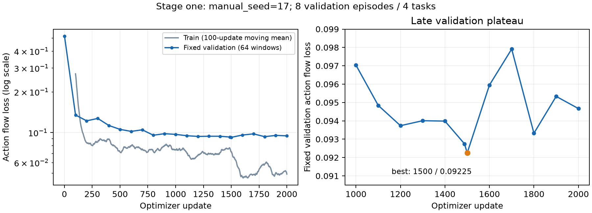

# 几何感知预测式 VLA：架构依据、实验配置与结果

这是本仓库统一的架构与训练实验文档。阅读顺序为：一、架构设计及理论依据；二、实验配置与资源成本；三、实测结果及假设检验。原先分散的设计审查、训练计划和训练论证已合并于此。

**状态快照：2026-09-22，两阶段训练和系统评测均已完成：三模型共2220次有效回合、192个预测诊断窗口。** 阶段一完成 2,000 次更新，用时 12.248 小时，固定使用第 1,500 步 `best.pt`。旧 `stage2_s17_gpu7` 未继承此权重、且只用单卡，已停止在第 330 次更新；保留日志与第 300 步检查点作为历史尝试。修正后的阶段二使用 GPU 4/5/6/7、全局 batch 32，于 2026-09-20 23:43:55 完成 2,000 次更新，状态文件记录墙钟 15,697.9 秒。最初五卡比较原生与阶段一best，随后GPU0补齐阶段一、GPU1完成阶段二best同协议评测。阶段一评估于09-21 15:38、阶段二评估于09-21 21:04（北京时间）完成；两阶段各自固定验证选出的第1500步best。阶段三未启动。原始事件记录保留在文末；旧自动日志误写“阶段一”的 `stage2_s17_gpu7` 记录属于上述已停止运行。

## 一、架构设计、理论支撑与训练逻辑

### 1.1 问题定义与研究目标

目标是让一个预训练 VLA 在信息不足时通过连续动作获取证据，再根据新观察完成操作或回答问题。例如，面对“抽屉里的物体是什么颜色”，机器人需要操作把手、打开抽屉、观察内部，然后回答并停止。

我们研究三个递进问题：几何和历史是否改善对已有观察的利用；动作后果监督是否改善共享表示和控制；这些改进是否能迁移到需要先获取信息的任务。整套组合及主动探索能力尚未得到本项目实验的证实。

### 1.2 按数据流解释现有架构

```text
两路 RGB → MolmoAct2 原生视觉编码器与连接层 → 视觉 tokens
                                                   ↑ 残差相加
深度＋相机内外参 → 自写三维位置编码 ─────────────────┤
时间、视角编码 ─────────────────────────────────────┘
                                                   ↓
任务语言＋本体状态＋实际执行动作历史 → MolmoAct2 VLM
                                       ├─ 逐层 K/V → 原生动作专家
                                       │                 ↓
                                       │            生成 10 步动作
                                       │                 ↓
                                       │            执行前 5 步
                                       │                 ↓
                                       │         新观察与执行反馈 → 更新上下文
                                       ├─ 原生语言头 → CONTINUE / DONE: 答案
                                       └─ 共享表示＋实际未来动作段
                                                 ↓ 仅训练
                                            自写未来预测器
                                                 ↓ 对齐
未来真实 RGB → 冻结的原生视觉编码器与连接层 → 目标视觉特征
```

直接复用 [AllenAI MolmoAct2-LIBERO](https://huggingface.co/allenai/MolmoAct2-LIBERO) 的权重、处理器、视觉编码器、连接层、VLM、动作专家和状态/动作归一化。它的 VLM 来自 Molmo2-ER；本地配置中的 VLM 为 36 层、隐藏维度 2560，动作专家为 36 层、隐藏维度 768。图像预处理后的原生视觉 tokens 进入同一个 VLM，原生逐层 K/V 条件接口保留。[底座论文](https://arxiv.org/html/2605.02881v1)、[官方模型实现](https://huggingface.co/allenai/MolmoAct2-LIBERO/blob/main/modeling_molmoact2.py)

本仓库自己实现的部分如下，通用 PyTorch 算子仍用于线性层、注意力和优化器：

| 自写模块 | 输入到输出 | 关键实现及边界 |
| --- | --- | --- |
| [几何对齐与编码](../src/grounded_interaction/predictive_vla/geometry.py) | 深度、标定、原生 patch 位置 → 2560 维几何残差 | 在坐标栅格上复用原生裁剪/池化映射；patch 中心深度反投影到共同参考系；Fourier＋MLP，末层零初始化；保留深度有效位 |
| [历史与条件接口](../src/grounded_interaction/predictive_vla/backend.py) | 最多三次双视角观察、状态、已执行动作、任务 → VLM 上下文 | 自写时间块注意力；同一时刻观察可相互读取，跨时间只读过去；时间/视角及历史状态/动作使用小型适配层 |
| [低秩适配及原生工具](../src/grounded_interaction/predictive_vla/native.py) | 冻结 VLM 线性层 → 原层输出加低秩残差 | 保留原生 AE 调用和动作后处理，可旁路新增路径核对原生行为 |
| [未来预测器](../src/grounded_interaction/predictive_vla/model.py) | 共享隐藏表示＋真实后续动作＋未来 patch 位置/时距 → 未来视觉特征 | 256 维、8 头、2 层交叉注意力与 FFN；上下文和动作构成 memory，没有未来 query 间的 self-attention |
| [联合训练](../src/grounded_interaction/predictive_vla/training.py) | 真实轨迹窗口 → 动作、预测、有效语言标签上的损失 | 原生连续 flow 目标；逐 patch 的 Smooth L1 未来损失；teacher 目标停止梯度；有可信标签才计算语言交叉熵 |
| [执行反馈](../src/grounded_interaction/predictive_vla/runtime.py) | 动作前缀 → 环境执行 → 新上下文 | 只记录实际执行的控制；任务完成由策略语言输出提出，环境私有成功判据仅供隔离评测 |

三维点使用相机内参反投影，再通过逐帧外参转到共同参考系；腕部外参随机器人变化。该几何分支使用已观测表面的信息，patch 中心深度只是近似。无效深度代表未知，不代表空空间。当前状态沿用原生离散表示，历史状态和动作使用自写连续投影。

训练时动作梯度经过原生 K/V 接口更新 VLM LoRA 与输入适配层，不切断这条梯度。未来真实动作只用于预测条件及动作监督；标准 flow 目标中的带噪动作是训练变量。策略上下文不包含未来图像、未来答案或尚未执行的动作。

Teacher 使用同一个冻结的原生逐帧视觉编码器与连接层，不额外加载视频基础模型。未来目标只在独立调用中编码。冻结提供稳定目标，不能保证预测器一定使用动作，也不能保证目标特征包含任务需要的小文字等细节。

部署时预测器不运行；动作专家通过 flow matching 生成动作序列。原生语言头可输出 CONTINUE 或 DONE，但当前没有相应训练标签，尚不能声称完成判断可靠。

### 1.3 技术来源与证据强度

| 工作 | 可以支持的设计选择 | 本项目的差异与证据边界 |
| --- | --- | --- |
| [MolmoAct2 §4、§6.6](https://arxiv.org/html/2605.02881v1) | 已训练 VLM 与 AE 的逐层连接；目标域联合适配。Table 12 中，关闭离散联合目标时，全模型微调平均成功率 96.95%，只训 AE 为 93.05% | 我们冻结视觉和 VLM 原权重，用 LoRA＋全参数 AE，只训练连续动作；与官方全模型及离散/连续联合配方不同 |
| [SpatialVLA §IV-D](https://arxiv.org/html/2501.15830v1) | 几何附着到视觉特征；去掉 Ego3D 后两个 variant-aggregation 指标从 81.6%/79.2% 降到 68.9%/66.7% | 采用有标定 RGB-D、自写共同坐标系残差；没有复用其底座、深度估计器和动作词表 |
| [Octo §III](https://arxiv.org/html/2405.12213v2) | 按时间组织多模态 tokens，以分块因果注意力限制历史访问 | 自写时序组织；没有加载 Octo 主干，AE 仍接收原生 K/V |
| [Act, Sense, Act §V-B、§VI-E](https://arxiv.org/html/2602.04600v1) | 认知预训练、联合训练及机器人适配；移除记忆后任务平均成功率由 83.3% 降至 40.7%，去认知预训练也降低表现 | 其双路记忆及人体/机器人数据与我们不同；当前三帧历史不是其长时记忆，我们的阶段一也不是其认知预训练 |
| [V-JEPA 2-AC §3](https://arxiv.org/html/2506.09985v1) | 冻结视频编码器，用不足 62 小时 DROID 交互数据训练动作条件预测，并用于机器人规划 | 它以相邻本体状态差构造动作且使用模型预测控制；我们使用记录控制量，通过训练辅助分支影响直接策略 |
| [VLA-JEPA §3–4](https://arxiv.org/html/2602.10098v1) | 状态表征预测与机器人动作目标联合训练的先例及机器人实验 | teacher、预测器与控制接口不同；其整体结果不等于我们的辅助损失已被单独验证 |
| [π₀.₅](https://arxiv.org/abs/2504.16054)、[π₀](https://www.pi.website/blog/pi0) | 语义与控制联合后训练、视觉语言条件下的连续 flow 动作生成 | 使用 MolmoAct2 的现成控制能力，不叠加另一套 VLA 或动作专家 |
| [Diffusion Policy](https://diffusion-policy.cs.columbia.edu/) | 预测动作块、执行前缀、重观察的滚动控制 | 当前生成 10 步、执行 5 步；实际控制周期和推理时间另行测量 |
| [ZS-IP §3、§7](https://arxiv.org/html/2602.18374v1) | 围绕观测是否足以回答问题组织交互；记录了错误成功判断 | 提供任务定义及失败分析参考，其模块化零样本系统不能证明我们的端到端训练有效 |

不同论文的数字来自不同评测条件，只说明各自实验中的机制证据，不用于跨论文排名，也不是本项目成绩。复用结构技巧、自写实现和减少模块本身都不是新颖性证明。

### 1.4 为什么分三个训练阶段

**阶段一：输入与控制适配。** 使用公共操作示范，只优化动作目标，希望几何和近期历史提升空间变化、短期遮挡和执行反馈下的控制表现。原技能不退化只是下限，不能单独证明该阶段有价值。动作梯度有机会增加对有用信息的依赖，但任务若不需要几何或历史，网络也可能忽略它们；因此用 2.9 节的诊断 bench 测能力收益。单独安排阶段一是否必要，还要和同数据、同总预算的直接联合训练比较；若没有性能或效率收益，应缩短预热或取消独立阶段。

**阶段二：动作后果联合学习。** 在动作目标上增加真实动作条件的未来监督，让共享表示既服务于控制，也包含解释可见变化的信息。损失为 `L_flow + λ_pred L_future`；只有出现可信回答标签时才加 `λ_lang L_response`。在专项 IP 训练前固定此阶段检查点，独立测试公共数据后训练带来的迁移。

**阶段三：补齐信息获取行为及证据判断。** 优先选择公共数据中确有揭示过程的片段，不足时再收集专项示范。监督链条为“证据不足 → 揭示动作 → 新证据 → 回答或完成操作 → 停止”，并加入已经可见时直接完成的配对任务，避免固定动作脚本。与基础操作回放混合，降低技能遗忘。专项训练后的成绩单独报告。

阶段一已有预训练控制能力可用，因而先适配新增输入是当前工程选择，没有文献证明该顺序全局最优。取得认知标签后，可将短暂认知预热再联合训练作为候选消融；它尚未实现或启用。全部目标从第一步共同训练也需要等数据、等更新预算的对照。

### 1.5 理论解释、限制与可检验假设

如果两个隐藏状态在当前观察及保留历史中完全不可区分，模型不能仅凭这些输入可靠识别真实状态。几何补充可见表面的空间信息，历史保留先前证据，交互能够改变可观测性；行为和任务监督才提供选择揭示动作的直接依据。这是问题结构解释，不是主动探索的收敛保证。

当前有四个明确限制：三帧历史仅覆盖约 0.5 秒；预测目标不直接奖励信息增益；确定性 latent 预测器不表示多种可能未来的概率分布；示范中的条件相关性不自动等于任意动作下的反事实正确性。对不可见且随机的内部颜色，预测器不能在打开前凭空获得答案。

| 编号 | 待检验设想 | 需要的证据 |
| --- | --- | --- |
| H0 | 新接口仍可训练，并保留原生控制调用 | 原生旁路一致、真实梯度、保存恢复、稳定更新 |
| H1 | 适配后原有操作能力保持 | 与原生基线配对的闭环成功率；参考容差为下降不超过 5 个百分点 |
| H2 | 几何与历史各自有实际收益 | 分别重新训练去几何/去历史模型，在对应空间与证据历史任务上比较 |
| H3 | 动作后果监督改善共享表示及控制 | 预测优于复制基线；动作条件诊断；等数据、等预算的闭环收益 |
| H4 | 公共数据训练能够迁移到信息获取行为 | 阶段三之前的新 IP 场景结果及与无预测方法的比较 |
| H5 | 专项监督能形成证据驱动行为和可靠结束判断 | 阶段三后回答、任务成功、错误 DONE、重复交互及基础能力保持指标 |

## 二、实验设计、配置与资源成本

### 2.1 数据集与数据量

主数据为 [LIBERO 官方链接的原始 HDF5](https://huggingface.co/datasets/yifengzhu-hf/LIBERO-datasets)，利用仿真状态重建双视角 RGB-D。以下来自已下载文件实际统计，原始动作数尚未扣除不合格轨迹及无后继帧尾动作。

| 数据套件 | 任务文件 | 原始轨迹 | 原始动作/状态 | 文件体积，十进制 GB |
| --- | ---: | ---: | ---: | ---: |
| Spatial | 10 | 500 | 62,250 | 6.237 |
| Object | 10 | 500 | 74,507 | 7.444 |
| Goal | 10 | 500 | 63,728 | 6.373 |
| Long（libero_10） | 10 | 500 | 138,090 | 13.731 |
| 合计 | 40 | 2,000 | 338,575 | 33.785 |

检查保留 1,982 条、排除 18 条（0.9%），保留 333,811 个可配对动作；全部合格轨迹有 RGB-D，回答标注为 0。按完整场景资产/结构家族分组，同一轨迹的窗口及重标留在同一 split。

| 划分 | 轨迹数 | 有后继观察的动作数 | 每五步取窗口的动作监督窗口数 |
| --- | ---: | ---: | ---: |
| 训练 | 1,584 | 234,830 | 47,601 |
| 验证 | 198 | 46,717 | 9,427 |
| 测试 | 200 | 52,264 | 10,533 |

窗口相互重叠，不是独立示范。窗口数按当前五步节奏及真实轨迹长度计算；末尾短窗口按实际长度监督。阶段一 2,000 次更新、有效 batch 32，大约访问 64,000 个窗口，不能称为新增 64,000 条轨迹。

数据证据见 [原始统计](../data/preparation/full_dataset_counts.json)、[最终审计](../data/prepared/stage1_full/final_audit.json)、[manifest](../data/prepared/stage1_full/manifest.json)。底座此前已经训练过四套 LIBERO；本次 split 控制的是本轮适配泄漏，不能消除底座既有接触。新 IP 布局、隐藏内容和任务组合需要另外隔离。

### 2.2 数据时序、几何及采样协议

两路相机为前视与腕视，重渲染分辨率均为 256×256，控制频率实测 20 Hz。原始数据含 T 个状态与 T 个动作时，导出 T 个观察及前 T−1 个动作，丢弃缺少真实后继状态的最后一个动作，不复制终帧。保留真实连续动作，不删除低幅度动作后拼接不相邻帧。

RGB、米制轴向深度、相机内参和逐帧外参同时对齐；状态为 8 维（末端位置、轴角、两个夹爪位置），动作沿用 LIBERO 7 维控制及原生归一化。深度射线与实际状态转移用于审计；转移误差准入阈值为平移 1 cm、旋转 0.02 rad。这是对应关系筛查，不是绝对定位精度声明。详细数组约定保留在独立的 [数据格式规范](trajectory_format.md)。

不把模拟器隐藏物体状态、文件名或成功谓词传给策略。轨迹结束不自动生成 DONE；没有核验的继续/回答标签就屏蔽语言监督。预测 horizon 默认 10 步，末尾用真实长度，不能复制未来标签。

### 2.3 后续数据及容量限制

| 来源 | 用途及体量 | 当前状态 |
| --- | --- | --- |
| [MimicGen core D0](https://mimicgen.github.io/docs/datasets/mimicgen_corl_2023.html) | 12 个文件约 12k 条生成轨迹，源文件 47.265 GB；完整 core 为 88.787 GB | 仅预算，未下载；需核对控制语义、语言、回放和标定，不能称为等量独立人类示范 |
| IP 专项数据 | 起点 2–3 类任务、200–500 条示范，必要时与基础回放约 1:1 混合 | 未收集；数量由覆盖和学习曲线决定 |
| [DROID](https://droid-dataset.github.io/droid/the-droid-dataset) | 原文档核查的完整 RLDS 约 1.7 TB，超出本项目限制 | 不下载全量；以后如需使用，仅选审计过的子集 |
| [CALVIN](https://github.com/mees/calvin) | 双路 RGB-D 的备选来源 | 未纳入当前实验，需要独立控制接口适配 |

来源不同但都为七维的动作不能直接拼接；坐标系、单位、旋转、控制周期和夹爪约定必须独立核验。普通操作数据的规模不自动代表信息获取行为覆盖。

容量上限为 **1 TB = 1,000,000,000,000 字节**；累计下载与本地工作集分别记账，到 800 GB 停止扩张并重做预算。删除文件不重置累计下载量。所有清理仅限仓库内明确路径，不沿 symlink 删除仓库外文件。

| 已核查资产或额度 | 数量 | 测量/预算说明 |
| --- | ---: | --- |
| 40 个数据文件＋19 个模型/处理器文件 | 55.566 GB | 已准备；数据 33.785 GB，模型约 21.781 GB |
| 该批累计下载保守预留 | 99.647 GB / 110 GB 上限 | 台账含中断请求未使用的预留，不是实传字节数 |
| 全量合格 RGB-D 目录 | 132.944 GB | 当前压缩 NPZ 及清单的表观文件量 |
| 本仓库工作集 | 约 219.975 GB | 本次合并时单次目录统计，包含模型、数据、环境和输出，硬链接只计一次；不等同于文件系统实际分配块 |
| 当前 RGB-D 导出限制 | 400 GB | 原始未压缩布局估算 310.732 GB；已被实测压缩体积替代为容量判断依据 |
| 阶段二新增训练数据预算 | 至多 500 GB，且服从总上限 | 尚未转换；源文件体积不等于重渲染后体积，扩容前重新测量峰值 |
| 检查点与评测输出参考额度 | 80 GB | best/last 各约 7.719 GiB，保存临时文件也计入峰值 |

不复制 teacher 权重，不缓存全量逐 patch teacher 特征。模型、数据、缓存和大型输出均排除在 Git 提交之外，提交脚本、配置及文档。

### 2.4 硬件、软件及设备映射

| 项目 | 当前实际配置或已核查信息 |
| --- | --- |
| 训练 GPU | 仅物理 GPU 7，1 × NVIDIA RTX 5880 Ada Generation，49,140 MiB（约 48 GiB） |
| 主机 | AMD EPYC 9554，256 个逻辑 CPU，约 503.5 GiB RAM；共享机器，不代表本任务独占 |
| 驱动 / 训练 CUDA | 570.211.01 / PyTorch CUDA 12.8 |
| 模型环境 | 仓库 `.venv`，Python 3.11.16，torch 2.11.0+cu128，torchvision 0.26.0+cu128，transformers 4.57.6，numpy 2.4.6 |
| 仿真环境 | 独立 `.venv-sim`，MuJoCo 2.3.7、robosuite 1.4.1、numpy 1.26.4、本地 LIBERO |
| CUDA 选择 | `CUDA_VISIBLE_DEVICES=7`、`CUDA_DEVICE_ORDER=PCI_BUS_ID`；进程内 cuda:0 映射到物理 7 |
| EGL 渲染 | 本机物理 GPU 7 对应 EGL 4；通过 PCI/CUDA 映射核验，不能假设 EGL 与物理编号相同 |
| 数据准备并行 | 最后一次重建 32 进程，单进程 OMP/BLAS 线程数 1；最终审计 16 路 |
| 正式训练并行 | 单进程、单 GPU，OMP 线程数 4；四卡 DDP 未启用 |

环境详情：[训练环境清单](../data/preparation/training-environment.txt)、[仿真环境清单](../data/preparation/simulator-environment.txt)。曾发生 EGL 7 实际使用物理 GPU 5 的问题，发现后已停止本任务相关进程并修正。早期原生闭环计时不能标为整个流程只用物理 GPU 7，修正记录在第三部分保留。

### 2.5 正式阶段一配置

下表以 [实际配置](../experiments/stage1_policy.yaml)、[运行元数据](../runs/stage1_s17_gpu7/run_metadata.json) 和 [启动脚本](../scripts/run_stage1.sh) 为准。

| 参数 | 实际值 |
| --- | --- |
| 底座 / 运行目录 | `allenai/MolmoAct2-LIBERO` / `runs/stage1_s17_gpu7` |
| 复现种子 | `manual_seed=17`；数据顺序、flow 噪声及评测随机性使用显式手动种子 |
| 冻结部分 | 视觉编码器、视觉连接层、VLM 原权重及输入词嵌入 |
| 训练部分 | VLM 36 层 attention＋MLP LoRA；全参数 AE；几何与历史输入适配层 |
| LoRA | rank 64，alpha 16 |
| 可训练参数 | VLM LoRA 114,425,856；AE 577,564,448；新增适配层 385,152 |
| 损失 | 连续动作 flow；预测权重 0，语言权重 0；预测器当前不实例化 |
| microbatch / 梯度累积 / 有效 batch | 1 / 32 / 32；1 GPU × 1 × 32 |
| flow 训练采样 | 每个真实动作块 8 个噪声/时间样本，不是 8 条独立示范 |
| 更新预算 | 2,000 次 optimizer update；未宣称达到收敛 |
| 优化器 | AdamW，betas=(0.9, 0.95)，eps=1e-6，weight decay=0，梯度裁剪 1.0 |
| 峰值学习率 | VLM LoRA、新增层、AE 三组均为 5e-5 |
| 调度 | 200 次更新线性 warmup，然后 cosine 衰减至峰值的 10% |
| 精度 | BF16 autocast；可训练权重和 Adam 状态为 FP32 |
| 历史 / 动作 horizon / 执行前缀 | 3 个双视角时刻 / 10 步 / 5 步 |
| 物理时长 | 历史跨度约 0.5 s，动作块 0.5 s，执行前缀 0.25 s |
| 上下文限制 / episode 预算 | 16,384 tokens / 1,000 控制步；不静默截断真实长轨迹 |
| 图像增强 | 当前不做图像增强；仍使用底座原生图像处理 |
| 在线验证 | 初始、更新 1、其后每 100 次更新；固定手动种子下的 64 个验证窗口 |
| 模型选择 | best 按上述验证动作损失选择，另存 last；测试集不参与选择 |
| 检查点 | 适配器、AE、优化器、scheduler、随机状态、epoch 与数据位置；同阶段恢复核对配置和预算 |

在线 64 个验证窗口不是完整 198 条验证轨迹，也不是闭环评测。正式成功率与 IP 评测单独进行。更换阶段要明确继承模型权重和重建优化器的边界，不能把阶段一恢复命令当成阶段二配置。

已运行的入口为 `bash scripts/run_stage1.sh`；同阶段恢复为 `bash scripts/run_stage1.sh --resume runs/stage1_s17_gpu7/last.pt`。入口有进程锁、设备及前置报告核验；此处记录命令用于复现，不是要求在当前训练旁再启动一份。

### 2.6 后续阶段配置与评测协议

| 阶段 | 拟议数据与目标 | 初始预算和待定配置 | 状态 |
| --- | --- | --- | --- |
| 二 | 先用全部现有合格训练数据做动作＋未来预测；兼容数据扩容另列 | 本次固定 2,000 更新、全局 batch 32；四卡配置见下表。原 10,000–20,000 更新仅为扩容后的候选预算，尚未执行 | 已停止错误单卡启动，四卡预检通过，正式训练已开始；MimicGen 未下载 |
| 二的语言监督 | 仅限审计过的继续/完成/答案 | 有标签时语言权重候选 0.1；无标签仍为 0 | 当前回答标注为 0 |
| 三 | 200–500 条专项示范起步，与基础回放约 1:1；联合动作、预测和可信语言监督 | 2,000–5,000 更新，学习率起点为阶段二对应值的约 1/2；batch 以实测为准 | 未收集、未启动；由阶段二迁移结果与覆盖缺口决定 |

尚未执行的扩容和阶段三配置仍是搜索起点。预测损失数值大小不能直接用来决定权重，需要监控共享层梯度及控制表现。失败轨迹的有效转移可用于后果监督，失败动作不能未经纠正就作为行为克隆正例。

#### 2026-09-20 修正后的阶段二配置

这次实验要回答的是：**继承同一个阶段一模型后，在相同公共操作数据上增加动作后果监督，能否改善未来表征及控制？** 因此复用原数据划分，不把新增数据和新增损失的作用混在一起。全量指全部 **1,584 条训练轨迹、47,601 个候选窗口**，不是 1,982 条都参与梯度更新，更不是万条级示范。198 条验证、200 条测试继续隔离。本次快速复核另抽查 9 条轨迹、389 个窗口，时间边界及历史因果关系通过；不是重新宣称完成一轮全量重渲染审计。

| 项目 | 本次锁定配置与原因 |
| --- | --- |
| 初始化 | `runs/stage1_s17_gpu7/best.pt`，第 1,500 步；逐张量精确恢复 LoRA、几何/历史适配器、AE；新预测器、新 AdamW、新调度器。预检权重不进入正式运行 |
| 硬件 | 4 × RTX 5880 Ada，物理 GPU 4/5/6/7，各 48 GiB 级显存；每卡完整模型和优化器副本 |
| batch | 每卡 microbatch 1 × 累积 8 × 四卡 = 全局 32；8 个 flow 噪声样本是每个动作段内的目标采样，不是额外独立示范 |
| 并行方式 | 自写同步数据并行：按同一个 seeded 全局窗口序列分发互不重叠样本；本地累积梯度，NCCL 求和后除以全局实际样本数，再裁剪并更新。四卡参数逐值核对 |
| epoch 边界 | 每个完整 epoch 最多丢弃不足四卡的尾部窗口；当前 47,601 窗口丢弃随机顺序最后 1 个。最后不满 batch 的更新按真实全局样本数归一化 |
| 损失 | `L_action + λ(u) L_future`；首步 λ=0，按已完成更新数在 200 步内线性增至 0.1，此后保持。验证始终用终值 0.1，避免 ramp 改变检查点选择尺度 |
| 学习率峰值 | VLM LoRA 2e-5、几何/历史适配器 5e-5、AE 1e-5、全新预测器 1e-4；较小已有模块步长用于控制新目标引入时的扰动，尚不代表最优设置 |
| 优化器与预算 | AdamW β=(0.9,0.95)、eps=1e-6、weight decay=0、全局 norm clip=1；200 步 LR warmup，cosine 降至峰值 10%；2,000 次更新，约 1.34 遍候选窗口 |
| 精度与冻结 | 可训练权重和 Adam 状态 FP32，前后向 BF16 autocast；原生视觉编码器/连接层冻结，teacher 独立编码未来帧并停止梯度；语言损失 0 |
| 验证 | 全部 198 条验证轨迹各固定抽取 1 个窗口，四卡分摊；固定抽样和噪声，记录 action / prediction 两项。第 1、2 步及每 100 步保存，最终步保存 |
| 复现 | 唯一基础 `manual_seed=17`；数据顺序 seed=17+epoch，训练噪声 seed=17+1000×rank；验证派生偏移 100000。检查点保存每个 rank 的随机状态和数据位置 |
| 容量 | 未新增下载；启动前 data/checkpoints/runs/cache/两套环境合计约 237.8 GB（磁盘占用），预检和正式 best/last 预计新增约 33 GB，低于 1 TB 总限制 |
| 性能和结论 | 以四卡真实预检和正式更新日志为准，不把四卡数量直接当四倍加速；后果学习及 IP 迁移尚未证实 |

入口为 `bash scripts/run_stage2.sh --preflight --prediction-warmup-updates 1`，用两次更新覆盖 λ=0 和 λ=0.1 的真实计算与同步；通过后 `bash scripts/run_stage2.sh` 从阶段一 best 重新初始化进行正式训练。正式输出 `runs/stage2_s17_gpu4567`，两步预检输出 `runs/stage2_preflight_s17_gpu4567`。同一运行恢复可附加 `--resume runs/stage2_s17_gpu4567/last.pt`，必须保持配置、四卡数量及训练预算相同。

四卡启动前软件验证共 27 项通过，其中新增四进程梯度测试将不同 rank 的非等长样本、局部未使用参数及全局未使用参数，与单进程全局平均梯度的 AdamW 更新逐值比较。通过这些检查证明训练实现符合设定，不能代替预测优于复制当前特征、动作条件有用和闭环能力提升的实验。

最小对照为：未修改底座、等预算原生接口微调、几何＋历史但无预测、完整方法、完整方法分别去几何/去历史，以及阶段二与阶段三的独立结果。结构消融需要重新训练；推理时临时关闭模块仅作诊断。比较固定同一数据划分、更新预算、场景、执行节奏和动作预算。

公共控制评测拟每任务 20 个配对初始状态，40 任务共 800 回合/条件；IP 拟 3 类任务 × 50 场景 × 2 种可见性条件，共 300 回合/条件。场景尚未全部构建，这些是预算。测试种子和场景与开发验证分开；先单种子筛查，关键结论再用预先列明的至少三个手动种子确认，按任务/场景分组计算配对 bootstrap 95% 置信区间。

IP 指标包括任务成功率、答案准确率、证据不足时错误 DONE 率、证据出现后的停止延迟、获取证据所需动作数、重复无效探索、超时和基础操作保持率。平衡隐藏答案，设置不需要探索的对照，以及当前画面相同但历史证据不同的配对任务。模拟器真值只用于隔离评分。

### 2.7 实测显存、完成成本与部署速度

显存统一用 GiB，磁盘用十进制 GB。下表由已完成的全部 2,000 次更新日志计算，更新耗时包含一个有效 batch 的累计前后向，不是单个 microbatch。日志中独立执行的验证与保存用墙钟另计。

| 资源/成本项 | 实测或估算 | 口径 |
| --- | ---: | --- |
| 最终更新进度 | 2,000 / 2,000 | 2026-09-18 04:30:31 北京时间完成 |
| GPU allocated / reserved 峰值 | 31.82 / 32.53 GiB | PyTorch 进程统计 |
| 系统显存 | 33,756 MiB | 训练期间的近期采样，不是全程最大值 |
| 全部更新平均 / 中位耗时 | 20.85 / 20.70 s | 有效 batch 上限 32；末尾不足批次如实保留 |
| 已记录更新耗时合计 | 11.586 h | 前后向、数据与优化器更新时间合计 |
| 训练循环墙钟 / 单卡占用成本 | 12.248 h / 12.248 GPU·h | 包含验证和保存；不含此前模型加载、数据准备及后续评测 |
| 本轮数据遍历 | 约 1.344 遍训练窗口 | 47,601 个窗口完整一遍，加第二遍 16,384 个窗口；不是完整两个 epoch |
| 新增一轮 2,000 更新的参考成本 | 约 12.25 GPU·h | 仅原配置同吞吐情景估算；当前未启动 |
| 观测到的上下文最大值 | 1,333 tokens | 全局原始 P50/P95 尚未汇总，不能把每步分位数再当全局分位数 |
| 单个 best / last 文件 | 约 7.719 GiB | 含当前可训练参数及优化器等状态 |
| 阶段二 / 三显存与耗时 | 未测 | 需要新目标和新数据的实际 profiling |

数据准备的最后一次 32 进程调用在 766.9 秒完成轨迹处理，含退出汇总共 778.5 秒，复用 555 条、重新处理 1,445 条；新观察吞吐约 339 个双视角时刻/秒。此数字不包含此前准备和暂停时间。最终 16 路审计用时 328.5 秒。32 个准备进程曾采样合计 RSS 36.75 GiB；真实模型预检 CPU RSS 峰值为 17.67 GiB；正式训练全程 RAM 峰值尚未汇总。

本轮已完成，旧剩余时间估算已标记为历史记录。GPU 小时按单 GPU 占用墙钟计，不按利用率折算。阶段二新增预测分支且数据/batch 会变化，不能把阶段一时间直接套成全路线预算。后续成本须包含额外种子、消融、调参及闭环评测。

部署 batch 为 1，flow solver 为 10 步，生成 10 步动作、执行 5 步后观察。20 Hz 下前缀覆盖 0.25 秒，只是动作的物理时长；当前尚无完整适配后策略的端到端 P50/P95 证明能达到 4 Hz 重规划。早期原生模型约 0.44 秒/轮的数据及设备限制在第三部分说明。

### 2.8 当前这批数据训完后的执行顺序

| 顺序 | 具体工作 | 进入下一步的条件 |
| --- | --- | --- |
| 1. 固定阶段一结果 | 保留 best/last，汇总损失、实际成本和异常；扩大离线验证覆盖，记录模型选择仅使用了哪些验证窗口 | 检查点可恢复，记录齐全，无数值异常；不靠测试集重新选模型 |
| 2. 测原有操作能力 | 用阶段一选定模型和原生底座跑相同 LIBERO 初始状态，先筛查再扩至预定回合数；暂把未训练的语言终止分支与控制评测分开 | 对原技能下降是否超过 5 个百分点给出配对区间；退化则先定位输入、控制和训练问题 |
| 3. 验证预测分支 | 先用当前合格数据做阶段二短试验，检查 teacher 冻结、动作条件、未来信息隔离及实际显存/吞吐 | 优于复制当前特征的诊断，并核实正确动作条件确实有用；否则先修正监督与实现 |
| 4. 准备并进行阶段二主实验 | 审计万条级候选数据的动作、标定和语言；在总容量限制内扩容；联合动作和未来预测训练，同时保留等数据/预算对照 | 数据通过审计、配置及资源预算锁定；没有答案标签就继续关闭语言监督 |
| 5. 先测公共数据迁移 | 固定阶段二检查点，在未用专项示范训练的 IP 场景测信息获取和控制；答案/终止能力按实际监督范围单列 | 得到可区分迁移成功、控制失败、缺记忆和缺认知标签的结果 |
| 6. 按缺口补阶段三 | 若信息获取行为或证据判断不足，补真实揭示示范及 CONTINUE/DONE/答案；混合基础回放后再评测 | 把专项微调收益与此前迁移结果分开，不用更低动作 loss 代替行为证据 |

阶段一结束不是整项研究结束。万条级扩容和后续训练都有前置检查，不能在阶段一最后一步后无条件切换到尚未审计的新数据。

### 2.9 阶段一小型诊断 bench：任务设计草案

**状态：历史设计草案。** G 后续已完成首批测试，H 完成单布局开发检查，结果见第三部分；R/X 尚未实施。新一轮扩大评测以 2.11 节为准。 目标是在有限成本下区分空间适应、短期证据利用和执行反馈能力；测试的是完整 VLA 策略。当前同时更新 VLM LoRA、输入适配层和 AE，性能差异不能直接归因于 VLM 单独变强。

设计原则是保留已有抓放技能和任务语言，成对改变一个信息条件。困难条件应迫使模型使用目标机制，而不能只是增加碰撞、缩小抓取容差或延长动作链。模型都失败可能是难度地板，不能证明方法等价；模型都成功则继续看效率及更高难度曲线。开发集确定难度后锁定测试场景，不依据我们模型的输赢筛选场景。

**三类主测试。** 优先复用本地 `libero_goal/put_the_bowl_on_the_plate` 等简单目标和现有碗、盘、柜体资产；自写场景变体和评分，保持训练时的 7 维控制、20 Hz 和双相机顺序。

| 测试 | 普通与困难条件如何配对 | 主要分数 | 希望区分的能力 |
| --- | --- | --- | --- |
| G：相机变了，物体没变 | 同一物理初态、目标和控制器；普通为原视角，困难只改变前视相机姿态并同步更新标定，腕视保持原样 | 任务成功率、首次抓取成功、首次闭爪位置误差、非目标接触/超时 | 是否更能把图像位置映射到空间控制；该结果本身仅是视角鲁棒性，几何归因需消融 |
| H：刚看到目标，随后短暂遮挡 | 同一场景做可见与短暂遮挡条件；另构造目标左/右的配对世界，当前输入一致，过去看到的位置不同 | 重观察前首个五步动作的方向选择、迟疑/反向动作、完成率及重观察后恢复 | 是否实际利用最近的视觉证据 |
| R：刚才那次抓取成功了吗 | 相同示范控制前缀，正常放置使抓取成功，小偏移使抓取落空；模型从执行反馈后接管 | 落空后重新接近/抓取的比例和延迟、空夹爪直接去目标盘的错误、最终成功率 | 是否利用执行结果改变后续动作；不能单凭此项证明历史必需 |

G 的开发难度起点为相机 yaw 变化约 ±10°、pitch 约 ±5°；另预留 ±20°/±10° 的高难度层。先只改一个因素，不同时叠加光照、纹理和物体位置。相机沿目标附近改变观察姿态，目标与机器人必须仍可见、工作空间不变。重新提取 K 和逐帧外参，跑已有射线审计；错误标定不能当作方法挑战。可参考 [LIBERO-Plus 的可控扰动协议](https://github.com/sylvestf/LIBERO-plus)，无需下载它的全量数据或导入另一套策略。

H 是首版中最尖锐的机制测试，构造要求如下：

1. 在两个配对世界里，唯一目标分别位于左/右，语言不包含位置答案。当前 robot state、任务、步号、相机标定及当前双视角 RGB-D 对齐；历史里真实看到过目标的位置。
2. 从模拟器实际执行相同前缀并采集历史，目标在历史开始前就已放置，不能拼接来自另一世界的旧图。示范前缀仅用于设置诊断起点，模型接管后的成功单独统计，不能宣称完成了前缀动作。
3. 目标在 `t-5` 时可见，在 `t` 时被遮挡；评估 `t` 到 `t+5` 的第一个动作前缀。视觉证据此时仍处于当前三帧窗口中。用不阻挡机械臂可行路径的遮挡板/相机视线遮挡构造，当前 RGB 与深度同时反映遮挡。
4. 两个相机都要检查，避免腕视、深度、反射、阴影、夹爪位置或任务文本泄露目标位置。用逐数组比较和预定容差核验当前输入；如果未实现等价，只能叫普通遮挡测试，不能宣称是纯历史辨别。
5. 左右条件数量平衡，同一对使用相同动作噪声种子。只有当前输入确实不可区分时，单帧策略才具有左右首动作至多约 50% 的信息上限；停着不动另记为未作出选择，不能从分母剔除。
6. 主条件遮挡仅持续一个观察周期，下一次观察恢复可见，避免最终完成率完全受长时记忆限制。开发时可看更短/更长证据时距，但超过三帧窗口的条件单列为结构边界，不计作主成绩。

R 的偏移起点约 5–15 mm，具体值需在开发场景中验证能稳定形成正常/落空两支。通过物体初始位置和真实控制前缀形成失败，不在接管时瞬移物体，不改变机器人控制器、摩擦或抓取 API。记录实际动作与所有公开观察。夹爪状态或当前图像也可能解释失败，所以该组是执行反馈鲁棒性，历史贡献仍须去历史模型对照。若指定小偏移不能形成可恢复的有效条件，则报告构造失败并重新校准开发参数，不用模型输赢挑选样本。

**额外探索组 X：需要先揭示目标。** 拟用两个容器/抽屉随机放置目标，语言只要求把目标放到盘中；配对条件为目标已可见和仍被遮挡。记录是否采取有效揭示动作、首次获得证据时间、重复检查空位置及最终成功。先用少量场景评估可行性；这是面向后续阶段的 IP 探针，不与阶段一三类主测试混成一个总分。语言 DONE 当前未训练，主评分使用独立环境判据。此任务定义参考 [Act, Sense, Act 的遮挡搜索任务](https://arxiv.org/html/2602.04600v1)，结果仍由本项目独立测试。

**规模和随机性。** 首轮核心共 120 回合/模型：G 为 20 个起点 × 2 条件；H 为 10 个布局 × 左右 2 支 × 可见/遮挡 2 条件；R 为 20 个起点 × 正常/落空 2 条件。H 的统计独立单位为布局，不能把四支当成四个独立场景。可选 X 为 10 个配对场景 × 2 条件，另报。开发场景不计入这 120 回合。

训练保持 `manual_seed=17`；拟固定 bench 开发 `manual_seed=117`、测试 `manual_seed=217`、统计重采样 `manual_seed=317`。目标左右、相机偏移、前缀和噪声均通过显式手动种子与场景编号确定；同场景的比较模型复用同一条件和噪声。测试 seed 与开发分开并不能自动消除预训练接触：本 bench 复用熟悉资产/技能，结论限定为新扰动与新证据条件下的适应性。

**比较对象和归因。** 第一轮直接比较 M0（原生 MolmoAct2-LIBERO）和 M1（当前阶段一 best）。这给出实际系统的能力差别，但 M1 同时多用了信息并接受额外训练。论文级归因还需 M2（同数据、同更新预算的原生接口微调），以及重新训练的去几何/去历史模型。纯历史组中 M0 没有过去输入时处于信息劣势：胜出首先支持历史接口有价值，不能称为同信息条件下 VLM 推理更强。可增加保留相同历史包装但未训练的工程对照；随机新增状态/动作适配不能当作已经公平对齐的历史基线。临时关闭深度或替换历史仅是敏感性诊断，不替代重新训练的消融。

**评分与判断。** 分别报告每类普通/困难条件的成功率、配对差值和过程指标，不把普通任务平均分淹没困难条件。额外报告难度损失差：`(M1困难 − M1普通) − (M0困难 − M0普通)`，正值说明 M1 在该组掉分较少；仍同时公布四个原始分数，防止原本普通条件很差造成误读。H 的首动作评分必须在重获视觉证据前完成。R 在没有调整的情况下继续搬运空夹爪应记为错误；几何误差仅在模型确实触发闭爪时有定义，未闭爪要另外记失败，不能剔除。

首轮属于筛查：按成对场景/布局给出置信区间，保留每个回合和失败录像。20 对起点通常不足以确认小幅收益，不能把“不显著”等同于无效。显示差异后，用预先留出的新场景扩样并重复手动种子。若只在 G 提升，结论限于视角适应；若 H 首动作正确率和效率提升，可支持短期证据利用；若 R 提升，支持执行反馈适应；X 的成功才提供初步信息获取行为证据。都无提升时，应重新检查阶段一必要性或数据覆盖，而非只继续加大模型/数据。

**执行预算与落地顺序。** 主任务初始上限 150 个接管后控制步，三组统一；开发阶段用参考控制器/人类检查可达性和预算合理性，场景规则锁定后再评估 M1。每次生成 10 步、执行 5 步，最多 30 次策略调用，120 回合上限为 3,600 次/模型；M0＋M1 上限 7,200 次。真实耗时用两模型各自的历史长度及端到端调用耗时测量，不能套用早期原生约 0.44 秒。无语言轮询、batch=1，评测只使用物理 GPU 7；在当前训练结束后顺序加载模型运行。保存初始化条件、实际执行动作、RGB-D/标定及私有评分的分离记录。

现有 `public_frame`、`restore`、模型加载及检查点恢复接口可以复用。需自写诊断场景构造、适配后策略的闭环 runner、实际动作反馈协议与评分器；现有两回合原生 smoke 脚本还不能直接执行本设计。先用无模型的场景/时序审计确定可行性，再跑小规模开发回合，锁定配置后运行正式 120 回合。该节仍为正式诊断 bench 设计；2026-09-18 已开始下述普通任务开发预检，它不等同于这 120 回合。

### 2.10 已落地的几何/历史诊断协议（2026-09-18）

按用户要求固定阶段一 `best.pt`（第 1,500 步），原生模型作为参照；不再挑选训练检查点，也不启动阶段二。先跑开发可行性，规则通过后才使用独立测试布局。该协议是 2.9 节构想的第一批实现，先覆盖 G/H，不包含 R/X。

**G：相机视角变化。** 使用开中间抽屉、放碗到盘中两个任务；配对条件为原相机，以及 agentview 绕桌面中心 yaw ±10°、pitch ∓5° 的真实相机位姿变化。RGB-D 与外参由模拟器重新生成，wrist 相机不动。每个配对起点逐数组确认完整物理状态、本体状态、wrist 图像/标定和 agentview 内参不变，agentview 外参确实变化，并通过独立 mesh-ray 深度检查。评分为每条件成功与控制步数，以及扰动造成的掉分差；三个策略为原生、best、best 在推理时关闭三维位置残差。

**H：真实历史与短暂双相机遮挡。** 首版双碗重着色场景没有通过原生可见条件的开发门槛：两种目标均未最终成功，第一动作方向仅 1/2 正确，其中一支搬走 ramekin。保留该失败，不将其作为历史能力的负面结论。对应 [失败开发报告](../runs/stage1_geometry_history_dev_s117/report.json) 和原始场景可重现。

正在核验的版本改用已经通过普通控制预检的单碗放盘任务。仅在一切观察之前，把碗放到原位置沿世界 y 轴 ±6 cm 的两个候选初始位置之一；相机、其他物体、任务及机器人中立悬停目标保持相同。随后执行 40 步真实控制，记录过去时刻 30、35 的两视角观察及实际动作 30–39。接管时刻 40，hidden 条件两路 RGB 置灰、深度置为未知；执行一个 5 步动作前缀后恢复真实视觉，visible 对照始终可见。场景不是在历史和当前之间瞬移目标，而是从不同真实初始位置分别演化。

新场景的无模型审计已通过：排除有意变化的碗自由关节后，其余物理状态在 1e-10 容差内一致；策略读取的 hidden 当前 RGB-D、标定、本体状态与历史动作仍要求逐数组/逐值完全一致，历史 RGB 必须不同。任务固定“Put the bowl on the plate.”，布局内两位置、可见性及比较策略共享显式动作噪声种子。证据见 [单碗场景审计](../runs/stage1_single_bowl_scene_audit_s117/report.json)。

H 主要即时指标为接管后前 5 步末端位移是否指向正确候选位置：沿两位置连线投影超过 2 mm 才算选择，否则记未选择且不剔除。它是早期方向代理指标，不等同于已经抓对目标；另报最终放置成功。这是短期视觉记忆测试，不能外推为自然遮挡下主动获取证据。H 比较原生、best、best 仅输入当前帧；相同隐藏输入和噪声下，当前帧模型的第一动作必须一致，平衡目标位置下方向正确率上限为 50%。原生可见条件先核验。开发中即时方向 2/2 正确，而完整放置 1/2；因此当前 H 只用于即时方向的记忆判定，最终任务成功附带报告，不据其失败推断记忆失败。原生隐藏两分支第一动作已核验完全相同，方向仅 1/2 正确；恢复视觉后两支都完成放置，展示了为何不能用通用完成率掩盖该问题。

**范围、预算与归因。** 当前开发为 G 的 2 个布局 × 2 条件，加 H 的 1 个布局 × 2 个目标 × 2 个可见性，共 8 场景。开发 seed=117，使用 demo_2，先评原生以检查可行性。拟测试使用独立 demo_10–19、seed=217：G 为 20 布局 × 2 条件，H 为 10 布局 × 2 目标 × 2 条件；全部主策略和单项干预合计 240 回合。开发结果不计入正式结果，也不能用 best 的胜负调试难度。

每次生成 10 步、执行 5 步，接管后预算 300 控制步；H 的 40 步固定前缀另记。相对于 2.9 节原设 150 步，这里用普通预检中原生完成抽屉需要 275 步的开发证据，统一提高预算；在正式测试前锁定。仅物理 GPU 7、batch=1，无语言完成轮询。关闭几何和去历史都是**推理输入干预**，只能帮助判断现有策略是否利用这些输入；不能替代同预算原生微调和去模块重训消融。

实现：[场景生成](../scripts/make_diagnostic_cases.py)、[隔离模拟器](../scripts/libero_diagnostic_server.py)、[无模型场景审计](../scripts/audit_diagnostic_scenes.py)、[评测入口](../scripts/evaluate_diagnostics.py)。开发数值/时序审计已通过：[审计报告](../runs/stage1_diagnostic_scene_audit_s117/report.json)。当前灰屏和原始历史示意见 [历史输入检查图](../runs/stage1_diagnostic_scene_audit_s117/history_inputs.png)。模型开发可行性与后续测试结果仍待运行完成。

### 2.11 阶段一、二结束后的机制与泛化评测设计（2026-09-20）

**本节的大矩阵仍为设计。** 最初要求等待阶段二结束；用户随后单独授权阶段一 best 对原生的提前验证，实际执行范围和新增结果见 2.12、3.3 节。本节替代 2.9 节草案中尚未实施的部分；2.10 节及已完成的 G/H 结果作为历史探索证据保留。机器可读协议见 [evaluation_protocol.yaml](../experiments/evaluation_protocol.yaml)，已有结果和待填表格集中在 [验证资产入口](assets/validation/index.html)。不得把协议中的目标数量写成已经建好的场景或已经跑完的回合。

#### A. 实验要解释什么

评测沿着“能执行 → 使用正确证据 → 理解动作后果 → 泛化 → 获取信息”的顺序进行。阶段一同时改变输入结构、LoRA 和 AE，阶段二又增加训练预算及预测监督，因此仅看 M0→M1→M2 的成功率不能做模块归因。**现有预测头只在训练时使用，部署时不会显式预测并搜索候选动作；不能把结果描述为在线世界模型规划。** 语言完成判断没有获得可信监督，回答/终止能力暂列诊断，不并入已实现能力。

| 问题 | 想要学到的能力 | 足以产生怀疑的反例 |
| --- | --- | --- |
| 几何 | 当投影或物体空间关系改变，仍能正确接近、接触与抓取 | 成功率只在原视角改善；关闭几何不降低表现，甚至更好 |
| 历史 | 当前输入不可区分时，利用真实过去证据作出不同且正确的动作 | 遮挡后始终朝同一方向；更换历史改变动作却没有提高正确率 |
| 动作后果 | 区分同一初态下不同实际动作产生的不同未来 | 只预测静态背景；删掉动作仍一样好；预测优于基线但只发生在没变化的区域 |
| 语义与泛化 | 随任务目标改变选择，迁移到本项目未训练的物体、布局和场景 | 换目标指令仍抓旧物体；换纹理有收益但换形状就失败 |
| 主动感知 | 信息不足时获取证据，获得证据后按证据行动 | 不管目标是否可见都执行同样的开门套路；看见证据后仍随机选目标 |

#### B. 从相关工作借鉴的评测原则

| 依据 | 本项目借鉴 | 不直接照搬的部分 |
| --- | --- | --- |
| [MolmoAct2 §6.7](https://arxiv.org/html/2605.02881v2) | 控制数据、优化预算与执行接口，分别做模块对照和实用模型比较 | 论文的成功率和训练成本不能作为本项目结果；底座已适配 LIBERO |
| [LIBERO-Plus](https://openaccess.thecvf.com/content/CVPR2026/html/Fei_LIBERO-Plus_A_Progressive_Robustness_Benchmark_for_Visual-Language-Action_Models_CVPR_2026_paper.html) | 单因素扰动、难度曲线、按扰动维度报告 | 不直接导入整套任务堆叠成一个总分；先做匹配的少量机制测试 |
| [LIBERO-PRO](https://arxiv.org/abs/2510.03827) | 替换目标、初态和指令，排查动作序列记忆 | 杂乱文本下动作不变只能作敏感性现象；正式语义测试必须有可执行的不同目标 |
| [Act, Sense, Act](https://arxiv.org/html/2602.04600v1) | 分开衡量观察行为与操作结果，关注部分可观测和历史依赖 | 不把单个灰屏首动作测试当作完整主动感知，更不照搬人体动作接口 |
| [VLA-JEPA](https://arxiv.org/abs/2602.10098) | 明确未来信息只作监督，检查外观变化与动作相关变化 | 我们是原生 AE 联合训练和单帧冻结 teacher，不宣称复现其全部训练范式 |
| [RoboCasa365](https://robocasa.ai/) | 按任务、物体和环境多样性分层评测泛化 | 跨环境控制适配通过前，不运行或合并该框架的成绩 |

下列具体配对场景、指标、样本数和判定规则是本项目的设计，不是上述论文已经验证了我们的组合。

#### C. 环境如何搭建，以及为何分两层

**主环境：沿用现有 LIBERO/MuJoCo 与自写场景/评分代码。** 保持同一机械臂、实际控制约定、双相机 RGB-D 和原生归一化，优先排除换控制器导致的失败。模型 `.venv` 与模拟器 `.venv-sim` 继续进程隔离。现有模拟器依赖为 MuJoCo 2.3.7、robosuite 1.4.1，详见 [固定环境依赖](../experiments/simulator_requirements.txt)。每个场景记录环境实际控制频率；不得仅按论文描述把本地步号换成秒。

拟扩展六类场景：普通桌面、厨房台面、柜体、置物架、分拣台、工具工作台。场景变化要包括物理布局/容器/支撑面，单纯换背景图片另列为外观扰动。开发候选为桌面/厨房台面/柜体三类，场景留出候选为置物架/分拣台/工具工作台三类；每个配对任务只比较在双方均可实现的技能，最终资产家族划分通过准入后冻结。计划八类物体：碗、杯、瓶、盒、罐、餐具、几何体、清洁用品；每类六个资产身份，共 **48 个目标身份**，其中每类两个用于开发、四个用于正式测试。**这只是待实现的资产清单规模，尚未下载或生成。** 训练集中已有资产单独登记为熟悉参照，不混进“新物体”列。

同一来源模型的缩放、变色和近似网格必须按资产/形状家族整体划分。测试资产不得出现在本项目训练、开发和预检中；对底座预训练是否见过相同物体无法完全证明，所以表述限定为“本项目留出资产”，不写“从未见过”。现有已经看过结果的 demo10–19 G 场景不能再次冒充新的确认性测试。

**第二环境：RoboCasa365，作为扩展实验单列。** 只选择能用当前固定基座机械臂表达的开抽屉、抓放、柜内取物和移动遮挡物等任务。先实现并检查坐标、旋转、夹爪、频率、动作尺度、相机顺序及标定适配；移动底盘、双臂动作不能直接塞进 LIBERO normalizer。此环境未安装、适配未完成，当前没有跨环境结论。

场景准入在查看待比较模型的测试表现之前完成：独立脚本/人工参考轨迹可完成任务；目标可达、无穿模/初始接触异常；所有公开观察有正确标定；执行记录与反馈一致；评测标签不进入策略；干预只改变指定因素。失败场景登记原因并按预定后备序号替换；物理无效可以排除，模型失败、超时和不动作必须保留。H 旧测试布局 10/11/14/17 的其他物体状态被扰动，属于场景构造失败，不是模型成绩，也不能通过放宽容差强行纳入。

#### D. 多维测试矩阵

以下数量是开发准入后冻结的目标正式规模，均按**一个模型、一个动作噪声种子**计算；多个噪声种子不增加独立场景数。先开发再冻结，不能按 M2 的输赢挑选布局。

| 组 | 构造与主要问题 | 配置数量 | 主要指标及解释 |
| --- | --- | ---: | --- |
| K 基础技能 | 8 类技能，每类 12 个可见目标布局 | 96 回合 | 任务宏平均成功率、失败阶段；用于区分不会操作与不会找信息 |
| G 几何 | 8 类任务 ×12 布局 ×原视角/轻扰动/较强扰动；前视变化，腕视不变，标定同步 | 288 回合 | 配对成功率下降、首次接触位置误差、非目标接触；没有接触不能从误差分母悄悄消失 |
| H 历史 | 4 类任务 ×12 布局 ×两个目标世界 ×可见/最后证据距今5/10/20步 | 384 回合 | 再观察前第一个5步动作是否选对；未作选择单列。20步证据已超出当前三帧窗口，作为容量边界 |
| R 反馈 | 4 类任务 ×12 布局 ×成功/可恢复失败的真实执行前缀 | 96 回合 | 规定预算内纠错、空夹爪继续运输、最终恢复。当前图像也可能足够，不能单独归因为历史 |
| L 语言 | 6 类任务 ×8 布局 ×原指令/等义改写/改变目标的有效指令 | 144 回合 | 等义指令是否稳定；目标变化后是否真的选择新目标；相同画面下检验语言作用 |
| O 泛化 | 8 类任务 ×12 布局 ×新布局/新物体/新场景/新组合 | 384 回合 | 各层任务宏平均、最差任务族、失败类型；不同分布不混成一个成功率 |
| X 信息获取 | 4 类揭示机制 ×12 布局 ×两个隐藏世界 ×证据已可见/仍隐藏 | 192 回合 | 揭示→读到证据→选对目标→完成任务的整条链，同时报告每段失败 |
| P 离线后果 | 200 条留出轨迹各3个窗口，4种动作输入；不执行策略 | 600窗口，2,400次预测/预测器 | 变化区域预测、复制基线、动作条件收益；统计单位仍为轨迹/场景家族 |
| B 真实分支 | 48 个相同初态各实际执行3段不同且有效的动作 | 144 段真实分支 | 是否把不同动作对应到各自真实未来；不是替换动作后仍拿旧未来当真值 |

G 中 yaw 0/±10°/±20°、pitch 0/±5°/±10°是开发候选，不在未验证可见性前宣称难度可比。另做与主结果分开的标定偏差、深度缺失、光照/纹理/噪声敏感性曲线：正确几何有用与错误几何会伤害策略是不同问题。为避免全因子组合爆炸，先单因素，再锁定少量组合；不得把所有因素同时加大后把失败归因于几何。

K/G/O 的八类候选技能为抓放、开/关抽屉、开/关柜门、从容器取物、移动遮挡物、放入容器。H 的四类证据为目标位置、目标身份、目标容器、最近检查结果；R 的四类事件为抓空、滑落、抽屉未开到位、目标被移位；L 的六类指令涉及颜色、形状、类别、空间关系、目标容器、开/关操作。各类都须先通过模型无关的可行性准入，不能只用一个碗和一个抽屉代表全部能力。

H 要扩展到目标位置、目标身份、目标容器、最近检查结果等不同证据。两个世界在决策点的 RGB、深度、本体状态、标定、文本、步号、剩余预算和前缀控制逐项匹配，只有真实历史证据不同。灰屏版本仅测试短期证据保留；实体遮挡版本需同时审计两路相机、阴影、反射和深度，不符合当前输入等价时降级为普通遮挡鲁棒性测试。证据5/10步仍在窗口中时检验历史能力，证据20步已消失时检验边界；不把边界失败包装为“再训练就能解决”。

X 的四类候选为抽屉、柜门、可移动遮挡物、腕部视角移动。隐藏世界须在揭示后要求不同动作，而揭示前不能泄露目标。每个任务都有“证据已经可见”的配对条件，以识别是否无条件执行固定搜索套路；记录第一次获得有效证据的时刻、已知空位置的重复访问和可见目标下多余揭示动作。可加“固定顺序搜索＋原生策略”作为简单行为基线，及“脚本揭示后交给策略”作为技能上界；脚本动作不计为模型自己学会的探索。当前三帧上下文无法保存任意长搜索历史，长时重访失败需要归因到记忆结构边界。

#### E. 预测诊断怎样避免自欺

预测目标沿用冻结 teacher，统一归一化与 patch 对齐。复制当前特征基线只在相同 view/crop/patch 对应关系上比较；布局变化须先对齐并公布有效 mask，不能拿不对应的 patch 比误差。全图均值常被静态背景主导，因此同时报告全图、动作相关物体、真实变化区域三项。区域标签/分割只给评测者；阈值和区域规则在开发数据固定，不能按某模型误差筛选窗口。静止、接触、位移三种窗口分层采样，保留各层真实比例及宏平均。

比较正确动作、零动作、逆序动作和同长度/同控制尺度的其他真实动作。后两类可能离开训练分布，所以“换动作后误差变大”只能支持敏感性；更强证据来自 B 组：复位同一初态、实际执行合法动作分支、记录各自真实未来，再检验预测与分支对应。候选未来检索限定在同场景的多个未来，防止靠背景识别场景就得高分。

M1 没有训练过预测头，不能给它挂一个随机头后宣称 M2 表征更好。需要冻结 M1/M2 后，用相同容量、相同训练数据/预算分别拟合诊断 readout，再在留出轨迹比较；这些 probe 的训练数据与正式测试完全分离。另设无动作预测器和仅在训练集估计的平均特征基线。预测改善、策略改善、主动感知改善是三项独立结论。

#### F. 对照方法与必要性

| 方法 | 唯一希望改变的因素 | 回答的问题 | 状态 |
| --- | --- | --- | --- |
| M0 原生 MolmoAct2-LIBERO | 无本项目适配 | 相对实际底座是否更好 | 可用 |
| M1 阶段一 best | 已训练几何/历史、LoRA、AE | 阶段一之后的系统表现 | 可用，第1500步固定 |
| M2 阶段二 best | 在 M1 上联合动作与后果监督 | 两阶段最终效果 | 正在训练，结束后按固定验证目标选择 |
| C2-action | 从同一个 M1 出发，等数据/样本/更新/LR，仅动作目标 | 排除多训练2,000步本身造成的收益 | **未实现、未训练，二阶段因果主张的必要对照** |
| C2-detach | 同样训练预测器，但切断它回到共享表示的梯度 | 是否只是预测头学会，而部署策略没受益 | 未实现、未训练 |
| 推理去几何/去历史 | 同一检查点临时关闭输入通路 | 已训策略是否依赖相应信息 | 阶段一已有入口；只是干预诊断 |
| C1 原生接口等预算微调 | 保持额外训练预算，去掉新增几何/历史接口 | 阶段一收益是否只是普通微调 | 未训练 |
| 去几何/去历史重新训练 | 其他训练设置和预算一致 | 真正的结构贡献 | 未训练，论文级归因阶段执行 |

同数据、同样本数的对照是主要归因；同 GPU 小时作为补充，不混用两种公平口径。C2-detach 不改变未来目标和 readout 容量。停止的 `stage2_s17_gpu7` 从底座出发、权重和学习率均不同，**不是 C2-action 或任何公平二阶段对照**。外部 OpenVLA-OFT/π 系列可在接口核验后作为背景比较；预训练数据、信息输入和预算不同，不用它们替代上述同底座对照，也不直接引用论文分数到本项目表格。

#### G. 泛化划分、统计与判断边界

布局、物体、场景、组合四层分别保留，记录资产来源/授权、父资产、物理参数、任务模板、场景家族、训练/开发接触情况。左右/可见隐藏/视角变体属于同一配对家族，必须一起分组。新实验开发基础 seed=1117、测试=1217、统计=1317；策略噪声采用显式配对 seed，所有随机性均由显式 manual_seed 派生。已有结果的 seed=117/217/317 保持原记录。

首先报告单训练 seed=17 的事实；若要报告训练稳定性，完整方法和必要对照须增加 manual_seed=29、43 的独立训练。换场景 seed 或 flow 噪声 seed 不能当作重新训练。模型选择只看验证集，M2 best 与 last 的敏感性可以另报，但不能挑测试集表现更好的权重作为主结果。

统计按任务族与独立场景做分层配对重采样，10,000次，报告95%区间、原始分子分母和每任务结果。H 的两个目标和多种遮挡条件、P 同轨迹窗口均不能算独立样本。失败、超时、不选择保留在分母；成功回合耗时和含失败的预算消耗同时报告，避免只挑快成功样本。多项正式假设检验使用 Holm 校正。+5个百分点提升、−5个百分点技能保持界限是事先设定的实际意义目标，不是这批样本一定具有检出能力；开发阶段按配对不一致率做样本量评估，区间跨界则写不确定。

判断链：P/B通过只支持可预测的动作后果；M2优于C2-action才支持联合目标对部署控制有贡献；同时在O留出层有效才支持对应范围的泛化；X上完整证据链改善才支持主动感知迁移。改进只发生在训练熟悉场景时，不能写成通用能力。当前三帧结构、短预测horizon和没有回答标签都是明确边界。

#### H. 组会与论文资产如何产出

准备七类表：能力概览、分任务/分泛化层成功率、配对差值区间、预测机制、信息获取事件、计算/存储成本、场景排除记录。所有表行附 run/case/模型/seed/权重选择/原始日志路径；未运行字段用空值或“待测”，不填零。阶段二训练曲线是优化过程，不放进已验证能力表。

Demo 在阶段二结束后录制，按相同模拟步同步并排显示 M0/M1/M2，C2-action 就绪后加第四列；成功早停后保持末帧并注明停止，不能通过不同倍速营造优势。隐藏真值只放独立评测者栏，避免让观众误以为模型能看到答案。每段显示案例号、manual seed、当前可见证据、实际执行动作、模型接管点、成功/超时及失败类别。

选片规则先锁定：一个固定seed案例，加“都成功、仅M2成功、仅基线成功、都失败”各类按案例编号第一例；没有该类就注明不存在。H 要展示决策前的真实历史和首动作；P/B只画真实 latent 误差/候选匹配，不用未验证的图像解码器伪造预测视频；X同时展示不需要探索和需要探索的配对任务。视频解释现象，统计表承担结论，不能用精选成功合集代替评测。

#### I. 执行顺序与成本预算

本次只生成协议与已有结果的静态资产。二阶段结束后依次执行：冻结检查点与协议 → 无模型场景准入 → 开发环境检查 → 冻结正式场景清单 → K和P/B → G/H/R/L/O → X → 必要对照与独立训练seed → 结果表和对比视频。C2-action未完成前，只能报告阶段间差别，不能作预测目标的因果结论。任何修改开发难度或准入条件须先形成新版本协议，再开尚未查看结果的正式场景。

完整闭环设计每模型1,584回合，M0/M1/M2共4,752回合；若两个C2对照全套加入，共7,920回合。按每回合15–45秒举例，前三模型约19.8–59.4 GPU小时，理想四卡并行约5–15小时；这是预算算术，不是实测承诺，模型加载、渲染、长回合、场景审计和对照训练另计。先用开发场景测吞吐，再锁定执行批次；只跑预注册优先组时必须逐组报告，不能称全套完成。

评测新增空间先预留100 GB，全仓库仍受1 TB总限制及800 GB复核线约束。所有回合保存紧凑RGB/动作/事件与清单，深度和完整重放只保留审计与机制诊断需要的部分；批量开始前按样本测量估算，不盲存每步原始多视角RGB-D。训练使用GPU4/5/6/7期间，不另起评测竞争显存；未来评测多GPU选择接口还需实现并验证，不能把当前只认GPU7的旧脚本描述成现成四卡runner。


### 2.12 提前执行的阶段一双模型验证与场景扩展（2026-09-20）

用户允许阶段二结束前先验证阶段一，并限定只比较 **MolmoAct2-LIBERO 原生与阶段一 best（update 1500）**。本轮不运行 last、关几何、关历史或阶段二模型。GPU 0 专用于验证；GPU 4/5/6/7 继续训练。对照固定任务、初始物理状态、动作预算和采样 manual seed，分别使用原生当前帧接口与 best 训练时的几何/历史接口。它回答“完整系统是否变好”，不单独识别哪个模块造成提升。

**先扩大历史诊断。** 复用已经生成、尚未运行策略的 10 个候选布局，每布局两个目标位置和可见/隐藏两个条件。严格检查隐藏时全部当前输入相同、过去实际动作相同、只有过去视觉证据不同；除目标自由关节的状态外，其余物理状态必须一致。布局 10、11、14、17 不满足物理隔离，按模型无关规则剔除；12、13、15、16、18、19 保留。所有剔除及误差保留在 `experiments/diagnostic_cases/stage1_native_best_history_s217/scene_audit.json`。这不是根据成功率筛选简单场景。

剩余 6 个布局形成每模型 24 次、两模型共 48 次评估。脚本先执行 40 步到中性悬停点，best 获得步骤 30、35 的历史及实际动作，原生按原接口只看步骤 40。隐藏条件在步骤 40 将两路 RGB 置灰、深度置未知，首次执行 5 步以后恢复视觉；只评分恢复前的方向。目标世界平衡，主判据保持“沿正确方向位移超过 2 mm”，不在看到结果后更换阈值。来源任务及原始 demo 初态属于阶段一 train；新增的是碗位置变化与信息隐藏组合，不能称为训练留出任务。它是人工信息缺失压力测试，尚不代表自然遮挡、持续记忆或主动探索。

**再扩大任务和场景广度。** `experiments/diagnostic_cases/stage1_generalization_s1217/manifest.json` 预先固定 12 个任务、每任务 demo 30/40 两个布局、每布局 4 种条件，共 96 个场景条件、192 次策略 rollout：

| 条件 | 环境修改 | 要检查的能力 |
|---|---|---|
| normal | 原始物理场景与相机 | 任务操作基础及难度参照 |
| camera | 绕场景中心偏航 ±20°、俯仰 ∓10°；内外参重新读取 | 较大视角变化下能否保持操作 |
| lighting | 模拟器灯光 diffuse/ambient/specular 乘 0.55 | 对非几何外观变化的鲁棒性 |
| combined | 同时改变相机与灯光 | 两类变化组合后是否明显崩溃 |

场景覆盖厨房柜体/微波炉/炉灶、客厅篮筐、书桌收纳，物体包括碗、杯、摩卡壶、书、食品包装、酒瓶、牛奶等已有模型。相机与灯光修改保留物理状态和任务语言；审计检查标定、物理状态、本体状态、相机内参、任务未在初态完成，并验证纯灯光变化不会改变深度。场景均由模拟器真实渲染，不用图片替换冒充物理泛化。

| 任务来源 | 数量 | 可作出的解释 |
|---|---:|---|
| 我们的 train | 4 | 已训练任务的鲁棒性参照，初态也可能见过 |
| 我们的 validation | 4 | 未参与优化器更新，但影响 best 选择，不能算干净测试集 |
| 我们的 test | 4 | 未参与我们训练和 best 选择的任务；底座仍可能在预训练见过 |

四个 test 任务为杯子放微波炉并关闭、两只摩卡壶放炉灶、书放收纳架、橙汁放篮筐。禁止把已有网格的视角/光照变化称为新物体身份，也不把本项目留出任务称为底座从未见过。每任务只有两个布局，先测广度；不据此做强单任务统计结论。

主要端点为固定时限的完整任务成功率。LIBERO-10 长任务给 500 步，其余任务 300 步；每次预测 10、执行 5 步后重新观察。训练/验证/测试来源分别报告原场景及三种变化后的成对差异。失败时以完整时限计入步数成本，避免只比较成功案例造成选择偏差。区间按任务、再按任务内初态成对重采样；只把 24 个物理布局视为布局单位，不把条件、帧或两个模型算作独立样本。

随机性使用显式 manual seed：场景 1217、每任务/初态的算术偏移值写入 case JSON；统计 1317。历史已有场景继续保留 217 及原来的算术偏移，避免重定义旧样本。复现依据为配置、原始清单、种子和直接数组检查。

部署：GPU 0（NVIDIA RTX 5880 Ada，49,140 MiB 总显存）单策略实例，batch 1、BF16 推理且训练参数按原加载流程保持 FP32，模拟器独立进程。48 次历史评估实测 447.3 秒（约 7.45 分钟，含加载/模拟器启动），峰值 allocated 12.53 GiB / reserved 13.68 GiB。192 次长短任务混合评估暂预算 2–4 小时，需用实际吞吐更新；不能把 5 步历史探针耗时线性外推成长任务。无需下载数据，新增场景/逐帧日志与视频控制在 100 GB 预留内。

入口：`scripts/run_stage1_generalization.sh`，仅在完整场景审计通过、前一项 GPU 0 历史评估结束后启动两模型。完成时自动输出逐 episode 表、分来源成功率、成对区间及场景总览，并追加本实验日志。更大阶段一/二诊断设计仍保留在 §2.11，本次执行授权没有自动扩展到那些尚未实现的训练对照。

### 2.13 五卡扩大泛化：40 任务、物体位移与跨物体历史（2026-09-21）

上一轮两模型各 96 次任务 rollout 总体打平，不能据此宣称泛化改善。本轮保持权重、动作接口和判定阈值不变，扩大样本与机制测试范围。配置入口为 `experiments/diagnostic_cases/stage1_expanded_s3217/protocol.json`；启动/恢复入口为 `scripts/run_generalization_expansion.py`；结果页面为 [扩大泛化实验](assets/stage1_expanded/index.html)。旧轮单独保留，不将两轮结果无标注混合。

| 组别 | 候选范围 | 候选场景条件 | 两模型回合上限 | 主要端点 |
|---|---|---:|---:|---|
| S：任务与观察条件覆盖 | 全部 40 个本地任务 × 4 初态 × 原场景/视角/光照/组合 | 640 | 1,280 | 300/500 步内完整任务成功率 |
| P：真实目标位置变化 | 6 类目标 × 4 初态 × 原位置/y−4 cm/y+4 cm | 72 | 144 | 固定任务时限内成功率，比较相同初态的三种位置 |
| H：跨物体历史依赖 | 6 类目标 × 4 初态 × 两个目标世界 × 可见/隐藏 | 96 | 192 | 当前隐藏后首次 5 步正确方向位移超过 2 mm |
| 合计 | 先审计，后执行两模型 | 808 | 1,616 | 不混合 H 与完整任务成功率 |

六类目标是碗、酒瓶、牛奶盒、橙汁盒、奶酪盒和书。S 使用原有 ±20°/∓10° 相机变化及 0.55 灯光系数，增加到全部任务，避免看到初轮结果后只加对 best 有利的扰动。P 在 MuJoCo 中改变目标自由关节的位置；其他物理状态、相机、任务保持一致。H 复用真实悬停执行与历史记录，并保留各源任务的原始语言；不再把所有物体任务写成“把碗放到盘子上”。

初态固定为各任务 demo 22/26/34/44，本轮未用上一轮 demo 30/40。它们对本次评测是新的，不能自动视为训练没见过。40 个任务中 32 个属于本项目 train，4 个属于 validation，4 个属于 test；S 分别报告这些来源，P/H 也携带原始来源标签。所有物体仍为已有 LIBERO 网格，不能声称对底座全新，也不能将六类目标写成六个都已通过审计的测试集。

**场景有效性优先于模型表现。** 每个布局的全部条件一起接受或剔除；场景生成和筛选不加载策略。审计检查深度标定、任务尚未完成、非目标物理状态一致、隐藏当前输入一致、实际执行历史一致、过去图像确有证据，以及目标深度穿透不超过 2 mm。H 另检查目标漂移不超过 1 cm。被剔除对象/任务和原因全部列出；没有可用布局时记为“未能构建有效场景”，不能当作模型成功率零或默默消失。审计通过仅表示这些物理/信息约束成立，不等于保证机器人能到达或完成任务。

**坐标检查修正。** 预检发现不同源场景的世界原点不同：奶酪任务物体中心可位于 z≈0.009 m，而厨房目标常在 z≈0.8 m。原先 P 审计误用了统一的绝对高度范围，错误排除合法桌面目标。现改为相对原始位置检查：水平每轴不超过已声明的 4 cm、原始高度保持，保留穿透/非目标状态/相机检查。物理场景、位移幅度、种子与权重未变；GPU 7 曾暂停后用原缓存补验，其错误剔除报告与修正说明保存在运行目录。这是坐标约定错误修复，不是按策略成功率放宽条件。

**复现与公平性。** manual seed 3217，case seed=3217+1000×任务序号+demo序号；统计种子 3317。任务按明确序号分配给 GPU，同一布局的所有条件和两个模型落在同一块卡，不用设备序号改变动作采样种子。固定阶段一 best update 1500；不给阶段二或 last 混入新结果。布局/条件/两模型保持成对，统计以任务、再以任务内物理布局重采样。中途表格只纳入两模型及全部条件均已完成的布局，防止原生先跑完而 best 还没跑造成假差异。多维指标为探索性结果，不能只依据某个区间不跨零作显著性声明。S 沿用首轮固定世界参考点 `[0,0,0.95]` 的相机旋转；源场景坐标约定不同，因此相对目标的平移/遮挡强度未跨任务归一化。两个模型在同一 case 内仍严格匹配，但不能把跨任务差异全部解释为同等视角难度下的能力差异。

**部署与成本。** GPU 0/4/5/6/7 各一个独立评测进程，单卡 batch 1、BF16 推理；每卡最多两个独立模拟器进程并行做无模型审计，之后策略 rollout 顺序执行，避免多个大模型挤在同卡。每卡先 H、再 P、最后 S，各阶段只加载本阶段需要的一份底座，再恢复 best。前轮 192 回合实测 2.03 小时，本轮暂估 15–22 GPU 小时、五卡 3–6 小时，审计剔除和任务时长会改变实际成本；最终须从日志回填。

启动前仓库约 276.0 GB。无需下载数据；新增输出上限 100 GB，每 GPU 工作目录限 19 GB，并在每个 rollout 前预留 200 MB，达到预算则停止保留结果。按现有大小加预留仍远低于 1 TB。进程使用单卡锁、直接数组/参数核验和可恢复报告；中断的 rollout 目录移入仓库内 `interrupted/` 保留，重新从同一 seed 开始该回合，不删除旧结果。

**共享 GPU 占用事件（2026-09-21）。** 初始五卡空闲，运行途中其他用户任务新占用了 GPU 4/5。GPU 5 的 S 评估在首个动作前因额外约34.5 GiB占用而显存不足，没有将该回合计作模型失败。已保留错误与中断目录，GPU 4/5 改为等待空闲后继续；GPU 0/6/7保持运行。资源门槛为至少18 GiB空闲且连续三次检查没有其他计算进程，原卡原seed恢复；监控仅对本项目的显存资源故障自动重启，不终止其他用户工作。五卡3–6小时预算以卡可用为前提，资源排队会延长墙钟；不能把等候时间混作模型推理延迟。

验证记录：原 rollout 协议 4 个测试通过；真实有效历史场景检查通过，人工注入的 seed 改动、当前画面泄漏、过去动作泄漏和非目标物理状态改动均被审计拒绝。五卡作业已实际启动，详情以 `runs/stage1_expanded_s3217/gpu*/status.json` 和各阶段 `evaluation/report.json` 为准。结果页面每 30 秒刷新文件，最终自动生成完整配对表、每任务表、排除清单、描述性区间、正反例视频并追加本日志。

### 2.14 阶段一系统评估、阶段二同协议验证与论文扩展决策

本节于2026-09-21冻结，区分当前已观察到的证据、正在运行的验证和未实施的扩训计划。它不是事后把所有正结果解释成预设假设，也不将论文投稿作为能力已经成立的证据。

**研究问题与识别边界。** RQ1：将几何与历史接入预训练VLA并进行阶段一适配，是否改善完整操作任务的扰动鲁棒性，以及是否损害原始场景表现？RQ2：在当前视觉证据被隐藏时，系统能否使用此前真实观察作出不同的动作？RQ3：阶段二动作条件未来预测是否优于时间连续性基线、是否依赖正确的动作，以及这些性质是否伴随完整任务表现改善？前两项仅比较固定阶段一best与原生；第三项增加修正后阶段二best。系统差异包含训练和输入差异，不能被直接识别为单一模块的因果效果。

**实验设置。** 固定原生MolmoAct2-LIBERO、阶段一验证集选出的best update1500、修正四卡阶段二按固定联合验证目标选出的best update1500；不在测试结果中选择checkpoint。场景、动作噪声、控制预算、执行前缀、任务语言和成功判据沿用manual seed3217的既有设计。阶段一剩余84回合迁到GPU0；阶段二在GPU1新增740回合（H 52、P 48、S 640），直接复用原生与阶段一已完成的参考记录，避免重复计算。H先完成，随后做未来预测诊断，再完成P与S。每个初始策略输入必须与原生相同，渲染舍入差仅按记录的严格条件归一；其余差异中止评测。场景剔除均沿用在看到策略结果前完成的审计，不因阶段二表现更改分母。

**预测机制诊断。** 预先固定manual seed4217；validation/test各4个源任务，每任务最多12条轨迹、每轨迹前后半段各1个窗口，计划192个窗口，真实动作段10步、真实未来帧位于t+10。比较训练后的预测器在真实动作、全零物理控制、动作时序反转、同任务不同轨迹动作四种输入下的未来特征误差；同时报告复制当前teacher特征及零特征基线。误差使用与训练一致的归一化目标及smooth-L1，分别统计全部有效patch和当前/未来归一化特征RMS变化大于0.1的patch，避免静态背景掩盖失败。当前与未来teacher网格必须一致，真实未来帧仅用于teacher和评估，不进入策略输入；动作替换后仍与真实未来比较，因此它是动作相关性诊断，不是替代动作的真实反事实预测准确率。按轨迹先平均、任务再平均；validation不能替代test。若真实动作与错误动作近乎不区分，或变化区域预测不优于复制当前，不把低训练loss称为学会了后果。

**统计与报告。** S/P以完整任务成功为端点，H以首次5步沿目标方向位移超过2mm为端点。先报告分子/分母、正常与每种扰动、train/validation/test、逐任务成败转移，再给按任务和布局两层成对bootstrap的探索性95%区间（10000次，manual seed3317）；H两个目标世界保持在同一布局内。所有条件、失败与无合格场景的任务均披露。只有4个源任务test、扩展设计是在前一轮结果之后制定，且底座可能已见过LIBERO任务，因此不宣称广泛未见类别泛化或预注册验证。没有预设不劣界限，区间跨零既不证明等价，也不证明不退化。

**机制解释所需对照。** 阶段二相对阶段一多了优化步数、学习率变化和预测损失；即使胜出，也不能直接归因预测监督。投稿前需要同一阶段一初始化、同样数据顺序/优化步数/动作损失/LR的action-only继续训练对照，与开启预测损失比较；报告额外预测计算成本。几何和历史独立贡献需从同一原生底座训练完整模型、无几何、无历史、无预测等预先冻结变体；推理时关闭输入只作诊断，不能代替重训消融。建议至少3个明确manual seed（17、29、43），报告训练种子方差及分层成对评估；不引入基于文件或字符串的种子推导。

**相关工作的经验与本项目推论。** [MolmoAct2官方实现](https://github.com/allenai/molmoact2)保留VLM到flow动作专家的接口，并提供分阶段训练和多种部署评测；本项目借鉴接口复用及多层次评估，而非复现其大规模预训练。[Act, Sense, Act](https://arxiv.org/html/2602.04600v1)用具备眼手运动信息的人类数据、机器人数据和阶段化学习支持非马尔可夫主动感知；它提示信息获取行为需要合适的监督与分支场景，不能从我们当前的灰屏记忆测试推导出主动探索。[VLA-JEPA正文§3.3、式9](https://arxiv.org/html/2602.10098v1)明确使用动作flow matching与世界模型预测的联合目标；此前仅按摘要将联合训练说成本项目独有设计不准确，现予纠正。其世界模型以VLM生成的latent action和冻结V-JEPA 2状态为条件，本项目以实际动作段和Molmo单帧视觉teacher为条件，预测器结构也不同，故借鉴的是联合监督思路，并非复现同一模型。以上文献支持设计动机，不构成本项目效果的证明。

**根据结果分支决策。** 若未来预测优于复制基线、对正确动作敏感，同时阶段二在源任务test和困难闭环上呈稳定收益，则进入小规模等预算因果对照，再考虑扩训。若只有历史方向改善，论文主张应限制为历史条件控制，不能写成预测式主动感知。若预测误差下降但闭环无收益，优先检查预测区域、时间跨度和共享表示梯度，而非立即增加数据。若正常技能退化，先分析任务级遗忘与数据混合。无论哪一分支，都须增加真正的信息获取任务：初始可见输入相同、隐变量不同，只有移动视角/移开遮挡/打开容器后才能完成任务，并用无信息收益动作或固定探索策略作为对照。

**扩训方案（候选，尚未下载或启动）。** 先用当前约2k轨迹作机制开发；下一档目标10k条多任务合格轨迹，按任务族、物体实例及场景划分训练/验证/锁定测试，控制同一场景重置的数量，不把大量重复窗口算成独立轨迹。优先自行生成有精确RGB-D、标定和真实执行动作的仿真交互轨迹；可评估[MolmoBot公开仿真路线](https://allenai.org/blog/molmobot-robot-manipulation)的数据/环境作为来源，但需先审计动作定义、相机标定和许可兼容性。公开人类视频只有在具备可用位姿及动作对齐时才进入动作监督；缺标定的RGB不伪装成真值RGB-D。候选混合为60%基础操作、30%获取信息后决策、10%失败恢复，比例须在验证集试验，不能宣称是文献给定最优比例。10k通过后再比较30k档；同时做固定优化步数的数据多样性比较，以及另列增加训练计算的学习曲线，避免把数据与计算收益混在一起。

**存储和算力预算。** 仓库总量继续限制为十进制1TB。阶段二本轮评估新增目录上限60GB，每回合前留200MB；不复制原生完整轨迹。扩训数据先取小批估计每条压缩RGB-D轨迹的均值与P95，再由（1TB减当前实际占用、检查点/评测预留及安全余量）决定能否装下10k，不预设10k必然小于1TB。当前阶段二四卡2000更新、全局batch32、约4.361h是实测参考：相同上下文和软件的一个等预算对照约17.44 GPU小时；4变体×3训练种子约209 GPU小时（四卡理想约52h），未含预处理、排队、审计、评测与新任务更长上下文开销。单卡评估batch1，具体延迟、allocated/reserved显存与墙钟以本轮输出为准，不能用训练峰值或曾经共享卡的速度充当独占推理预算。

**论文证据路线。** 主结论应围绕“什么新增能力来自何种训练机制”，而非拼接模块。最低实验链为：原生/阶段一/阶段二成对闭环 → 等预算action-only对照 → 几何/历史/预测重训消融 → 锁定的跨物体实例、场景和任务族泛化 → 真正信息获取及后续任务完成 → 资源与失败分析。若目标投向机器人顶级期刊，应再规划真实硬件闭环验证及跨场景复现；当前仿真和少量源任务不自动达到该证据强度。扩大训练和真机采集须在本轮结论后另行确定，不随评测完成自动启动。

## 三、实验结果、假设检验与事件记录

### 3.1 已完成的工程检查

| 检查 | 实际结果 | 可支持的结论 |
| --- | --- | --- |
| 数据准备与最终审计 | 1,982 条通过，333,811 个配对动作，18 条排除 | 当前轨迹满足已实现的时序、格式与几何检查；不等于标签完美或策略有效 |
| 原生接口旁路 | 固定输入和噪声下动作最大绝对差 0 | 旁路新增路径可保留原生动作调用 |
| 真实反传 | VLM LoRA、新增层、AE 均有非零梯度 | H0 的梯度路径可用 |
| 小样本拟合 | 4 个真实窗口、8 次更新，固定噪声 loss 0.31630 → 0.01441 | 可优化性检查，不是泛化结果 |
| 保存恢复 | 真实 AE、适配层与优化器恢复检查通过 | 当前检查点路径可用 |
| 软件检查 | 本次 24 项测试通过 | 软件契约检查，不代替闭环实验 |

证据：[真实模型预检](../data/preparation/preflight.json)、[数据审计](../data/prepared/stage1_full/final_audit.json)。预检曾发现零初始化历史 token 导致归一化梯度尖峰；改成原生 token 嵌入加零残差后，首步梯度范数由约 8.65×10⁷ 降至 6.50。该工程问题已修复，不能据此宣称整体研究假设成立。

### 3.2 正式阶段一的最终优化结果

正式训练于北京时间 2026-09-17 16:15:38 启动，从下载的 MolmoAct2-LIBERO 权重开始。早期小规模试启动在优化器更新为 0 时停止，其权重未用于初始化正式运行。

| 优化器更新 | 北京时间 | 固定窗口验证动作 loss |
| ---: | --- | ---: |
| 0 | 09-17 16:16:25 | 0.516332 |
| 1 | 09-17 16:17:35 | 0.516296 |
| 100 | 09-17 16:54:33 | 0.134891 |
| 200 | 09-17 17:32:30 | 0.122213 |
| 300 | 09-17 18:09:33 | 0.127314 |
| 400 | 09-17 18:46:11 | 0.112846 |
| 500 | 09-17 19:22:31 | 0.105696 |
| 600 | 09-17 19:59:05 | 0.102090 |
| 700 | 09-17 20:35:48 | 0.104862 |
| 800 | 09-17 21:11:28 | 0.095646 |
| 900 | 09-17 21:47:48 | 0.098208 |
| 1000 | 09-17 22:23:28 | 0.097036 |
| 1100 | 09-17 22:59:11 | 0.094843 |
| 1200 | 09-17 23:35:46 | 0.093736 |
| 1300 | 09-18 00:12:34 | 0.094007 |
| 1400 | 09-18 00:48:37 | 0.093986 |
| 1488 | 09-18 01:20:46 | 0.092745 |
| 1500 | 09-18 01:27:07 | 0.092248 |
| 1600 | 09-18 02:04:15 | 0.095949 |
| 1700 | 09-18 02:40:36 | 0.097912 |
| 1800 | 09-18 03:16:59 | 0.093324 |
| 1900 | 09-18 03:53:24 | 0.095333 |
| 2000 | 09-18 04:29:40 | 0.094669 |

最终完成 **2,000/2,000** 更新，末步训练 loss **0.038325**。最佳验证 loss **0.092248（第 1,500 步）**，最终验证 **0.094669**。约 1,200 步后没有持续下降，不能仅凭末步训练损失低就认定应继续训练，也不足以据此确认过拟合。`best.pt` 与 `last.pt` 元数据、手动种子及结构已核对，预测器均未实例化。

验证采用固定手动种子和固定 64 窗口，因而上述前后数值可用于本次在线监控；它们不代表全验证集或闭环成功率。复现抽样后发现，这 64 个窗口实际来自 **8 条轨迹、4 个验证任务**，其中一个任务占 36 个窗口；完整验证集为 198 条轨迹。抽样覆盖记录见 [validation_coverage.json](../runs/stage1_s17_gpu7/validation_coverage.json)。初始 0.516332 是新增结构训练前的损失，不是原生 MolmoAct2 闭环成绩。训练损失来自不同窗口与噪声，也不能逐步作严格配对。当前只优化动作目标，未来预测和语言损失均未启用。曲线、梯度、学习率、token 数及显存原始值见 [metrics.jsonl](../runs/stage1_s17_gpu7/metrics.jsonl)。



图中训练线是 100 次更新移动均值；验证是同一批 64 窗口。两者输入窗口不同，不用曲线差直接估计泛化差距。可下载 [PDF](assets/stage1_training.pdf)。

### 3.3 闭环与交互感知结果

| 实验 | 结果 | 解释 |
| --- | --- | --- |
| 原生模型连接检查 demo_0 | 135 步成功；生成动作中位数 0.439 s，P95 0.796 s | 工程连接检查 |
| 原生模型连接检查 demo_1 | 300 步预算内未成功；生成动作中位数 0.437 s，P95 0.449 s | 失败保留；两个起点不能估计基准成功率 |
| 阶段一完整闭环评测 | 本轮40任务及跨物体诊断已完成，见下方系统评估 | 正常、扰动与源任务test分开解释；未作原技能不劣判定 |
| 几何/历史受控消融 | 未完成 | 不能归因新增输入的收益 |
| 阶段二预测诊断及 IP 迁移 | 四卡联合训练已完成；尚无阶段二预测机制/闭环评测 | 不能判断后果学习或主动探索 |
| 阶段三专项微调与完成判断 | 尚未训练/评测 | 不能判断证据驱动行为及可靠终止 |

上述两个原生检查曾在物理 GPU 5 渲染、策略请求 GPU 7，不能称为整个流程单 GPU 7 的延迟测量，也不是增加几何/历史并训练后策略的成绩。设备错误已修正，原始说明保留在 [闭环检查报告](../data/preparation/native_rollouts/report.json)。后续正式闭环需要重新测量全链路。

#### 2026-09-18 新的 GPU 7 配对开发检查

三个策略使用相同初始状态、语言、显式采样种子、10 步生成/5 步执行、300 步预算；batch=1，不调用未训练的语言停止判断。任务属于当前训练 split，**这是恢复与闭环执行预检，不是泛化、几何/历史收益或 IP bench**。所有适配后回合都已逐数组确认初始双视角 RGB-D/标定和机器人状态与原生完全相同。模拟器渲染与策略均核验为物理 GPU 7。

| 任务 / 起点 | 原生完成步数 | best（1500） | last（2000） |
| --- | ---: | ---: | ---: |
| 开中间抽屉 / demo_0 | 135 | 125 | 135 |
| 开中间抽屉 / demo_1 | 275 | 120 | 130 |
| 放碗到盘中 / demo_0 | 70 | 75 | 80 |
| 放碗到盘中 / demo_1 | 80 | 95 | 90 |

每个策略均 4/4 成功，合计 12 回合。best 对抽屉更快、对放碗稍慢；last 相对 best 三个起点更慢、一个更快。样本不足，不报告显著性或总体成功率提升。全部 282 次策略调用的观测历史、动作历史与后续执行反馈已审计连续对齐。best/last 的 887 个检查点张量（包含固定几何 buffer）均精确恢复；此处没有发现权重加载或历史错位问题。

| 策略 | 单次策略调用 P50 / P95 | PyTorch allocated / reserved 峰值 | 4 回合墙钟之和 |
| --- | ---: | ---: | ---: |
| native | 0.427 / 0.435 s | 12.53 / 13.68 GiB | 94.37 s |
| best | 0.397 / 1.201 s | 12.90 / 14.20 GiB | 92.17 s |
| last | 0.403 / 1.218 s | 12.96 / 14.43 GiB | 89.37 s |

调用计时包含策略编码和动作生成，并在结束时同步 GPU；不包含模拟器执行及观察存盘。回合墙钟包含启动模拟器、观测保存和执行，不包含模型加载/检查点恢复。主机为共享环境，best 运行早期与 CPU 数据范围审计有重叠；不据此声称模型部署加速。三者调用中位数均超过 0.25 s，当前串行实现尚不能支持每 0.25 s 完成一次重规划的实时性主张。显存为 PyTorch 进程口径，不包括独立渲染进程。

证据：[逐回合报告](../runs/stage1_paired_precheck_s117/report.json)、[时序审计](../runs/stage1_paired_precheck_s117/audit_summary.json)。每次观察的 RGB-D/标定、请求动作、实际反馈和私有成功判据均留存，私有判据未进入策略输入。

运行命令（重跑需指定新的仓库内输出目录；`--resume` 仅用于恢复未完成的预检）：

```bash
CUDA_VISIBLE_DEVICES=7 CUDA_DEVICE_ORDER=PCI_BUS_ID OMP_NUM_THREADS=4 OPENBLAS_NUM_THREADS=4 .venv/bin/python -u scripts/evaluate_stage1.py --output runs/stage1_paired_precheck_s117 --policies native best last
CUDA_VISIBLE_DEVICES=7 CUDA_DEVICE_ORDER=PCI_BUS_ID OMP_NUM_THREADS=4 OPENBLAS_NUM_THREADS=4 .venv/bin/python -u scripts/validate_stage1.py --output runs/stage1_expanded_validation_s117
```

#### 扩大验证：全部 198 条验证轨迹的固定抽样

每条轨迹前后半段各抽一个窗口，共 396 个窗口，覆盖四个验证任务。best/last 使用相同窗口及 flow 噪声，manual_seed=117，未使用测试集、未更新权重。这仍是抽样验证，不是全量 9,427 验证窗口。

| 检查点 | 更新 | 窗口均值 loss | 任务宏平均 loss | 检查耗时 |
| --- | ---: | ---: | ---: | ---: |
| best | 1500 | 0.070580 | 0.070446 | 293.1 s |
| last | 2000 | 0.069216 | 0.069067 | 277.6 s |

扩大抽样中 last 平均损失比 best 低约 1.93%，四个任务中三个略好、一个略差；这修正了仅从原 64 窗口认为后段完全没有收益的推断。差异较小，且普通闭环没有对应的一致改善，既不能据此宣称收敛，也不足以支持原配置直接追加一轮长训。两轮验证合计约 9.51 分钟，不含模型加载/检查点恢复；各自 PyTorch allocated / reserved 峰值 12.53 / 13.61 GiB。

**用户明确指定后续使用 best，因此几何/历史诊断固定第 1,500 步 best.pt。** 保留 last 的检查结果作为诊断记录，不在后续 bench 中挑选检查点。证据：[扩大验证报告](../runs/stage1_expanded_validation_s117/report.json)。

#### 首批几何与历史诊断结果（已完成记录，2026-09-20整理）

下表全部来自已保存日志，本次整理没有新增模型回合。几何 G 使用两个任务、20个配对起点、原视角/扰动视角两条件，三个模型共120回合；manual_seed=217。底座已有LIBERO经验，这不是新任务零样本泛化。

| 模型 | 原视角成功 | 扰动视角成功 | 扰动条件相对原生差值 |
| --- | ---: | ---: | ---: |
| 原生 MolmoAct2-LIBERO | 19/20（95%） | 19/20（95%） | 参照 |
| 阶段一 best | 20/20（100%） | 18/20（90%） | −5个百分点 |
| 同一 best 推理关闭几何 | 20/20（100%） | 18/20（90%） | −5个百分点 |

以布局为配对单位、按两个任务分层，10,000次bootstrap，manual_seed=317：扰动条件best−native为−5个百分点，95%区间[−20,+10]；best−去几何为0，区间[−15,+15]。难度下降差best−native为−10个百分点，区间[−30,+10]。**当前不支持几何编码带来独立收益，也不能证明两种方法等价。** 相同汇总成功率中存在不同的失败案例：关闭几何在`G_0_10_shifted`修复失败，但在`G_0_13_shifted`造成失败，因此也不能说几何输入完全没有影响。

历史 H 使用单碗两位置构造，仅一个开发布局；主要分数是视觉恢复前首次5步方向，而不是后续完成率。

| 模型 | 可见时首方向正确 | 灰屏时首方向正确 | 独立布局数 |
| --- | ---: | ---: | ---: |
| 原生模型 | 2/2 | 1/2 | 1 |
| 阶段一 best | 2/2 | 2/2 | 1 |
| 同一 best 仅当前输入 | 2/2 | 1/2 | 1 |

这是利用短期证据的初步信号，不作显著性/泛化结论。正式H候选中若干布局未通过物理隔离审计，尚未得到正式模型成绩。输入关闭属于诊断干预，不代替重训消融。

可直接复用的 [CSV、图表与来源入口](assets/validation/index.html) 包括120个G逐回合结果、按任务拆分表、配对区间和H开发结果。[原始G报告](../runs/stage1_geometry_test_s217/report.json)、[配对统计](../runs/stage1_geometry_test_s217/analysis.json)、[H开发报告](../runs/stage1_history_single_bowl_dev_s117/report.json)保持不变。

#### 阶段一 best 对原生：扩大的历史诊断（2026-09-20，GPU 0）

已完成 48/48 次新策略评估，6 个独立布局；记录在 `runs/stage1_native_best_history_s217_gpu0/evaluation/`。

| 测试条件与指标 | MolmoAct2 原生 | 阶段一 best |
|---|---:|---:|
| 当前可见：首次 5 步朝正确目标移动超过 2 mm | 12/12 | 11/12 |
| 当前隐藏：同一首次动作方向指标 | 6/12 | 10/12 |
| 隐藏条件下交换目标世界的最大动作变化，按布局取平均 | 0.0000 | 0.4136 |

隐藏条件 best 提高 33.3 个百分点。以 6 个布局为重采样单位，10,000 次 bootstrap 的描述性 95% 区间为 +16.7 至 +50.0 pp；但小样本精确成对符号翻转检验双侧 p=0.125。**不能只凭 bootstrap 区间不跨零写成统计显著。** best 相对原生的“隐藏减可见”变化改善 41.7 pp，符号翻转 p=0.0625；本轮也不据此作显著性声明。

机制解释：隐藏条件中，原生在两个目标世界获得完全相同的输入和采样 seed，实际输出也完全相同，因此目标平衡后只有一半正确。best 随过去画面中的目标位置改变动作，并在 10/12 个目标世界超过预设正确方向阈值。该结果支持“这个 best 在此任务中能够利用额外的过去视觉证据”，比仅看动作损失更直接；不能独立证明三维编码有效，也不能分开归因于新增输入接口、结构与再次训练。

失败解释：best 隐藏条件下的两个未达标样本是 H_18/target0（约 1.48 mm）和 H_19/target0（约 0.71 mm），均朝正确方向但移动不足，按主判据仍计失败。best 的可见失败 H_19/target0 约 1.67 mm。探索性阈值敏感性分析：阈值 1/2/5 mm 时，隐藏 best 为 11/10/7 个正确，原生始终 6 个；较严格动作幅度下优势缩小。原始位移和所有阈值保留，不调整主判据。

已有相机测试复算只取两模型：原视角原生 19/20、best 20/20；偏转视角原生 19/20、best 18/20，尚未看到整体视角鲁棒性提升。新旧实验的共同结论是：**历史利用有局部正面证据，几何/广泛泛化提升仍未证实。** 这些均不能代替完整交互感知成功率。

可直接展示的资产在 [双模型验证页面](assets/stage1_native_best/index.html)：逐案例 CSV、轨迹/步数/显存指标、位移图 PNG/PDF、置信区间与精确小样本检验、阈值敏感性表，以及 5 个真实成对 MP4。视频包括全部结果不一致的几何案例和一个 seed 固定的共同成功案例；按仿真时间同步，结束面板冻结，不挑选只对 best 有利的样例。12 任务扩展结果单独写入 `assets/stage1_generalization/`，未完成前不填写成功率。

#### 首轮 12 任务的完整泛化结果（192 回合，已完成）

两模型各评估 96 个任务条件，均成功 **84/96（87.5%）**，墙钟约 2.03 小时。分原始数据来源，train 原生 28/32、best 28/32；validation 原生 29/32、best 31/32；test 原生 27/32、best 25/32。各来源内条件顺序为原场景/相机/光照/组合：test 原生为 7/6/7/7，best 为 6/6/6/7，每个分母均为 8。完整表、置信区间、真实对比视频在 [首轮泛化页面](assets/stage1_generalization/index.html)。

结论：本轮未看到整体泛化成功率提升；在参与 best 选择的验证任务上的改善不能替代测试集证据，测试任务上的 best 总成功数反而较少。每任务仅两个初态，这既不足以证明两系统等价，也不足以普遍否定几何/历史路线。扩大实验的目的，是提高任务和初态覆盖并拆分机制，不是继续寻找一个有利的总分。历史探针的局部正面结果不能抵消此处未获支持的整体泛化结果。

#### 扩展 H 已完成：跨物体历史证据（104 回合，2026-09-21）

本批 H 候选为 6 类物体、24 个布局，最终 4 类物体、13 个布局通过物理/信息隔离审计。两目标世界×可见/隐藏×两模型，共 **104 次**策略评估已全部完成；它是 seed 3217 的新一批，不与此前 seed 217 的六布局结果混算。

| 物体任务 | 有效布局 | 可见：原生 / best | 隐藏：原生 / best | 原始数据来源 |
|---|---:|---:|---:|---|
| 碗放盘子 | 2 | 4/4 / 4/4 | 2/4 / 4/4 | train |
| 书放收纳架 | 4 | 8/8 / 6/8 | 1/8 / 7/8 | test |
| 牛奶盒放篮筐 | 4 | 8/8 / 8/8 | 4/8 / 8/8 | train |
| 橙汁盒放篮筐 | 3 | 6/6 / 6/6 | 0/6 / 6/6 | test |
| 合计 | 13 | **26/26 / 24/26** | **7/26 / 25/26** | 不视为26个独立任务 |

隐藏指标仍是“第一段 5 步沿目标方向超过 2 mm”，不是抓取或最终摆放成功。橙汁的原生 0/6 包含方向位移不足的情况，因此隐藏条件不是强制二选一，不能把 50% 当作该指标的固定随机下界。书本可见条件 best 丢了两例：一例正确方向约 1.09 mm，另一例反方向约 0.31 mm，均不达主阈值；隐藏唯一未达标例为正确方向约 1.52 mm。所有例子照预定阈值计分。

对完成的每个布局额外核验：原生在两个隐藏世界的首段输出动作完全相同，best 接口实际读取步骤30/35/40，原生只读40；两者的噪声种子按相同 case seed+40 设置。动作依赖数值保存在 `history_action_dependence.csv`。结果支持“额外历史输入在这些任务中确实影响动作，并经常给出正确目标方向”，正面信号已超出单一碗任务。只有四个有效物体任务，且是人工当前画面缺失探针，仍不能证明自然遮挡、主动获取信息或整体操作泛化改善，也不能把提升单独归因于再次训练。

酒瓶和奶酪的 H 候选全部因物理状态不一致、目标漂移或悬停失败而被剔除，属于场景构建受限，不是记忆能力测得为零。另有牛奶/橙汁 P 位置偏移候选会引入超过2 mm的碰撞，整组被剔除；完整排除清单与候选分母见扩大实验资产页。P/S 仍在运行，不能用已完成 H 的积极结果提前替代完整任务评测结论。

新增 [跨物体历史图与4个讲解视频](assets/stage1_expanded/index.html)。每类物体按 manual seed3317 从有效布局中选一个，选择不使用模型分数；视频展示真实过去画面、当前隐藏输入和动作后的评估画面。停帧用于讲解，末帧明确标为决策后 evaluator view，不伪装成模型提前看见的证据或实时运行速度。

<!-- stage1-system-assessment:start -->
#### 一阶段训练的系统评估：已完成

完成时间（UTC）：2026-09-21T07:38:17.389660+00:00。有效评测 **1480/1480**，仅比较原生与阶段一 best update1500。manual seed3217，统计seed3317。

40任务合计：原生 553/640，best 582/640，差值 +4.53 个百分点。正常场景差值 -1.88 个百分点；本项目4个test源任务合计：原生 46/64，best 49/64。结合各扰动条件及配对区间解读，不能用全部任务均值取代test结果。

| 评测 / 本项目划分 | 原生 | 阶段一 best | 宏平均差值及探索性95%区间（百分点） |
| --- | ---: | ---: | ---: |
| S/all/all | 553/640（86.4%） | 582/640（90.9%） | +4.5 [+0.0, +9.2] |
| S/normal/all | 154/160（96.2%） | 151/160（94.4%） | -1.9 [-7.5, +3.8] |
| S/camera/all | 126/160（78.8%） | 138/160（86.2%） | +7.5 [-0.6, +16.2] |
| S/lighting/all | 149/160（93.1%） | 155/160（96.9%） | +3.8 [-2.5, +10.6] |
| S/combined/all | 124/160（77.5%） | 138/160（86.2%） | +8.8 [+0.0, +17.5] |
| S/all/train | 457/512（89.3%） | 478/512（93.4%） | +4.1 [+0.2, +8.6] |
| S/all/validation | 50/64（78.1%） | 55/64（85.9%） | +7.8 [-6.2, +21.9] |
| S/all/test | 46/64（71.9%） | 49/64（76.6%） | +4.7 [-21.9, +29.7] |
| P/all/all | 46/48（95.8%） | 47/48（97.9%） | +2.1 [+0.0, +8.3] |
| P/normal/all | 15/16（93.8%） | 16/16（100.0%） | +6.2 [+0.0, +25.0] |
| P/minus_y/all | 15/16（93.8%） | 15/16（93.8%） | +0.0 [+0.0, +0.0] |
| P/plus_y/all | 16/16（100.0%） | 16/16（100.0%） | +0.0 [+0.0, +0.0] |
| H/visible/all | 26/26（100.0%） | 24/26（92.3%） | -6.2 [-21.9, +0.0] |
| H/hidden/all | 7/26（26.9%） | 25/26（96.2%） | +68.8 [+50.0, +90.6] |

S/P为完整任务成功率；H为首次5步方向超过2mm的正确率，不能合并为一个总成功率。S覆盖40任务×4布局×4条件；P只有4/6类物体通过场景审计，H只有4/6类、13布局。完整剔除列表保留。

普通任务与扰动成绩回答系统表现是否改变；历史实验回答是否能利用已有历史。两者都不能独立证明几何模块贡献，也不能证明主动探索。普通场景保持没有预注册的不劣界限；test仅4个本项目未训练源任务，底座可能已见过。以上区间为探索性，不作多重校正后的显著性主张。

GPU5分片中断于172/256回合，剩余84回合按用户授权迁到GPU0，保留全部已完成回合、手动种子与原始中断记录。原错误为腕部RGB仅3个颜色分量相差1/255。现只允许每视角≤0.01%颜色分量、幅值≤1/255的舍入差；其他数组及完整物理状态必须完全相同，再以原生初始帧作为双方共同输入，保存原始渲染与修正记录。本次实际发生 1 次初帧归一。未修改奖励、成功判据、权重或场景。跨设备后续渲染/数值差异仍是限制。

资源统计（回合耗时不含模型加载、排队、审计及中断尝试；共享主机不支持严格吞吐比较）：

| 模型 | 回合墙钟累计/h | 每回合策略中位耗时的中位数/s | allocated / reserved 峰值/GiB |
| --- | ---: | ---: | ---: |
| native | 5.520 | 0.438 | 12.53 / 13.68 |
| best | 7.951 | 0.886 | 12.96 / 14.43 |

[完整表格、图与对比demo](assets/stage1_expanded/index.html) · [机器可读系统评估](assets/stage1_expanded/system_assessment.json)。此前12任务两者84/96的阴性结果继续保留，不合并不同种子的重复任务冒充独立任务。
<!-- stage1-system-assessment:end -->


### 3.4 当前结果是否证实或证伪设计设想

| 设想 | 当前判定 | 判定理由及下一项证据 |
| --- | --- | --- |
| H0：接口可训练 | **当前检查条件下获得支持** | 原生旁路、真实反传、保存恢复及正式更新已通过；不扩展为能力结论 |
| H1：原技能保持 | **普通操作可用，未建立统计不劣结论** | 扩大S正常条件原生154/160、best151/160；未预设不劣界限，结合3.3节配对区间解释 |
| H2：几何与历史各有收益 | **几何独立收益未获支持；历史有跨物体的局部行为证据** | 新 H：4类物体、13布局，隐藏best25/26、原生7/26，可见best24/26、原生26/26；首段动作随历史证据变化。首轮12任务整体均84/96。两模型比较不能单独归因于模块，灰屏方向诊断不等于完整任务泛化 |
| H3：后果监督改善控制 | **本配置未获得支持** | 阶段二S 578/640，阶段一582/640；test均49/64。192窗口中，预测未来未优于复制当前，换错动作的误差差异极小；需要等预算继续训练对照与机制修复 |
| H4：信息获取行为迁移 | **尚未检验** | 两阶段均完成操作与短时历史测试，但没有要求主动获取缺失信息的完整IP闭环；历史灰屏方向正确不能代替这一证据 |
| H5：专项监督及完成判断有效 | **尚未检验** | 当前回答标注为 0，阶段三未启动 |

**现阶段结论：接口训练可行、历史条件决策有局部证据；完整操作的正常与扰动表现见3.3节系统评估，几何独立贡献、动作后果学习及主动获取信息仍需各自对照。** 动作loss或总体均值不能替代这些机制验证。

后续若预测器在变化窗口上不优于复制当前特征、动作替换没有影响，说明当前实现未获得相应预测机制证据；若公平闭环对照排除了有实际意义的收益，则可否定“该配置在该评测范围内有收益”的具体设想。仅统计不显著或样本不足应记为不确定，不能声称普遍证伪。若阶段二迁移失败而阶段三成功，结果属于专项学习，不能回写成零专项示范迁移。

### 是否需要再开第二轮阶段一

当前先排查，不启动第二轮，也不把第二轮阶段一和阶段二混为一谈。判断依据如下：

- **实现或协议错误**：先修复并重新验证；继续训练不能修复加载、历史错位或执行协议错误。此次旧脚本的失效配置字段、执行反馈不全及新增校验对 buffer 的误判均属于检查工具问题，没有据此重写训练权重。
- **训练仍不足**：若覆盖全部验证轨迹的固定抽样仍随更新改善，且闭环失败能归因为已覆盖技能学习不足，再给一个有上限的续训预算；先短程验证收益再扩大，明确学习率及新日程，不直接把旧 2,000 更新恢复命令当作延长训练。
- **已有平台或后段退化**：保留 best，优先诊断训练数据覆盖、增强、遗忘及接口，而不是照原配置重复完整一轮。
- **普通控制可用、困难条件缺少收益**：先跑 2.9 节的几何/历史受控任务，决定补哪类数据；需要后果学习时才进入阶段二。普通任务成功不能证明主动探索。

本次新增两项证据：原生/best/last 在两个普通任务、各两个训练起点的配对开发检查；以及 best/last 在全部 198 条验证轨迹上每条抽 2 个窗口，共 396 窗口的离线检查。后者各在轨迹前后半段抽一个窗口，两个模型使用相同窗口与相同 flow 噪声，manual_seed=117；按任务和轨迹记录，不使用测试集。上述两项检查均已完成，结果见 3.3 节。结论是接口适配达到进入下一阶段机制预检的条件，几何/历史收益仍未验证；当前不追加阶段一训练，先按用户要求运行几何/历史诊断。

### 3.5 重要事件与解释修正

| 北京时间 | 已发生的事 | 对实验解释的影响 |
| --- | --- | --- |
| 2026-09-16 | 论文、数据和硬件核查；用户一度限制为预算 | 当时预算表不是实测；后续执行授权替代了预算限制 |
| 2026-09-17 14:45 前后 | 真实模型预检、梯度修复、小样本拟合及早期数据审计 | 当前控制频率以数据实测 20 Hz 为准；旧缓存观测差异只作诊断，不取代状态转移检查 |
| 15:00 前后 | 40 个 HDF5、19 个模型文件就绪；两条原生闭环连接检查 | 失败结果及设备计时限制如实保留 |
| 15:29 | 小规模试启动停止，优化器更新 0；改为完整 2,000 条候选准备 | 正式运行没有继承小规模试训练权重 |
| 15:38 | 发现 EGL 7 对应物理 GPU 5，修正到物理 GPU 7 | 撤回早期“渲染在 GPU 7”及全链路单卡计时的说法 |
| 15:47 | 数据准备从 4 提升至 32 进程，已合格数据复用 | 后续吞吐区分缓存复用与新生成，不宣称线性加速 |
| 16:08 前后 | 全部候选完成，最终审计改为 16 路 | 18 条不合格轨迹排除并保留审计证据 |
| 16:13:40 | 全量数据最终审计通过 | 正式训练的前置检查完成 |
| 16:15:38 | GPU 7 正式阶段一启动 | 开始计算正式训练更新及成本 |
| 本次文档合并 | 统一架构、训练依据、配置、实测与假设状态；删除重复文档 | 保留现有日志路径，运行中的训练可继续自动追加 |

### 3.6 后续每轮需要补齐的结果

每轮记录实际数据/split、手动种子、配置、开始结束时间、更新数、分项损失、模型选择规则、allocated/reserved 显存峰值、正式 RAM 峰值、全局 token 分布、秒/更新、墙钟及 GPU 小时、闭环条件和置信区间。失败、中断及设备更正同样保留。测试集不能用于调参；来自同一轨迹的窗口不能充当独立重复。

已有工程预检和 G/H 结果见 3.3 节。用户随后授权提前执行阶段一双模型验证，具体范围以 2.12 节为准；后果预测和等预算训练对照仍按 2.11 节等待阶段二结束。新增结果更新 3.2–3.4 的结论，并追加时间记录，避免把旧快照误读成实时状态。

### 3.7 自动运行日志与后续追加

以下保留训练启动后的原始自动记录；本节以追加方式更新。正文中的实测表是标明日期的快照，不随每个训练步自动刷新。

2026-09-17T16:13:40+08:00：完整阶段一数据检查通过，实际保留 1982 条轨迹、333811 个动作，划分 {'train': 1584, 'validation': 198, 'test': 200}；manual_seed=17。现在启动 GPU 7 正式训练，更新预算 2,000 次，有效 batch=32。

2026-09-17T16:15:38+08:00：阶段一训练进程启动，输出 runs/stage1_s17_gpu7，目标 2000 次更新，有效 batch=32，manual_seed=17。

2026-09-17T16:17:55+08:00：阶段一已完成 1 次更新；最近训练 loss=0.539513182695373，验证 loss=0.5162961786845699，已保存 runs/stage1_s17_gpu7/last.pt。训练循环累计用时 0.038 小时。

2026-09-17T16:56:10+08:00：阶段一已完成 100 次更新；最近训练 loss=0.08544554334366694，验证 loss=0.13489125588967，已保存 runs/stage1_s17_gpu7/last.pt。训练循环累计用时 0.676 小时。

2026-09-17T17:34:03+08:00：阶段一已完成 200 次更新；最近训练 loss=0.08345259237103164，验证 loss=0.1222132367111044，已保存 runs/stage1_s17_gpu7/last.pt。训练循环累计用时 1.307 小时。

2026-09-17T18:10:22+08:00：阶段一已完成 300 次更新；最近训练 loss=0.10660621465649456，验证 loss=0.12731372928828932，已保存 runs/stage1_s17_gpu7/last.pt。训练循环累计用时 1.912 小时。

2026-09-17T18:47:51+08:00：阶段一已完成 400 次更新；最近训练 loss=0.08998564735520631，验证 loss=0.1128462802444119，已保存 runs/stage1_s17_gpu7/last.pt。训练循环累计用时 2.537 小时。

2026-09-17T19:24:13+08:00：阶段一已完成 500 次更新；最近训练 loss=0.0762749649293255，验证 loss=0.10569582658354193，已保存 runs/stage1_s17_gpu7/last.pt。训练循环累计用时 3.143 小时。

2026-09-17T20:00:49+08:00：阶段一已完成 600 次更新；最近训练 loss=0.10189785160764586，验证 loss=0.1020902218442643，已保存 runs/stage1_s17_gpu7/last.pt。训练循环累计用时 3.753 小时。

2026-09-17T20:36:42+08:00：阶段一已完成 700 次更新；最近训练 loss=0.07013540773186833，验证 loss=0.10486247327935416，已保存 runs/stage1_s17_gpu7/last.pt。训练循环累计用时 4.351 小时。

2026-09-17T21:13:05+08:00：阶段一已完成 800 次更新；最近训练 loss=0.05436988943256438，验证 loss=0.09564636304276064，已保存 runs/stage1_s17_gpu7/last.pt。训练循环累计用时 4.958 小时。

2026-09-17T21:36:46+08:00：完成统一实验文档，合并架构依据、分阶段训练逻辑、配置成本及结果判定；最新指标为 869/2,000。所有当前能力结论与未检验假设分别标明，manual_seed=17。

2026-09-17T21:48:41+08:00：阶段一已完成 900 次更新；最近训练 loss=0.07739462159224786，验证 loss=0.09820782899623737，已保存 runs/stage1_s17_gpu7/last.pt。训练循环累计用时 5.551 小时。

2026-09-17T21:49:09+08:00：完成阶段一诊断 bench 设计，核心为视角变化、短暂遮挡证据和抓取反馈三类，共拟 120 回合/模型，另设信息获取探索组。阶段一目标明确为能力收益而非仅不退化；设计尚未实现或运行，没有加载新模型或启动额外 GPU 任务。开发/测试/重采样分别拟用 manual_seed=117/217/317。

2026-09-17T22:24:21+08:00：阶段一已完成 1000 次更新；最近训练 loss=0.08820220112102106，验证 loss=0.09703584222006612，已保存 runs/stage1_s17_gpu7/last.pt。训练循环累计用时 6.145 小时。

2026-09-17T23:00:54+08:00：阶段一已完成 1100 次更新；最近训练 loss=0.06777464906917885，验证 loss=0.09484268960659392，已保存 runs/stage1_s17_gpu7/last.pt。训练循环累计用时 6.754 小时。

2026-09-17T23:37:25+08:00：阶段一已完成 1200 次更新；最近训练 loss=0.060853320435853675，验证 loss=0.09373620167752961，已保存 runs/stage1_s17_gpu7/last.pt。训练循环累计用时 7.363 小时。

2026-09-18T00:13:26+08:00：阶段一已完成 1300 次更新；最近训练 loss=0.07616965236957185，验证 loss=0.09400727670436027，已保存 runs/stage1_s17_gpu7/last.pt。训练循环累计用时 7.963 小时。

2026-09-18T00:49:33+08:00：阶段一已完成 1400 次更新；最近训练 loss=0.06667512116837315，验证 loss=0.09398553059145343，已保存 runs/stage1_s17_gpu7/last.pt。训练循环累计用时 8.565 小时。

2026-09-18T01:22:28+08:00：阶段一已完成 1488 次更新；最近训练 loss=0.05345055964939734，验证 loss=0.09274524079228286，已保存 runs/stage1_s17_gpu7/last.pt。训练循环累计用时 9.114 小时。

2026-09-18T01:28:50+08:00：阶段一已完成 1500 次更新；最近训练 loss=0.040475006579072215，验证 loss=0.09224757394986227，已保存 runs/stage1_s17_gpu7/last.pt。训练循环累计用时 9.220 小时。

2026-09-18T02:05:11+08:00：阶段一已完成 1600 次更新；最近训练 loss=0.0484960977191804，验证 loss=0.09594882998499088，已保存 runs/stage1_s17_gpu7/last.pt。训练循环累计用时 9.826 小时。

2026-09-18T02:41:30+08:00：阶段一已完成 1700 次更新；最近训练 loss=0.04316580019076355，验证 loss=0.0979119711992098，已保存 runs/stage1_s17_gpu7/last.pt。训练循环累计用时 10.431 小时。

2026-09-18T03:17:54+08:00：阶段一已完成 1800 次更新；最近训练 loss=0.06469386543903966，验证 loss=0.09332402947620722，已保存 runs/stage1_s17_gpu7/last.pt。训练循环累计用时 11.038 小时。

2026-09-18T03:54:20+08:00：阶段一已完成 1900 次更新；最近训练 loss=0.09412759104088764，验证 loss=0.09533320619084407，已保存 runs/stage1_s17_gpu7/last.pt。训练循环累计用时 11.645 小时。

2026-09-18T04:30:30+08:00：阶段一已完成 2000 次更新；最近训练 loss=0.038324673241731944，验证 loss=0.09466928149049636，已保存 runs/stage1_s17_gpu7/last.pt。训练循环累计用时 12.248 小时。

2026-09-18T04:30:31+08:00：阶段一训练达到本次预算：2000 次更新；最佳验证 loss=0.09224757394986227。这表示优化过程完成，闭环性能仍需单独评测。

2026-09-18T04:30:51+08:00：阶段一监控记录：训练完成，已记录 2000 次更新。详见 runs/stage1_progress.md。

2026-09-18：训练完成后核对 best=1500、last=2000、manual_seed=17；修复旧原生检查脚本对已删除配置字段的引用，并补齐限幅/夹爪处理后的真实控制反馈、历史连续性、初始观察逐数组配对及检查点精确恢复检查。24 项软件测试通过。开始 GPU 7 上原生/best/last 各两个任务、两个起点的开发预检；这些起点属于训练 split，仅检查执行能力和恢复链路，不构成泛化或 IP bench。未启动新训练。

2026-09-18：审计全部 333,811 条准备数据中的动作，手臂命令无超出 [-1,1]，夹爪命令全部为 ±1。正式训练梯度范数中位数 0.369，95% 分位数 0.642；2.85% 更新触发范数 1 的裁剪，未见持续梯度爆炸。复核在线验证覆盖仅 8 条轨迹，扩大验证检查已准备。新闭环校验曾误把固定几何频率 buffer 当参数查找而中断；改为校验完整 state_dict 后恢复，已完成的原生回合保留，失败日志保留。

2026-09-18：GPU 7 原生/best/last 配对开发检查全部完成，各 4/4 成功；精确恢复与初始观察一致，282 次调用的历史/反馈对齐检查通过。随后启动 best/last 的 198 轨迹、396 窗口扩大验证，未启动训练。

2026-09-18：扩大验证完成：best=0.070580，last=0.069216，396 个相同窗口；last 有小幅代理损失收益，但未表现出一致闭环优势。用户要求直接验证几何/历史能力并固定使用 best。开始受控诊断场景和输入一致性审计，暂未启动新训练。

2026-09-18：G/H 开发场景 8 个均完成无模型审计：相机扰动只改变指定视角；H 的物理状态、当前遮挡输入、动作历史与任务均匹配，历史图像包含不同目标证据。24 项软件测试通过。GPU 7 正在运行原生策略开发可行性检查，之后固定 best 进行比较。

2026-09-18：首版 H 双碗可见条件原生 0/2 最终成功、1/2 正确首方向，因此停止用它检验历史收益。根据原生失败改为单碗两初始位置，修改发生在 best 的 H 评估前。新场景数值/时序审计通过；仅用 GPU 7 并行运行独立 G 比较与新 H 原生可行性检查，两进程合计预计约 28 GiB。并行期间延迟不作为模型速度对照。

2026-09-18：单碗 H 原生开发结果：可见方向 2/2 正确，遮挡方向 1/2 正确；两个遮挡分支的第一请求动作逐数组完全相同。最终放置可见 1/2、遮挡 2/2，说明恢复视觉后的补救会遮蔽早期记忆错误。该场景可用于主要的“恢复视觉前目标方向”探针，未通过原设的完整放置可行性门槛；因此收窄 H 的能力判定到即时方向，完整任务结果只作附带结果，不用它归因记忆。此范围调整在 best 的 H 比较前完成。开始 best 与当前帧干预比较；G 的 20 个独立起点配对正在做无模型审计。

2026-09-18：在查看 best 的 H 开发结果之前生成并固定了正式 H 测试清单：独立 demo_10–19、manual_seed=217、原位置 y±6 cm、同一 40 步真实前缀与单次视觉中断。鉴于原生可在视觉恢复后补救，正式 H 仅执行接管后第一个 5 步前缀并评分，完整放置留在开发附带记录；所有模型使用相同 5 步预算。G 正式预算仍为 300 步，两个任务组不混成总成功率。H 40 条件的无模型审计已启动。

2026-09-18：开发 G 的 best 与去几何均 4/4 成功，原生 2/4，表明当前小样本系统改善不能归因三维残差。开发 H 的可见方向三策略均 2/2；隐藏方向 best 2/2、原生和 best_current 均 1/2，出现利用历史的初步信号。开发只有一个 H 布局，不计正式成绩。G 正式 20 布局 × 2 条件的无模型审计全部通过，已启动 native/best/best_no_geometry 共 120 回合。H 正式 10 布局 × 4 条件仍在做无模型审计，协议已在查看 best H 开发结果前固定。

2026-09-20T16:58:04+08:00：阶段一训练进程启动，输出 runs/stage2_s17_gpu7，目标 2000 次更新，有效 batch=32，manual_seed=17。

2026-09-20T16:59:45+08:00：阶段一已完成 1 次更新；最近训练 loss=0.8929001279175282，验证 loss=0.9672509622760117，已保存 runs/stage2_s17_gpu7/last.pt。训练循环累计用时 0.028 小时。

2026-09-20T17:38:49+08:00：阶段一已完成 100 次更新；最近训练 loss=0.5051143178716302，验证 loss=0.5507700392045081，已保存 runs/stage2_s17_gpu7/last.pt。训练循环累计用时 0.679 小时。

2026-09-20T18:18:26+08:00：阶段一已完成 200 次更新；最近训练 loss=0.45787716191262007，验证 loss=0.5097270915284753，已保存 runs/stage2_s17_gpu7/last.pt。训练循环累计用时 1.340 小时。

2026-09-20T18:57:48+08:00：阶段一已完成 300 次更新；最近训练 loss=0.48242419864982367，验证 loss=0.5032094269990921，已保存 runs/stage2_s17_gpu7/last.pt。训练循环累计用时 1.996 小时。

2026-09-20T19:18:13+08:00：阶段二（stage2_preflight_s17_gpu4567）启动，继承阶段一 best 第1500步；GPU 4/5/6/7，有效 batch=32，目标 2 更新。

2026-09-20T19:18:38+08:00：阶段二（stage2_preflight_s17_gpu4567）已完成 1/2 更新，验证目标=0.145027（目前最佳）；检查点已保存。

2026-09-20T19:20:11+08:00：阶段二（stage2_preflight_s17_gpu4567）已完成 2/2 更新，验证目标=0.145027（目前最佳）；检查点已保存。

2026-09-20T19:20:11+08:00：阶段二（stage2_preflight_s17_gpu4567）本次更新预算完成，耗时 0.033 小时。

2026-09-20：四卡真实预检完成，两次更新分别检验预测权重 0 和 0.1；阶段一 best 的 887 个张量逐值恢复、更新后四卡参数完全一致，预测器 36 个参数张量有非零梯度，冻结参数无梯度。第二次更新 5.858 秒，跨四卡最大 allocated/reserved 为 32.393/33.643 GiB；仅两步测速，尚非长期吞吐。读回 last.pt 核验 887 个策略张量、36 个预测器张量、四组优化器与四份随机状态，均通过。预检产物不用于正式初始化。

2026-09-20T19:23:16+08:00：阶段二（stage2_s17_gpu4567）启动，继承阶段一 best 第1500步；GPU 4/5/6/7，有效 batch=32，目标 2000 更新。

2026-09-20T19:23:27+08:00：修正后的正式运行 `runs/stage2_s17_gpu4567` 已完成第 1/2000 次更新，四卡实际全局 batch=32；首步预测权重 0，随后按 200 步日程升至 0.1。训练前固定 198 轨迹验证得到 action=0.066611、prediction=0.452672、固定联合目标=0.111878。该验证窗口集不同于阶段一在线 64 窗口，不能直接把两者差值当能力提升。完整修正证据见 [stage2_correction_review.json](../runs/stage2_correction_review.json)，实时指标见 [四卡 metrics.jsonl](../runs/stage2_s17_gpu4567/metrics.jsonl)。

2026-09-20T19:24:53+08:00：阶段二（stage2_s17_gpu4567）已完成 1/2000 更新，验证目标=0.111882（目前最佳）；检查点已保存。

2026-09-20T19:27:27+08:00：阶段二（stage2_s17_gpu4567）已完成 2/2000 更新，验证目标=0.111882（目前最佳）；检查点已保存。

2026-09-20T19:41:20+08:00：阶段二（stage2_s17_gpu4567）已完成 100/2000 更新，验证目标=0.107694（目前最佳）；检查点已保存。

2026-09-20T19:55:57+08:00：阶段二（stage2_s17_gpu4567）已完成 200/2000 更新，验证目标=0.105717（目前最佳）；检查点已保存。

2026-09-20：按用户要求仅设计阶段二结束后的评测，新增2.11节和机器可读协议，整理已有G/H结果为CSV、PNG/PDF及HTML资产入口；本轮新增策略回合为0。48物体身份、六类场景、扩大测试、匹配对照训练与新demo均标明设计/待实现状态。

2026-09-20T20:09:03+08:00：阶段二（stage2_s17_gpu4567）已完成 300/2000 更新，验证目标=0.104886（目前最佳）；检查点已保存。

2026-09-20T20:22:11+08:00：阶段二（stage2_s17_gpu4567）已完成 400/2000 更新，验证目标=0.104229（目前最佳）；检查点已保存。

2026-09-20T20:34:30+08:00：阶段二（stage2_s17_gpu4567）已完成 500/2000 更新，验证目标=0.104229（目前最佳）；检查点已保存。

2026-09-20T20:46:52+08:00：阶段二（stage2_s17_gpu4567）已完成 600/2000 更新，验证目标=0.104229（目前最佳）；检查点已保存。

2026-09-20T20:59:12+08:00：阶段二（stage2_s17_gpu4567）已完成 700/2000 更新，验证目标=0.104229（目前最佳）；检查点已保存。

2026-09-20T21:11:34+08:00：阶段二（stage2_s17_gpu4567）已完成 800/2000 更新，验证目标=0.104229（目前最佳）；检查点已保存。


2026-09-20T21:20:54+08:00：GPU 0 启动阶段一原生/best 的 12 任务扩展评估，manual seed 1217，24 个布局×4 条件×2 模型=192 次 rollout。96 个场景的物理状态/标定/信息隔离检查全部通过。场景生成曾在94个完整样本后收到SIGTERM，原因未确认；只补齐2个并重做全部审计，未删改旧场景，也未影响阶段二。运行路径 `runs/stage1_generalization_s1217_gpu0/`，结果完成后自动更新资产和本日志。此前48次历史评估已完成，见3.3节。

2026-09-20T21:24:38+08:00：阶段二（stage2_s17_gpu4567）已完成 900/2000 更新，验证目标=0.102718（目前最佳）；检查点已保存。

2026-09-20T21:37:16+08:00：阶段二（stage2_s17_gpu4567）已完成 1000/2000 更新，验证目标=0.102718（目前最佳）；检查点已保存。

2026-09-20T21:49:49+08:00：阶段二（stage2_s17_gpu4567）已完成 1100/2000 更新，验证目标=0.102718（目前最佳）；检查点已保存。

2026-09-20T22:02:24+08:00：阶段二（stage2_s17_gpu4567）已完成 1200/2000 更新，验证目标=0.102718（目前最佳）；检查点已保存。

2026-09-20T22:14:53+08:00：阶段二（stage2_s17_gpu4567）已完成 1300/2000 更新，验证目标=0.102718（目前最佳）；检查点已保存。

2026-09-20T22:28:18+08:00：阶段二（stage2_s17_gpu4567）已完成 1400/2000 更新，验证目标=0.102559（目前最佳）；检查点已保存。

2026-09-20T22:41:26+08:00：阶段二（stage2_s17_gpu4567）已完成 1500/2000 更新，验证目标=0.102314（目前最佳）；检查点已保存。

2026-09-20T22:53:51+08:00：阶段二（stage2_s17_gpu4567）已完成 1600/2000 更新，验证目标=0.102314（目前最佳）；检查点已保存。

2026-09-20T23:06:36+08:00：阶段二（stage2_s17_gpu4567）已完成 1700/2000 更新，验证目标=0.102314（目前最佳）；检查点已保存。

2026-09-20T23:19:01+08:00：阶段二（stage2_s17_gpu4567）已完成 1800/2000 更新，验证目标=0.102314（目前最佳）；检查点已保存。


#### 阶段一多任务场景比较完成（manual seed 1217）

两模型共 192 次 rollout，12 个任务、24 个物理布局。原始结果及分划分表见 `docs/assets/stage1_generalization/`。各条件分母均为 8；顺序为原场景、相机变化、光照变化、组合变化。

- train / native：[8, 5, 8, 7] / 每条件 8。
- train / best：[8, 6, 8, 6] / 每条件 8。
- validation / native：[8, 7, 7, 7] / 每条件 8。
- validation / best：[8, 8, 7, 8] / 每条件 8。
- test / native：[7, 6, 7, 7] / 每条件 8。
- test / best：[6, 6, 6, 7] / 每条件 8。

这是完整系统比较；单任务只有 2 个布局，不独立归因于几何或历史，也不证明新物体类别泛化。

2026-09-20T23:31:32+08:00：阶段二（stage2_s17_gpu4567）已完成 1900/2000 更新，验证目标=0.102314（目前最佳）；检查点已保存。

2026-09-20T23:43:55+08:00：阶段二（stage2_s17_gpu4567）已完成 2000/2000 更新，验证目标=0.102314（目前最佳）；检查点已保存。

2026-09-20T23:43:55+08:00：阶段二（stage2_s17_gpu4567）本次更新预算完成，耗时 4.361 小时。


2026-09-20T23:57:47+08:00：用户授权GPU 0/4/5/6/7五卡扩大阶段一评测，固定best update1500与原生，manual seed3217。计划808个候选条件、最多1616次rollout，先审计后运行。原始仓库大小约276GB，新增上限100GB。2026-09-21补正了跨场景世界高度假设，保留错误审计与修正说明；未改变场景和权重。

2026-09-21，阶段一评测补跑：五卡结果为1396/1480，GPU5分片因腕部RGB的3个颜色分量相差1/255而被严格配对检查中断，完整物理状态与其余观测数组完全相同。按用户要求，将剩余84次迁到GPU0；保留既有结果与原始中断文件，只对通过严格舍入范围及物理一致性检查的初帧使用原生共同输入。设备迁移记录在分片report.device_history，种子和成功判据不变。恢复脚本同步修复了零合格场景阶段重复审计的问题；9项协议测试通过。最终资产与日志完成后才写入 runs/stage1_expanded_s3217/completion_signal.json，信号为“一阶段训练的系统评估：已完成”。

2026-09-21 阶段一系统评估中间快照（未完成，不替代最终结果）：

| 条件 | 原生 | 阶段一best |
| --- | ---: | ---: |
| normal | 141/146 | 139/146 |
| camera | 116/146 | 125/146 |
| lighting | 136/146 | 142/146 |
| combined | 114/146 | 125/146 |

解释：已有配对结果提示扰动表现可能改善，正常场景未显示一致增益；这是尚未完成的探索性样本，不能据此宣布全任务泛化或几何贡献成立。物体偏移±4cm的完整P实验两模型均31/32，没有优势；H灰屏原生7/26、best25/26只支持利用历史作短时方向决策。本轮全部完成后由3.3节系统评估取代本中间快照。阶段二GPU1启动同协议740回合及192窗口预测诊断，记录于 runs/stage2_assessment_s3217_gpu1/。


#### 扩大阶段一泛化实验完成（manual seed 3217）

共完成 1480 次策略评估；候选上限1616，实际分母受模型无关场景审计剔除影响。逐项结果、所有剔除及对比视频见 `docs/assets/stage1_expanded/`。

- H/test/hidden/best：13/14，2个任务。
- H/test/hidden/native：1/14，2个任务。
- H/test/visible/best：12/14，2个任务。
- H/test/visible/native：14/14，2个任务。
- H/train/hidden/best：12/12，2个任务。
- H/train/hidden/native：6/12，2个任务。
- H/train/visible/best：12/12，2个任务。
- H/train/visible/native：12/12，2个任务。
- P/test/minus_y/best：4/4，1个任务。
- P/test/minus_y/native：4/4，1个任务。
- P/test/normal/best：4/4，1个任务。
- P/test/normal/native：3/4，1个任务。
- P/test/plus_y/best：4/4，1个任务。
- P/test/plus_y/native：4/4，1个任务。
- P/train/minus_y/best：7/8，2个任务。
- P/train/minus_y/native：7/8，2个任务。
- P/train/normal/best：8/8，2个任务。
- P/train/normal/native：8/8，2个任务。
- P/train/plus_y/best：8/8，2个任务。
- P/train/plus_y/native：8/8，2个任务。
- P/validation/minus_y/best：4/4，1个任务。
- P/validation/minus_y/native：4/4，1个任务。
- P/validation/normal/best：4/4，1个任务。
- P/validation/normal/native：4/4，1个任务。
- P/validation/plus_y/best：4/4，1个任务。
- P/validation/plus_y/native：4/4，1个任务。
- S/test/camera/best：10/16，4个任务。
- S/test/camera/native：11/16，4个任务。
- S/test/combined/best：11/16，4个任务。
- S/test/combined/native：11/16，4个任务。
- S/test/lighting/best：14/16，4个任务。
- S/test/lighting/native：11/16，4个任务。
- S/test/normal/best：14/16，4个任务。
- S/test/normal/native：13/16，4个任务。
- S/train/camera/best：115/128，32个任务。
- S/train/camera/native：104/128，32个任务。
- S/train/combined/best：114/128，32个任务。
- S/train/combined/native：103/128，32个任务。
- S/train/lighting/best：126/128，32个任务。
- S/train/lighting/native：124/128，32个任务。
- S/train/normal/best：123/128，32个任务。
- S/train/normal/native：126/128，32个任务。
- S/validation/camera/best：13/16，4个任务。
- S/validation/camera/native：11/16，4个任务。
- S/validation/combined/best：13/16，4个任务。
- S/validation/combined/native：10/16，4个任务。
- S/validation/lighting/best：15/16，4个任务。
- S/validation/lighting/native：14/16，4个任务。
- S/validation/normal/best：14/16，4个任务。
- S/validation/normal/native：15/16，4个任务。

H仅是首次方向；S/P为任务成功。统计按任务和布局成对，不能独立归因于模块，尚无新物体类别证据。


<!-- stage2-system-assessment-complete -->
#### 阶段二系统评估完成

固定best update1500，新增740次评测，与原生和阶段一形成三方成对比较。结果为探索性，不能将阶段二效果独立归因预测损失。

**完整任务结果。** S全任务合计阶段一 582/640、阶段二 578/640；正常条件阶段一 151/160、阶段二 155/160；源任务test阶段一 49/64、阶段二 49/64。这些结果描述系统训练前后的差异，需结合按任务和布局成对区间及额外训练对照，不能仅凭全任务均值断言方向正确。

**未来预测机制。**

- validation变化patch上的任务宏平均误差：真实动作 0.355247；复制当前 0.247366；同任务其他轨迹动作 0.355255；零控制 0.355250；时序反转 0.355247。
  解释：真实动作点估计未优于复制当前，替换其他轨迹动作后误差仅极微小上升（约10⁻⁶至10⁻⁵量级），不构成有实际意义的正确动作优势。这些点估计不构成显著性或反事实动力学正确性的证明。
- test变化patch上的任务宏平均误差：真实动作 0.361231；复制当前 0.226137；同任务其他轨迹动作 0.361235；零控制 0.361211；时序反转 0.361231。
  解释：真实动作点估计未优于复制当前，替换其他轨迹动作后误差仅极微小上升（约10⁻⁶至10⁻⁵量级），不构成有实际意义的正确动作优势。这些点估计不构成显著性或反事实动力学正确性的证明。

| 测试/划分/条件 | 模型 | 成功或正确/回合 |
| --- | --- | ---: |
| H/all/hidden | native | 7/26 |
| H/all/hidden | best | 25/26 |
| H/all/hidden | stage2_best | 25/26 |
| H/all/visible | native | 26/26 |
| H/all/visible | best | 24/26 |
| H/all/visible | stage2_best | 24/26 |
| H/test/hidden | native | 1/14 |
| H/test/hidden | best | 13/14 |
| H/test/hidden | stage2_best | 13/14 |
| H/test/visible | native | 14/14 |
| H/test/visible | best | 12/14 |
| H/test/visible | stage2_best | 12/14 |
| H/train/hidden | native | 6/12 |
| H/train/hidden | best | 12/12 |
| H/train/hidden | stage2_best | 12/12 |
| H/train/visible | native | 12/12 |
| H/train/visible | best | 12/12 |
| H/train/visible | stage2_best | 12/12 |
| P/all/all | native | 46/48 |
| P/all/all | best | 47/48 |
| P/all/all | stage2_best | 45/48 |
| P/all/minus_y | native | 15/16 |
| P/all/minus_y | best | 15/16 |
| P/all/minus_y | stage2_best | 14/16 |
| P/all/normal | native | 15/16 |
| P/all/normal | best | 16/16 |
| P/all/normal | stage2_best | 16/16 |
| P/all/plus_y | native | 16/16 |
| P/all/plus_y | best | 16/16 |
| P/all/plus_y | stage2_best | 15/16 |
| P/test/all | native | 11/12 |
| P/test/all | best | 12/12 |
| P/test/all | stage2_best | 11/12 |
| P/test/minus_y | native | 4/4 |
| P/test/minus_y | best | 4/4 |
| P/test/minus_y | stage2_best | 4/4 |
| P/test/normal | native | 3/4 |
| P/test/normal | best | 4/4 |
| P/test/normal | stage2_best | 4/4 |
| P/test/plus_y | native | 4/4 |
| P/test/plus_y | best | 4/4 |
| P/test/plus_y | stage2_best | 3/4 |
| P/train/all | native | 23/24 |
| P/train/all | best | 23/24 |
| P/train/all | stage2_best | 22/24 |
| P/train/minus_y | native | 7/8 |
| P/train/minus_y | best | 7/8 |
| P/train/minus_y | stage2_best | 6/8 |
| P/train/normal | native | 8/8 |
| P/train/normal | best | 8/8 |
| P/train/normal | stage2_best | 8/8 |
| P/train/plus_y | native | 8/8 |
| P/train/plus_y | best | 8/8 |
| P/train/plus_y | stage2_best | 8/8 |
| P/validation/all | native | 12/12 |
| P/validation/all | best | 12/12 |
| P/validation/all | stage2_best | 12/12 |
| P/validation/minus_y | native | 4/4 |
| P/validation/minus_y | best | 4/4 |
| P/validation/minus_y | stage2_best | 4/4 |
| P/validation/normal | native | 4/4 |
| P/validation/normal | best | 4/4 |
| P/validation/normal | stage2_best | 4/4 |
| P/validation/plus_y | native | 4/4 |
| P/validation/plus_y | best | 4/4 |
| P/validation/plus_y | stage2_best | 4/4 |
| S/all/all | native | 553/640 |
| S/all/all | best | 582/640 |
| S/all/all | stage2_best | 578/640 |
| S/all/camera | native | 126/160 |
| S/all/camera | best | 138/160 |
| S/all/camera | stage2_best | 136/160 |
| S/all/combined | native | 124/160 |
| S/all/combined | best | 138/160 |
| S/all/combined | stage2_best | 134/160 |
| S/all/lighting | native | 149/160 |
| S/all/lighting | best | 155/160 |
| S/all/lighting | stage2_best | 153/160 |
| S/all/normal | native | 154/160 |
| S/all/normal | best | 151/160 |
| S/all/normal | stage2_best | 155/160 |
| S/test/all | native | 46/64 |
| S/test/all | best | 49/64 |
| S/test/all | stage2_best | 49/64 |
| S/test/camera | native | 11/16 |
| S/test/camera | best | 10/16 |
| S/test/camera | stage2_best | 10/16 |
| S/test/combined | native | 11/16 |
| S/test/combined | best | 11/16 |
| S/test/combined | stage2_best | 10/16 |
| S/test/lighting | native | 11/16 |
| S/test/lighting | best | 14/16 |
| S/test/lighting | stage2_best | 15/16 |
| S/test/normal | native | 13/16 |
| S/test/normal | best | 14/16 |
| S/test/normal | stage2_best | 14/16 |
| S/train/all | native | 457/512 |
| S/train/all | best | 478/512 |
| S/train/all | stage2_best | 475/512 |
| S/train/camera | native | 104/128 |
| S/train/camera | best | 115/128 |
| S/train/camera | stage2_best | 113/128 |
| S/train/combined | native | 103/128 |
| S/train/combined | best | 114/128 |
| S/train/combined | stage2_best | 112/128 |
| S/train/lighting | native | 124/128 |
| S/train/lighting | best | 126/128 |
| S/train/lighting | stage2_best | 124/128 |
| S/train/normal | native | 126/128 |
| S/train/normal | best | 123/128 |
| S/train/normal | stage2_best | 126/128 |
| S/validation/all | native | 50/64 |
| S/validation/all | best | 55/64 |
| S/validation/all | stage2_best | 54/64 |
| S/validation/camera | native | 11/16 |
| S/validation/camera | best | 13/16 |
| S/validation/camera | stage2_best | 13/16 |
| S/validation/combined | native | 10/16 |
| S/validation/combined | best | 13/16 |
| S/validation/combined | stage2_best | 12/16 |
| S/validation/lighting | native | 14/16 |
| S/validation/lighting | best | 15/16 |
| S/validation/lighting | stage2_best | 14/16 |
| S/validation/normal | native | 15/16 |
| S/validation/normal | best | 14/16 |
| S/validation/normal | stage2_best | 15/16 |

[完整结果、预测诊断及三方demo](assets/stage2_assessment/index.html)。H不等于任务成功，4个源任务test不能支持广泛新类别泛化。是否扩训须结合真实动作预测对复制当前特征的优势、错误动作干预、闭环test和正常技能保持共同判断。


#### 2026-09-22 最终结果解读与组会论证

**研究目的。** 分别判断输入适配是否改善受扰动操作与历史使用，以及联合未来预测训练是否增加可识别的后果建模能力和下游收益。两个问题必须独立判定，不能因为完整模型仍优于原生而认定阶段二成功。

**证据范围。** 三模型各740回合，共2220：每模型S 640（40任务×4初态×4条件）、P 48（4类通过审计的物体任务×4初态×3条件）、H 52（13布局×两个目标世界×可见/隐藏）。H/P最初各6类候选，分别只有4类通过模型无关审计。预测诊断192窗口来自96条轨迹，validation/test各4个任务、各96窗口。采用两阶段各自固定best，未按评测结果重新挑选权重；两阶段训练各一个manual seed，不能将评测回合数等同于独立训练重复。

**阶段一结果与解释。** 40任务全条件成功率从原生553/640（86.41%）升至582/640（90.94%），差4.53个百分点；按任务/布局成对bootstrap的探索性95%区间为[0.00,9.22]个百分点，不作稳健显著性声明。收益主要来自相机扰动（78.75%→86.25%）与联合扰动（77.50%→86.25%）；正常条件96.25%→94.38%，未建立不退化。源任务test为46/64→49/64，差4.69个百分点但区间[-21.88,29.69]很宽，仅支持初步信号。H隐藏条件7/26→25/26，说明系统能用已观察过的历史作短时方向决策；它是人工灰屏、4类物体的局部机制证据，不证明主动获取信息，也不能把收益独立归因于几何编码。P真实±4cm偏移原生和阶段一均31/32，无增益。

**阶段二结果与解释。** S为578/640（90.31%），相对阶段一−0.625个百分点，探索性95%区间[-4.375,2.969]；本轮没有支持进一步总体改善，也不足以断言统计显著退化。正常条件151/160→155/160，而三种扰动条件均略降；源任务test均49/64。H隐藏均25/26、可见均24/26；P总数47/48→45/48（只算±4cm偏移则31/32→29/32）。因此阶段二保留了大部分系统能力，但未兑现增加后果监督带来附加收益的预期。

**预测机制的阴性证据。** test变化patch误差：复制当前0.226137；真实动作预测0.361231；同任务错误动作0.361235；零控制0.361211。复制当前在96个test窗口中的94个优于预测器，validation也在96个中92个优于预测器。错误动作与真实动作的宏平均误差差仅约0.000004，零控制甚至略低；输出对动作不是严格不变，但没有显示正确动作具有稳定的预测价值。结合闭环无附加收益，当前配置未通过“优于时间连续性基线且利用正确动作”的机制检验。可能是表征目标、短时跨度、预测器容量或动作条件利用不足；这些是待检验解释，不能把本结果说成已定位某个代码缺陷，也不能据此否定全部JEPA路线。

**决策。** 暂不直接按原配置扩到10k/30k。先固定阶段一best作为可用参照，复核时间/动作归一化/target坐标和梯度，做可控动作分叉及小样本过拟合；再比较“同数据、同优化步数、同学习率的action-only继续训练”与预测监督版本。只有机制诊断和困难闭环均改善，才执行2.14节的数据扩容和多训练种子计划。真正的投稿主张还需要独立几何/历史重训消融、锁定的新任务/物体实例测试、主动获取信息后完成任务的实验，并根据目标期刊补充真实机器人验证。

**PPT推荐叙事。** 1页问题与两阶段假设；1页冻结协议/数据规模；1页三模型完整任务结果；1页历史正向证据；1页预测分支的阴性诊断；1页决策和下一步。展示1个阶段二改善、1个阶段二失败的同场景三方demo，避免只挑成功案例。可直接使用[三模型成功率图](assets/stage2_assessment/three_system_task_success.png)、[预测机制诊断图](assets/stage2_assessment/prediction_mechanism_review.png)，同目录提供PDF与CSV；所有原始结果和先前阴性小规模实验保留。


#### 2026-09-22 JEPA文献对照与阶段二预测器debug

**问题与结论。** 本次针对“二阶段为何没有表现出有效的动作后果预测”检查文献、数据链路、真实权重和梯度。现有证据支持：动作路径连接正常，但正确动作尚无稳定预测价值；预测输出的空间变化明显弱于目标。尚不能把失败唯一归因于容量、teacher或注意力结构。未启动新一轮正式训练，未修改已有checkpoint，下面的候选结构仍待验证。

**文献核对。** 用户提到的“JEV”尚待明确论文或链接，未将它擅自对应到某篇工作。已明确区分两个名称相近的工作：VLA-JEPA和JEPA-VLA。

| 一手来源 | 对本次debug有用的实现事实 | 我们当前实现与其差别 |
| --- | --- | --- |
| [V-JEPA 2-AC正文§3](https://arxiv.org/html/2506.09985v1)、[官方动作预测器](https://github.com/facebookresearch/vjepa2/blob/main/src/models/ac_predictor.py) | 冻结预训练视频编码器后按帧提取状态；按时间交错状态、动作和视觉tokens，在分块因果Transformer内共同更新；包含下一状态及多步rollout训练 | 我们使用Molmo单帧视觉teacher，两个小型cross-attention readout从固定VLM上下文和动作tokens直接输出未来patch；尚无逐步状态转移或rollout约束。其动作是采样帧之间的末端状态差，不能直接替换我们的控制动作定义 |
| [VLA-JEPA正文§3.2–3.3及式9](https://arxiv.org/html/2602.10098v1) | 冻结V-JEPA 2状态，VLM生成latent action；世界模型采用时间因果预测；机器人训练明确联合动作与世界模型目标 | 联合训练确有文献先例，纠正2.14节此前的摘要误读。我们使用真实动作段作为预测条件，不能将论文的latent action训练收益直接移植为本项目的因果证据 |
| [JEPA-VLA正文](https://arxiv.org/html/2602.11832v1) | 将预训练V-JEPA 2预测表征引入VLA，并研究静态与动态表征的作用 | 提示teacher所含动态知识是一个独立变量；不等于对任意静态视觉特征增加未来损失就会获得同样能力 |

这些工作支持重新检查状态表征和动作融合方式，不支持直接堆叠一个大型视频模型。V-JEPA 2-AC中动作tokens同样少于视觉tokens，因此“动作token数量少”本身不是错误；关键差别是我们目前的上下文和动作只作为固定memory被读取，缺少该实现中状态与动作的逐层共同更新。

**已核查的数据与实现链路。** 训练样本使用从当前t开始的实际动作段，future observation对应t+动作长度；本次真实样本为t:t+10与t+10，未发现错位。动作normalizer使用非原位运算，本次检查未发现原始动作数组被改写。teacher为冻结的原生视觉编码器/connector，未来观测用于监督；冻结teacher而不使用EMA本身不是bug。现有predictor包含2,372,608个参数，内部宽256、2层、8头，直接输出2560维teacher patch。损失对target做LayerNorm，而prediction不做；这是待控制验证的目标设计差别，不能仅凭它断言训练错误。[V-JEPA 2-AC官方训练代码](https://github.com/facebookresearch/vjepa2/blob/main/app/vjepa_droid/train.py)在normalize_reps开启时同时规范化目标与预测。

**真实权重探针协议。** 脚本为[scripts/debug_stage2_predictor.py](../scripts/debug_stage2_predictor.py)，产物为[runs/stage2_predictor_debug_s5227/report.json](../runs/stage2_predictor_debug_s5227/report.json)。采用阶段二best（update 1500）、manual_seed=5227，从已冻结的预测诊断清单中，每个validation任务取首个窗口，共4任务4窗口，未按结果挑选。CPU运行、4线程，backbone bfloat16、predictor float32；只做前后向和干预，optimizer更新为0，不占用GPU。分两次执行，每次编码两个新增窗口；报告seconds是本次循环时间（扩展轮约73.5秒），不含此前运行和模型加载。每窗口1323–1326个上下文tokens、10个动作tokens、392个有效patch。为读取注意力而切换计算路径所致最大输出差约0.000004；此探针用于机制诊断，不替换正式GPU评测结果。

| 验证任务窗口 | 真实动作预测误差 | 复制当前误差 | 仅在推理时规范化预测后的误差 | 预测/目标空间变化RMS |
| --- | ---: | ---: | ---: | ---: |
| 奶油奶酪放入篮子 | 0.353076 | 0.224572 | 0.450854 | 0.310 / 0.914 |
| 两个罐装物放入篮子 | 0.352613 | 0.302849 | 0.451444 | 0.321 / 0.904 |
| 奶油奶酪与黄油放入篮子 | 0.366476 | 0.319056 | 0.477989 | 0.303 / 0.900 |
| 碗放入底层抽屉并关上 | 0.353932 | 0.178689 | 0.450700 | 0.312 / 0.908 |

上述误差是全有效patch上的训练同型SmoothL1，不能与上一节“变化patch、任务宏平均”的192窗口指标混用。空间变化RMS按patch去均值计算，只反映单个样本内的空间变化幅度，不等价于跨数据集的表征秩或完整collapse检验。

**观察与归因边界。** 4个窗口的动作输入梯度RMS均非零（约2.35e-6至4.29e-6），共享上下文梯度也非零；可以排除这批样本中完全断开的动作梯度路径。两层注意力给动作tokens的平均总权重为0.27%–0.58%，低于按token均分时约0.75%的参考值；它只是诊断线索，不能单独证明动作无用。置零或替换动作的效果很小，而破坏上下文或查询位置使误差明显变差，说明预测器确实使用了状态和空间信息，不能说它输出常数。输出空间变化只有teacher约三分之一，与偏平滑的条件平均预测或欠拟合相符；结合192窗口的正确/错误动作检验，优先怀疑有效动作利用不足。直接给现有输出加LayerNorm在4/4窗口上变差，故不把它作为修复旧结果的补丁。

**已落实的代码修复。** checkpoint加载原先可能在缺失predictor时保留随机预测头，也未完整检查该分支的非有限值。现在先检查配置与预测头是否一致、参数有限性，以及实例化预测器时的键和形状，再写入policy权重；合法的阶段二仅policy推理仍被允许。新增缺失、非有限、形状错误和合法policy-only恢复测试；相关23项测试通过，修改文件ruff检查通过。本轮真实best的预测头完整且成功加载，因此这个健壮性缺口不是已证实的本次失败根因。

**下一步修改与验证顺序（尚未实施）。**

1. 固定阶段一best，先只训练预测头，在很小的训练子集检查能否过拟合；用从相同当前状态执行不同动作、获得不同未来的分叉数据，要求正确动作比错误动作更准确。现有donor-action干预没有对应反事实未来，无法单独识别真实动力学。
2. 优先比较两个最小结构变更：显式当前teacher patch加预测残差，使模型有保留未变化背景的通路；独立的动作条件融合，使动作与大量上下文不只竞争同一次注意力归一化。分别消融后再决定是否组合；复制当前是必须超过的基线。它们是候选方案，不是已有修复结论。
3. 只有上述机制成立，再解冻VLM适配器与动作专家联合训练，并配对同数据、同预算的action-only继续训练。比较变化patch误差、正确动作优势和困难闭环成功率，防止辅助损失下降被误认为策略提高。
4. teacher替换、多步rollout、预测头扩容作为后续独立变量；不在机制未成立时同时加入，也不直接扩大正式训练数据来掩盖问题。新比较沿用manual seed及冻结数据清单，不回看test来挑模型。

#### 2026-09-22 阶段二结构排查：预先定义实验、失败范式与判定规则

**目标。** 将“预测分支没有带来收益”拆解成可以被反驳的解释，区分代码错误、表示/优化问题、忽略动作的捷径以及联合训练干扰。目标是得到一个边界清楚的结论，而不是预先保证某个结构改动有效。机器可读协议见[experiments/stage2_debug_protocol.json](../experiments/stage2_debug_protocol.json)。本节先写协议，再记录本次已经执行的两个CPU诊断；真实数据重新拟合、模拟器分叉和正式联合训练尚未执行。

**最直接的失败范式依据。** [Sobal等，Joint Embedding Predictive Architectures Focus on Slow Features](https://arxiv.org/abs/2211.10831)在移动点和背景干扰的受控环境中发现：逐帧变化的干扰不一定造成失败，轨迹内固定的干扰反而可能让JEPA忽略需要跟踪的运动状态；文中给出相应理论解释。它是2022年NeurIPS SSL workshop短文，其可训练表示设定与本项目冻结teacher不同。因此可借鉴“稳定背景捷径”的假设与控制变量，不能宣称我们的失败已经复现了该定理。

[EB-JEPA官方Two Rooms示例](https://github.com/facebookresearch/eb_jepa/blob/main/examples/ac_video_jepa/README.md)专门构造需要动作才能预测下一状态的环境，比较真实与随机动作的rollout，并报告去掉逆动力学目标后的明显失败。我们借鉴其“让动作成为必要信息”的实验设计，而不直接引入整套正则项。对于冻结teacher，先测真实前后状态能否解码出动作/物体变化，再决定是否需要修改表示。

[VICReg](https://arxiv.org/abs/2105.04906)支持用跨样本的方差与协方差检查表示退化，但单张预测图空间变化小不是完整的collapse证据。[视频预测的MSE研究](https://arxiv.org/html/1511.05440v6)讨论了不确定未来下的模糊预测；这为“平均未来”提供参考，并不直接证明我们的latent SmoothL1出现相同机制。[Gradient Surgery](https://arxiv.org/abs/2001.06782)分析了多任务梯度干扰，支持测共享参数上的梯度方向和大小；负余弦本身仍不足以证明策略受损。

**可解释性依据。** 假设同一个已观察状态有两个等概率动作，产生不同目标y₁、y₂。不读动作的确定性预测器只能给同一个答案。MSE下最优答案是两者均值，平均误差下界为‖y₁−y₂‖²/(4D)；相同权重的两个目标下，逐元素SmoothL1也以中点作为一个最优解，但一般分布下不能把SmoothL1最优解等同于条件均值。由此，只有在相同初态确实产生不同可观测未来时，正确动作优势才能成为有解释力的检验。普通演示数据中的“换一个donor动作”只能测敏感性，不能替代有真实分叉未来的对照。

| 待检验解释 | 最有区分力的对照 | 什么结果支持它 | 什么结果会削弱它 |
| --- | --- | --- | --- |
| F1：接线、时间、恢复或优化器错误 | 完全相同初态重放、teacher重复编码、动作边界断言、已知答案和可学习目标表 | 已知答案仍错，或梯度/参数更新/样本对齐异常 | 已知答案通过、简单动作任务能学会，只能排除这些具体路径的错误 |
| F2：预测器学到稳定背景，忽略物体和动作 | 同初态动作分叉；固定/独立随机背景；物体与背景分别计分 | 总误差改善而物体/动作指标不变，解除背景相关性后改善 | 在相同背景分叉下也能稳定预测不同物体结果 |
| F3：有效动作信息被融合方式或优化过程压弱 | 同参数预算、同数据的联合memory与独立动作归一化；实际动作与训练时隐藏动作 | 换融合方式改善正确动作优势，且复制基线/错误动作不能解释 | 原结构在真实数据分叉上同样学习成功，或各结构都失败且teacher本身不可分辨 |
| F4：输出空间/容量或目标参数化不适合 | 最优秩近似、当前输出层投影下界、小样本拟合、绝对预测/残差预测 | 最优低秩可表达，但学到的输出层表示差；单独改变目标形式改善 | 最优秩下界已经很高则支持硬容量限制；若所有头都可拟合则转查泛化与数据 |
| F5：目标对动作效果不敏感，或未来有未观测不确定性 | 相同初态不同动作的teacher距离、重复同动作噪声、真实状态/接触标注probe | 真实物体已变化而teacher分不开，或同动作未来方差接近跨动作差异 | teacher可稳定分辨动作分支，而预测器仍不能分辨，问题更靠近预测器 |
| F6：辅助目标没有帮助控制，甚至干扰控制 | 等预算action-only、仅头训练、正常联合、预测梯度在共享表示处截断 | 预测机制改善但联合控制不升；截断梯度或去掉辅助目标更好 | 多种子、困难闭环与预测机制共同改善，才支持辅助训练有效 |

**执行顺序与停止条件。**

1. **D0 接线与数据审计。** 保留前次检查，补充同一模拟器快照重放3次、teacher重复编码、视角/裁剪映射、未来t+h与实际执行段长度检查。快照须包含机械臂、物体、控制器内部状态和随机状态；只恢复物体位置不够。分叉的初始RGB-D、本体状态和历史应直接逐数组比较。不通过则停止结构比较。
2. **D1 已知答案的小任务。** 使用生产预测器类的缩小实例，构造相同初态、正反动作、不同未来；另设未来与动作无关的静态负对照。真实动作与训练时隐藏动作使用完全相同初始化、样本顺序、优化器和预算。精确oracle校验指标，动作盲中点给出每对目标的误差下界。只验证程序和基本学习通路，不证明机器人动力学。
3. **D2 输出空间审计。** 测每窗口最优256维仿射近似下界和现有输出层固定时的MSE下界。前者允许每个窗口使用不同的最优子空间，是乐观下界；它不证明整个数据集存在一个共享的256维解。后一项是现有输出权重与偏置的限制，不等同于该宽度所有网络的上限。均不能直接当作SmoothL1下界。
4. **D3 真实小样本拟合。** 从原train划分中，按manual seed固定选择32条不同reset family的窗口，尽量覆盖32个训练任务；另取同任务、不同reset family的32个开发窗口。拟合1/8/32窗口，分别从阶段二head和随机head开始；backbone固定阶段二best，用于诊断现有系统。只试预先列出的LR 1e-4、5e-4，保存0/100/300/1000步。先检查单样本学习曲线是否接近数据/表示下界，不把背下样本当成学会动力学。最终候选再用冻结阶段一best单独验证。
5. **D4 真实动作分叉。** 计划8个任务模板、每个6个初态，共48个初态family；按模板4/2/2分为训练/开发/锁定确认，不能把同一初态的分支拆进不同划分。每初态6种控制，共288段最多30步的rollout；在5/10/30步取得864个预测窗口。控制包括保持、±x、±y和夹爪变化，幅度按环境控制规范固定；“保持”采用已审计的夹爪保持命令，不把全零控制默认当成无动作。每初态额外重放保持控制3次估计噪声。完整保留接触、未接触、无可测变化和提前终止的记录；动作效果不足的样本单独分层，不能按模型结果剔除。此组恒定控制不能检验动作顺序，顺序敏感性须另用接触/夹爪时序分叉。
6. **D5 最小结构对照。** 核心为“绝对/残差预测”ד混合memory/独立动作融合”的2×2，四组都获得相同当前teacher patch输入。另加原始无当前patch输入模型，区分额外信息与残差参数化的作用。独立融合首先使用共享权重的两次readout，避免仅因新增参数取胜；仍须记录额外计算，并补充等计算预算敏感性比较。共同参数初始化和批次顺序相同；报告残差初始化自带复制基线造成的初始误差差异。不要同时改teacher、层数、LR、loss权重。每个因素的结论须来自配对比较，组合提高不能单独归因于其中一个因素。
7. **D6 定位失败范式。** 根据前面结果再选择一个变量：背景/前景占比（受控数据5%/20%/50%）、5/10/30步跨度、256/512宽与2/4层、物体位置/接触probe，或从真实前后teacher表征预测动作的逆动力学probe。逆动力学必须对照仅当前状态、动作均值及同初态分叉；不是所有控制都能从视觉唯一反演，因此其失败本身不能证明teacher无信息。跨family方差、特征有效秩、物体probe共同判断退化，禁止用一张特征图下定论。
8. **D7 回到VLA。** 只有机制通过，才做等预算action-only继续训练、仅训练预测头、联合训练、预测梯度在共享表示处截断四组。对VLM适配器与新增模块分别记录两种loss的梯度余弦及范数比；固定flow采样以减少比较噪声。不能在融合已变、数据已扩的同时声称识别了梯度干扰。最终需要困难闭环收益与已有技能保持，之后才讨论10k/30k扩训。

**预先固定的指标和证据门槛。** 全有效patch与变化patch分别计分，物体位置/接触状态另计；变化区域沿用固定的teacher变化定义，另报告低运动样本，不能根据预测效果改变区域。对同初态分叉，比较正确分配的总代价与交换目标后的总代价，平局单独报告，不计成功。开发门槛为：相对复制当前误差至少降低10%，真实动作相对错误动作至少降低5%，两分支正确分配率至少75%，三个训练seed方向一致。它们是本项目预设的工程门槛，不是文献常数或显著性证明。先确认跨动作目标差异明显大于重复同动作噪声；否则标记此测试无鉴别力，不能强行判模型失败。达到开发门槛后冻结选择，在新的锁定确认集报告初态family成对bootstrap区间及每seed结果；现有已经看过的test不再用于新方案的模型选择或宣称全新确认。

**预算与部署。** 所有随机性只由显式manual seed控制：数据6227，学习17/29/43。当前服务器为RTX 5880 Ada 48GB；本轮只用CPU，不调整其他GPU作业。

| 部分 | 数据/更新量 | 部署与显存 | 时间与存储说明 |
| --- | --- | --- | --- |
| 本次D1合成控制 | 16训练family×2分支、8开发family×2；2场景×2动作模式×3seed，每次200步 | CPU 4线程、FP32、batch 8窗口，GPU显存0 | 已实测12次优化/评估合计约14.5秒，不含导入；只保留指标，不生成生产权重 |
| 本次D2秩审计 | 前次4个真实验证窗口，0更新 | CPU 4线程，SVD/特征值计算FP64 | 已完成，不重新编码VLM；读取缓存和输出层，无新数据下载 |
| D3缓存与head拟合 | 32训练+32开发窗口；1/8/32子集；最多1000步/配置 | 缓存后head FP32，microbatch 1、accumulation 8；单卡目标2–6GiB，须实测 | 编码预计30–90分钟，head每配置2–30分钟，均为预算而非实测；先计时20步再排队。原生VLM编码预留40–48GiB，必要时CPU/串行 |
| D4分叉 | 288段≤30步、864窗口，另加重复保持控制 | 仿真串行恢复同一初态；编码与仿真分进程 | 预计1–4小时，不含后续所有训练；预留新增数据/缓存≤50GB，项目总量仍≤1TB十进制 |
| D5–D7 | 按前置门槛逐级解锁 | D5先head-only；D7需重新测完整训练显存与吞吐 | 不预先启动所有组合，不把估计时间当作性能结果 |

**本次已执行结果：D1控制实验。** [完整report](../runs/predictor_controlled_s6227/report.json)，[可执行脚本](../scripts/predictor_diagnostic_lab.py)。生产预测器类缩小为native width 32、内部32、2层4头、64个上下文tokens、4步动作；真实动作与隐藏动作具有相同参数数目。数据是自写的已知特征变换，不是LIBERO图像、JEPA预训练或新VLA成绩。开发集为8个从未拟合的初态family。

| 需要动作的合成场景 | seed 17开发误差 | seed 29 | seed 43 | 分叉正确分配 |
| --- | ---: | ---: | ---: | --- |
| 原预测器，给真实动作 | 0.0351 | 0.0425 | 0.0368 | 各8/8 |
| 同结构，训练时隐藏动作 | 0.2006 | 0.2136 | 0.2039 | 全部平局 |
| 复制当前 | 0.2044 | 0.2044 | 0.2044 | 全部平局 |
| 真实动作模型，推理时换成相反动作 | 0.5472 | 0.5675 | 0.5371 | 对应正确动作明显更好 |
| 每对目标的动作盲最优中点 | 0.1749 | 0.1749 | 0.1749 | 全部平局；此行用真实目标计算，仅作理论参照 |

动作模型训练误差约0.0028–0.0036；无动作模型的非零误差符合分叉不可区分的限制。静态负对照中，所有模型的分叉目标均相同，正确/交换目标代价全为平局，复制当前误差仅浮点量级；诊断没有把静态预测误判成动作理解。结论限于：原cross-attention读出结构不是数学上或实现上完全不能学习动作条件；在强、干净、必要的动作信号下能学会。它不证明原生产尺寸、真实复杂视觉和历史上下文也容易优化，也没有验证动作时序。

**本次已执行结果：D2输出空间审计。** [完整report](../runs/stage2_predictor_capacity_s6227.json)，[可执行脚本](../scripts/audit_predictor_capacity.py)。当前输出层为256→2560的线性映射，秩为256。对4个真实窗口：每窗口最优仿射秩256近似丢失的空间变化能量只有0.21%–0.36%；但固定现有输出层权重和偏置后，无论前面的隐状态如何变化，归一化目标的MSE仍至少约0.637–0.680。复制当前MSE分别约0.530、0.740、0.768、0.408，因此其中2个窗口即使前面预测完美，也无法在MSE上超过复制当前，除非更新输出层或改变输出参数化。该结论是现有固定读出层的代数约束，不是整个架构不可训练的证明；跨窗口共享子空间是否足够仍需更大样本审计。

**当前最明确的结论。** 已排除“所有动作路径根本不可能学习”的强解释，并削弱“单因256维硬容量不够”的简单归因。现有权重的输出空间拟合不足是可测的事实；稳定背景捷径、复杂条件下动作利用不足和目标参数化仍是候选原因。下一项最有信息量的真实实验是D3小样本拟合与D4同初态动作分叉，不应直接堆大模型或增加loss。已有文献给出可检验的失败范式，本项目何时符合该范式仍由上述对照决定。

**验证与复现。** 相关27项测试全部通过，新增文件ruff检查通过。新增已知答案测试覆盖：成对初态一致、oracle/中点误差、静态负对照不产生虚假动作收益、动作盲网络严格不区分分支、已知矩阵的秩下界。运行命令如下；输出目录不得复用覆盖旧实验。

```bash
CUDA_VISIBLE_DEVICES='' .venv/bin/python scripts/predictor_diagnostic_lab.py --output runs/predictor_controlled_s6227 --steps 200 --manual-seeds 17 29 43
CUDA_VISIBLE_DEVICES='' .venv/bin/python scripts/audit_predictor_capacity.py
CUDA_VISIBLE_DEVICES='' .venv/bin/python -m pytest tests/test_predictor_diagnostic_lab.py tests/test_training_resume.py tests/test_predictive_vla.py -q
```

#### 2026-09-22 GPU 2/3并行启动真实预测头排查

用户授权选择两张空闲卡并行试验。启动时GPU 2/3均约20MiB占用、0%利用率；使用两张RTX 5880 Ada 48GB。实际PCI设备经脚本校验，编码PID为2200355/2200356，持久调度进程PID为2200354；编码结束后PID将由8个head worker替代，不能据旧PID消失判断实验停止。实时状态为[runs/stage2_real_debug_s6227/status.json](../runs/stage2_real_debug_s6227/status.json)，逐配置曲线在同目录jobs下。调度器检测子进程错误后会中止本实验同阶段的其他子进程，并保留失败日志。

**数据审计修正。** 原train实际只有14个reset family，先前提出32个不同family不可实现。现按manual_seed=6227，从较小family中固定留出scene_20/11/17作为本次head开发集；训练使用其余11组。分别抽32条不同episode各1窗口，共64个窗口，按任务轮转抽样、时间点随机，未按预测误差或运动大小选择。已直接检查场景组不交叉及episode唯一。开发样本来自原train，因此原阶段二模型曾见过这些数据；这里只能判断新增head拟合的场景外变化，不是原系统的全新泛化评估。原validation/test没有用于本轮优化。

**计算流水线。** 两个编码进程各处理32窗口，恢复阶段二best（update1500），冻结policy及teacher，缓存共享上下文、当前/未来teacher patch和真实t:t+10动作。位置网格一致性、缓存样本身份和动作数组未被normalizer修改均有断言。每个窗口带原始清单条目和时间信息；缓存身份采用直接字段比较。编码全部成功后释放VLM，每卡启动4个独立head worker，8路并行，无需对小预测头做跨卡梯度通信。

**首轮48组。** 原结构36组：3个seed（17/29/43）×3个训练窗口数（1/8/32）×2个LR（1e-4/5e-4）×2种head初始化（阶段二best/随机）。另外12组为3个seed×4种当前patch输入一致的结构（绝对/残差×混合/独立动作融合），固定32窗口、随机head、LR1e-4。全部先跑300次更新，不自动追加到1000步。head用FP32 AdamW，betas=(0.9,0.95)、weight_decay=0、梯度裁剪1；microbatch=1，累积min(8,N)。各同规模对照共享批次顺序和公共参数初始化；不同规模的有效batch不同，因此不同N之间不能当作纯数据量消融。

独立动作融合使用同一readout参数分别读上下文与动作，再平均两路结果；无新增readout参数，但计算量更大。四个新结构共同加入相同的当前patch投影，其参数量与原结构不同，故“新结构对原结构”只能作为整体差别；绝对/残差、混合/独立之间的配对才用于因素归因。当前实验记录初始误差而不假设残差天然占优。每组输出0步训练指标、每50步曲线、最终训练/开发指标和独立诊断head权重；不改生产best。

全patch、teacher变化幅度前25%patch及复制当前分别计分。错误动作来自同划分其他缓存窗口，不一定同任务，明确只作观察性敏感性指标；本轮没有模拟器真实动作分叉，不能用这个指标确认因果动力学。真实分叉D4仍待后续执行。

**验证。** 新增测试确认原结构路径与生产预测器输出逐值一致，以及4个结构的当前输入/动作梯度和错误动作干预均有效；与合成诊断测试合计9项通过，新增脚本ruff通过。后续耗时与显存采用运行报告实测，不沿用此前CPU编码预算。


**本轮完成与结果。** 48/48组完成，8个head worker全部exit 0；32项相关测试通过。两个编码分片的编码循环分别45.2/49.6秒，峰值allocated约12.73GiB/卡；head每组约4.2–35.4秒（不含进程启动/缓存加载和初始评估），单进程峰值allocated不超过1.42GiB。4进程/卡期间GPU利用率实测约99%，整轮新增缓存和head产物约1.4GiB。完成后作业自动退出，未占用其余卡。结果见[summary.json](../runs/stage2_real_debug_s6227/summary.json)与[逐seed CSV](../runs/stage2_real_debug_s6227/scores.csv)。

以下均为本轮32个开发窗口；新训练行是3个seed均值、300步，表中继续训练原head使用LR1e-4，完整LR1e-4/5e-4网格在CSV中。变化区域是每窗口teacher差异最大的25%有效patch，是新的诊断定义和数据子集，不与前次192窗口评测数值直接拼接。错误动作来自其他窗口；正差仅表示观察性正确动作优势。

| 模型 | 全patch误差↓ | 变化patch误差↓ | 错误−正确动作误差↑ |
| --- | ---: | ---: | ---: |
| 阶段二best，未额外拟合 | 0.3426 | 0.3539 | -0.000011 |
| 复制当前 | 0.2168 | 0.4751 | 不适用 |
| original / stage2 | 0.3512 | 0.3667 | -0.000059 |
| current_absolute_mixed / random | 0.3196 | 0.3914 | -0.000003 |
| current_residual_mixed / random | 0.2346 | 0.4695 | +0.000003 |
| current_absolute_separate / random | 0.3144 | 0.3863 | +0.000948 |
| current_residual_separate / random | 0.2316 | 0.4655 | +0.000749 |

**结果解释。** 原head继续训练使32窗口训练误差从约0.341降至0.298（LR1e-4）或0.239（LR5e-4），开发误差却从0.343升至约0.351/0.363。单样本也呈训练误差下降、开发误差变差的模式，证明可优化但未建立泛化改善。当前输入一致的结构对照中，残差形式降低全patch误差，却提高变化patch误差，说明改善主要集中于变化较小区域；不能把它解释为物体动力学更准确，变化patch也不等同于物体分割。独立动作融合使donor动作差异增大，但均值优势仍不足1%，远低于预设5%开发门槛，且不存在真实反事实未来验证。全部结构的全patch误差仍高于复制当前。因此这些最小改动尚未修复动作后果预测，不能据此直接开启大规模联合训练。

**收敛的失败描述与边界。** 本轮支持“额外拟合可降低训练误差，但泛化不随之改善；保留当前特征的结构能改善静态重建，却未改善关键变化预测”的受限结论。这与稳定信息捷径的候选解释相符，但尚未证明等同于文献中的可训练encoder退化。下一项应优先构造同初态的真实动作分叉、区分teacher是否能辨认动作效果，再决定处理融合、目标还是监督数据；不继续盲目追加相同300步网格。

#### 2026-09-22 持续排查完成：真实动作分叉、查询表达能力与独立机制确认

**研究问题与结论层级。** 本轮要区分：输入/梯度根本未接通，teacher不含动作效果，空间查询无法拟合复杂特征，动作效果被预测目标弱化，以及跨初态/任务的状态转移泛化失败。追加99组GPU head训练：查询收敛36组、真实分叉30组、效果损失15组、单初态12组、宽度对照6组；与上一轮48组不同，不能合并称为独立VLA训练重复。本轮给出了可复现的失败模式，而不是一个已被修好且足以解释所有现象的单一代码bug：网络能记住一个状态的真实动作后果，但在新状态上把不同动作的未来预测拉得过近；改善排序或总loss并不意味着学到了准确的转移。

**真实分叉与审计。** 从原train的8个不同scene family各选一个任务，每任务3个源episode，在每episode记录长度25%和65%处取得两个初态，共48个takeover state。4/2/2任务组用于head训练/开发/机制确认，共24/12/12初态。每初态执行保持、±x、±y、夹爪变化6条分支，平移控制幅度0.2；保持分支额外重复2次，共384条实际仿真rollout，其中288条不同控制、96条重复控制。在5/10/30步得到1152个端点，其中864个为不同控制的监督窗口。控制值是环境规定的归一化命令，不是0.2米位移。夹爪保持沿用源记录命令，不把零控制当作无动作。

每个分支都重新创建环境、恢复同一记录物理状态、执行相同10步保持前缀，实际采样前缀0/5/10步作为历史；没有跨分支复用未恢复的控制器。全部分支的初始RGB-D、标定、本体状态、历史及模拟器状态逐数组相等；保持控制三次重复的全部端点公共数组最大差异为0。此结果排除了本数据中的重放噪声，并不自动覆盖其他仿真配置。私有物体位置用于记录位移，未送入VLA或teacher。任务包含抓取食品、操作炉灶/摩卡壶、杯子和碗等场景；同一源episode的两个takeover state有关联，不能当作独立轨迹重复。

数据manual seed=7227，各case的环境manual seed显式为7227+case_id，训练seed为17/29/43。原policy预训练/阶段二已见过这些任务的演示；划分只隔离本轮head的拟合，不是声称全新VLA任务泛化。训练144个10步分叉窗口，开发72个，确认72个；其他跨度用于teacher/已有head诊断。案例、输入与审计位于[runs/stage2_forks_s7227](../runs/stage2_forks_s7227/plan.json)，[真实同初态分叉图](assets/stage2_debug/same_state_fork.png)固定展示首个确认初态，未按模型成败选择。图中的未来画面是模拟器真实观测，不是预测latent解码图。

**调度与实测资源。** GPU 2/3先以2路验证reset流程，再以16个仿真进程（8个/卡）完成采集；暂停的本实验两个初始采集进程按已完成branch记录恢复，没有终止其他用户作业。两个冻结VLA编码进程流式处理完成的case，随后轻量head最多8路并行。所有训练head为FP32、AdamW、betas=(0.9,0.95)、weight_decay=0、grad_clip=1；分叉训练每次更新完整处理一个初态的6条分支，effective batch=6。15组效果损失对照中同时保留6个预测的计算图，权重0与1走相同计算路径。全部作业已结束并释放GPU 2/3。本轮分叉与训练产物约6.0GiB，查询实验约328MiB；项目实际总大小约316.9GB十进制，低于1TB。无需下载新teacher或其他大模型。

**1. teacher具有局部动作效果信息，但不能据此假定其动态泛化充分。** 每个已审计初态的6条分支，在5/10/30步都产生可分辨的teacher目标；36个训练/开发初态每跨度540对目标，均超过1e-5的特征RMS分离阈值，重复噪声为0。用teacher前后差异的分视角空间矩训练固定ridge=0.01分类器，6种控制的开发准确率为37.5%/44.4%/69.4%；仅当前特征均16.7%。在最终确认集，10步准确率降至29.2%（当前特征16.7%）。这支持teacher包含某些动作相关观测变化，并暴露跨任务probe迁移有限；不能证明teacher是理想动态状态，也不能把“分类器不足”与“teacher不足”唯一分离。它主要检验控制/视觉变化，不等同于物体物理理解。

**2. 原预测器的动作效果幅度严重不足。** 原阶段二best在训练/开发分叉上的预测变化幅度只有目标的约0.53%/0.46%/0.94%（5/10/30步）。10步全patch SmoothL1约0.3486，复制当前约0.1203。正确动作成对分配约53.1%，但交换动作代价差仅约0.000006。动作输出不为严格常数，然而这种微小响应不是准确后果建模。

**3. 查询表达确有影响，但改善拟合没有解决泛化。** 在前轮同一64窗口缓存上，使用原query、增加同参数量的线性坐标投影、增加固定频率1/2/4/8/16/32的正余弦坐标投影，分别以1/32窗口、LR1e-4/5e-4、3seed跑1000步。额外投影零初始化，前两个新增方案都从与原head完全相同的预测函数开始；均只增加24→256的投影，避免将参数数量变化误认为频率效果。频率只取二维空间坐标，时间/视角和既有memory接口保留。此实验借鉴[Fourier Features](https://arxiv.org/abs/2006.10739)和[谱偏置研究](https://arxiv.org/abs/1806.08734)对低维坐标回归的分析；这些论文并未证明我们整套cross-attention结构具有相同定理。

| 查询，LR5e-4、1000步 | 1窗口训练误差 | 1窗口拟合后的开发误差 | 32窗口训练误差 | 32窗口拟合后的开发误差 |
| --- | ---: | ---: | ---: | ---: |
| 原查询 | 0.0325 | 0.5728 | 0.1483 | 0.3846 |
| 同参数量线性扩展 | 0.0312 | 0.5804 | 0.1480 | 0.3856 |
| 频率扩展 | 0.0069 | 0.5549 | 0.1216 | 0.3803 |

表中为3seed均值。频率特征显著改善该小实验的训练拟合，不能只据此说生产模型已修复：开发误差仍差，仍没有胜过复制当前的证据。我们据此确认空间查询参数化是一个拟合限制，而非确认它是全部泛化失败的原因。

**对前次秩分析的补充。** 每窗口可以分别找最优256维子空间时，丢失能量仅约0.2%–0.4%；但真实head必须对所有窗口共享输出子空间。32个训练窗口的共同最优仿射秩256 MSE下界为0.1242，占中心化目标能量0.8895的约14%；秩512下界0.0590。未来减当前的共同秩256下界0.1226，占其能量0.5860约21%。因此不能将前次单窗口的乐观结果推广为“256维对全数据完全足够”，残差目标也不必然具有更低的共同秩。这些是MSE表达下界，不是SmoothL1下界或优化可达性的保证。[原始谱统计](../runs/stage2_query_convergence_s7227/global_rank.json)。

**4. 真实分叉训练能提高区分能力，仍严重低估变化。** 24个初态、每初态6动作，训练600步、LR5e-4；5种结构×真实/隐藏动作×3seed。隐藏动作组仅替换动作输入，保持模型参数、case顺序、目标和预算一致；同初态6个预测严格相同，成对比较全部平局。原结构开发成对正确率约82.0%、幅度比例8.3%；独立动作读出约93.0%/12.6%；频率查询加独立读出约95.0%/13.4%。绝对目标误差仍约0.289–0.305。当前patch残差结构误差约0.0948，接近但没有超过复制当前0.0932；成对正确率85.0%，幅度约9.0%。高成对正确率与低幅度可以同时发生，因此不能只看“错误动作比正确动作差”就宣称学到了准确的状态转移。

**5. 单初态的真实后果可以学会。** 固定预先指定的第一个训练初态，不按结果选样本，拟合其全部6个真实未来1000步，LR5e-4、3seed。原结构训练误差0.0392、幅度比例81.7%；频率+独立读出0.0248/86.6%；当前残差结构0.0149/90.5%，三者成对正确率均100%。对应动作盲残差组误差0.0707，幅度0、全部平局。当前残差模型在12个开发初态上误差却达到0.2344。它给出更强的局部可学习性证据：并非真实数据永远对不齐，或网络永远不能表示不同动作；问题突出表现为跨状态的转移泛化。能背下一个初态不等于学会通用动力学。

**6. 显式强调动作效果，能改变幅度但未修复未来预测。** 为区分共同场景内容与动作差异，对同初态六条分支构造：

- 原有损失：SmoothL1(预测未来，冻结teacher未来)。
- 效果损失：SmoothL1((预测−六分支预测均值)/s，(teacher−六分支teacher均值)/s)。
- s仅由24个训练初态的teacher动作方差确定；没有用开发或确认目标选尺度。总损失为原有损失+λ×效果损失，λ只比较0/1。

两种结构×λ0/1×3seed，加动作盲负对照3seed，共15组。权重0和1使用相同初始化、case序列、600步和优化器；效果中心化只在同一个真实初态内部进行。该差分监督是本项目诊断性设计，不是宣称直接复现某篇JEPA。它使用成组反事实监督，不能未经处理就套回只有一条专家动作的原演示数据。

当前残差结构在开发集的幅度从约9.0%提高到22.4%，正确动作平均优势从0.0023提高到0.0085；整体误差却从0.0948变成0.0973，仍未超过复制当前。平方误差还可以严格分解为共同均值误差和动作中心化误差：原绝对head的开发MSE约0.5356来自共同均值，0.1455来自动作差异；动作目标自身方差约0.1474，原head只解释了其中约1.3%。残差+效果损失解释约4.3%，仍很低。此MSE分解是额外诊断，不能把SmoothL1当作同一个代数分解。结果表明，目标权重会影响动作信号，但单靠提高权重不能产生正确的跨状态转移。

**7. 单纯加宽也未通过门槛。** 在相同残差/独立读出/效果损失下比较宽256与512，各3seed、600步。为避免宽模型缺少阶段二初始化的混杂，两组均随机初始化内部参数、输出层零初始化，初始函数严格为复制当前。开发误差均值约0.0954与0.0966；变化幅度约24.5%与29.7%。较宽模型增加了幅度与成对分配表现，但没有降低整体误差到复制基线以下，不能支持“只加宽即可解决”。这只检验了该预算和宽度，不能证明任何更大模型都无效。

**8. 锁定后的机制确认。** 开发阶段没有任何候选达到“比复制当前至少好10%”的晋级门槛，因此没有把候选提升为生产policy。另在打开确认结果前记录[确认协议](../runs/stage2_forks_s7227/confirmation_protocol.json)：固定原阶段二best、当前残差λ0、当前残差λ1、λ1动作盲对照，保留全部3seed，只验证已提出的机制，不据确认结果再选模型或调参。确认集来自2个task/scene group、6个源episode、12个takeover state；每模型180个相关动作对，不是180次独立实验。

| 确认集预测器 | 全patch误差↓ | 正确成对分配↑ | 预测/真实变化幅度 | 解释的动作方差 |
| --- | ---: | ---: | ---: | ---: |
| 原阶段二best | 0.3498 | 60.6% | 0.45% | 0.005% |
| 当前残差，原绝对loss | 0.0973 | 78.9% | 9.60% | 0.46% |
| 当前残差，加效果loss | 0.1005 | 88.1% | 18.87% | 0.64% |
| 同结构，隐藏动作 | 0.0966 | 全部平局 | 0 | 约0 |
| 复制当前 | 0.0825 | 全部平局 | 0 | 0 |

新训练行均为3seed均值。动作方差解释率定义为1−动作中心化预测MSE/teacher动作方差；是整个特征空间的量，不是物体位移R²。确认集再次出现“分配排序改善，但差异大小及方向整体仍不准确、全误差不及复制”的模式。提升动作幅度到18.9%也不等于解释18.9%的真实变化；解释方差仅约0.64%，说明这些差异还存在较大方向/空间位置误差。由于确认任务组只有两个，此处作限定场景的机制确认，不作广泛统计显著性主张。图中误差条为训练seed标准差，不是置信区间。

**可供论文使用的失败范式。** 当前“单帧静态视觉teacher + 稠密未来patch绝对回归 + 小型固定memory读出”的组合，在有限演示/分叉数据下出现：局部记忆可行，跨状态预测效果收缩，排序指标与精确转移脱节。与[JEPA优先学习慢特征的分析](https://arxiv.org/abs/2211.10831)存在动机上的对应，但本文teacher冻结，不能宣称复现了其encoder坍塌定理。这里明确识别的是本实现的运行失败模式及若干可干预因素，尚不能唯一归因于teacher、数据规模或全部联合梯度行为。没有证据表明这些诊断改动改善了VLA闭环成功率或主动交互感知。

**工程决策。** 暂停按原目标扩大阶段二联合训练；不将仅改善训练loss、复制能力或动作排序的诊断head替换进生产模型。下一版应先独立验证跨初态的动作转移，而非让整个VLM/AE为一个尚未通过机制检验的辅助目标继续适配。保留空间查询频率、显式当前状态、动作分支及差分监督作为可单独检验的实现候选；teacher/预测目标应增加与任务有关的可验证状态或几何变化指标，再决定是否仍对整张静态teacher特征做回归。这是后续路线建议，不是本轮已经验证的新架构。单初态拟合通过、独立分叉确认仍失败，是本轮停止继续盲扫参数而回到监督与转移表示设计的依据。

**资产与复现。** [完整99组训练表](assets/stage2_debug/all_diagnostic_fits.csv)、[逐seed确认表](assets/stage2_debug/confirmation.csv)、[汇总证据](assets/stage2_debug/evidence.json)、[确认结果图](assets/stage2_debug/confirmation_diagnosis.png)及同目录PDF。原始case/缓存/队列/权重保存在runs下，生产阶段一/二best未修改。所有随机选择使用显式manual seed，未引入散列身份或散列随机规则。图表由`.venv-sim/bin/python scripts/summarize_fork_diagnosis.py`生成；学习脚本使用`.venv`，仿真脚本使用`.venv-sim`。目标中心化测试确认共同误差不会冒充动作效果；oracle/复制测试确认分配指标不会把平局算成成功；原query、零初始化新增query、动作梯度和缓存/重放边界均已检查。

**最终校验。** 本轮相关40项测试通过，新增诊断脚本ruff通过。48个case全部完成、两个编码分片完成、99组追加训练完成、两个确认分片完成；GPU 2/3回到约20MiB空闲占用。生产checkpoint保持原样，未根据确认集选择新生产权重。

#### 2026-09-23 分层干预与管线修订：从稠密特征重建转向受控的特征变换

**问题和决策。** 前轮已经证明原头能拟合一个初态，但这不足以决定下一步改什么。本轮分别检验物理后果可预测性、视觉目标的空间对应，以及动作条件融合。确定的工程结论是：不再以原绝对patch回归头作为默认下一轮方案；加入自写的当前特征搬运头，并将下一轮拆成“冻结策略验证预测头→新分叉场景确认→小权重联合训练”。这不是宣称已经获得可靠世界模型。新候选在开发集平均优于复制当前9.64%，但解释的视觉动作方差仅6.65%，**没有达到联合训练的机制准入条件**；本轮不启动正式训练。

**实验梯度与数据边界。** 复用此前24个训练初态、12个开发初态，每初态6条真实动作分支，跨度10步，即144个训练窗口、72个开发窗口。仍是4/2个task/scene family；两个takeover来自同一episode时并不独立。本轮完全排除已用过的12个confirmation初态，未将其再次称为未见测试集。数据manual seed=8227，训练seed=17/29/43，原采集seed仍为7227。固定4层诊断：D1闭式物理转移回归；D2有特权信息的几何搬运；D3小型动作条件搬运与隐藏/交换动作/固定平滑对照；D4接入VLM条件的结构消融。所有head训练仅操作冻结缓存，没有更新VLM、AE或原stage1/stage2 best。

**D1：这批数据上的动作后果是否可跨初态预测？** 用实际动作和当前本体状态预测10步后的末端三维位置增量。采用训练集均值/尺度和固定ridge=0.01，不根据开发集选正则。对照仅动作、仅状态、状态+动作、池化VLM表示+动作；当前复制等价于预测零位移。RMSE按三维坐标计算，不是欧氏距离均值。动作解释方差先在同初态6分支内中心化，再汇总MSE。

| 开发集输入 | 末端坐标RMSE，mm↓ | 解释的物理动作方差↑ |
| --- | ---: | ---: |
| 复制当前位置 | 11.12 | 0 |
| 仅动作 | 7.71 | 88.62% |
| 仅状态 | 11.56 | 0 |
| 状态+动作 | 6.01 | 94.39% |
| VLM表示+动作 | 6.00 | 90.32% |

该阳性对照排除了“这些动作在开发场景里没有任何可学习规律”的解释。仅动作已很强，任务主要包含简单末端运动，**不能将94.39%解释为物体动力学、视觉理解或主动感知能力**。它也不证明共享VLM表示具备全部场景转移信息；此处只预测末端位置。

**D2：是否把视觉patch误当成可直接搬运的物理状态？** 用真实未来相机位姿和深度做反向重投影；这两项是明确标记的oracle特权信息，只用于诊断。使用有符号K和camera-to-world，在当前深度一致性2cm以内、仍可见的公共区域比较。RGB按每2像素采样；latent按实际native patch坐标采样，验证了两视角各14×14的行优先布局，保留边缘非均匀间距。单位变换和恒等搬运已通过独立测试，未用token数量直接猜测对应关系。

| 开发集腕部视角 | 当前复制误差 | 几何oracle误差 | 相对改善 | 可见覆盖 |
| --- | ---: | ---: | ---: | ---: |
| RGB，MSE | 0.02004 | 0.002422 | 87.91% | 81.91%像素 |
| Molmo teacher，SmoothL1 | 0.16265 | 0.16077 | 1.16% | 80.42%patch |

固定外部视角的搬运与复制基本相等，符合相机未移动的设置。两行损失、采样密度和覆盖不同，不能把两行误差绝对值比较；结果支持的是：正确几何映射能对齐大部分RGB变化，但不能相应对齐这一teacher的稠密特征。因素可能包括大范围语义上下文、低分辨率插值、遮挡与非刚性物体变化；该实验**没有唯一识别teacher质量问题，也不证明静态图像teacher普遍无效**。因此不直接把物理光流强制当成latent位移真值，不据此更换整个视觉编码器。

**D3：先预测变换是否优于重新生成全部特征？** 自写两视角各一个二维仿射变换的预测器，对当前冻结特征做双线性采样，不预测2560维新外观。小诊断模型是15→64→12 MLP，共1804参数，输入当前8维本体状态和7维动作均值；本数据每分支10步动作相同，所以均值不丢弃该诊断的顺序信息，但这个实现不能直接推广到任意动作序列。训练集状态归一化，输出零初始化为恒等复制，400步、batch=6、AdamW、LR5e-4、weight_decay=0、grad_clip=1。3seed分别训练真实动作、隐藏动作、仅动作（隐藏状态）；原先6组live/blind运行在新增控制实验中重复一次，只作一致性复跑，不增加独立seed数。

| 开发集对照，3seed均值 | 全patch SmoothL1↓ | 交换动作后的误差↓ |
| --- | ---: | ---: |
| 当前复制 | 0.09322 | 不适用 |
| 固定3×3均值平滑 | 0.15271 | 不适用 |
| 小仿射头，仅动作 | 0.08518 | 0.09428 |
| 小仿射头，隐藏动作 | 0.08925 | 0.08925 |
| 小仿射头，状态+动作 | 0.08424 | 0.09481 |

交换动作是在同初态6个真实控制间固定循环移位，保持目标不变；不是异任务donor。隐藏动作使用相同网络和样本序列，归一化动作全置零，只代表去除动作信息，不代表环境保持控制。固定平滑明显更差，排除了这一具体平滑规则作为改进的解释；不能泛化为排除所有平滑机制。真实动作优于匹配的隐藏动作，且交换动作恶化，说明改善确实含有动作条件信息。它仍只是开发集小规模证据，不能归为VLA成功率提升。

**D4：接回VLM并不自动保留收益。** 为处理真正的有序控制段，候选使用GRU编码每一步7维实际动作与相对时间；追加当前本体状态、绝对跨度、池化VLM上下文。直接拼接到一个MLP的首个未归一化实验（seed17）误差0.09112，隐藏动作0.09137；去掉VLM条件则为0.08458。仅归一化VLM条件的3seed误差分别0.09209/0.08634/0.09404，均值0.09082，并不稳定。该结果证明这里的条件融合选择会影响收益，**不能唯一归因于尺度**，也不能得出“VLM语义天然有害”。首个归一化seed17有一次相同设置复跑，单独保留，但不额外计入均值。

最终实现保留一条直接的“有序动作+本体状态→仿射参数”路径，并让归一化VLM条件通过独立小分支提供0.1倍修正；两条输出都零初始化。0.1是本轮预先于该候选运行设定的工程取值，没有搜索。它避免动作特征必须先与高维场景内容挤在同一个输出MLP中；但该变化也增加了参数/分支，因而是整体候选比较，不能当成严格等参数单因素证明。完整候选200984参数。

| 已实现候选，开发集 | 正确动作误差↓ | 交换动作误差↓ | 解释的视觉动作方差↑ | 比复制当前改善 |
| --- | ---: | ---: | ---: | ---: |
| seed17 | 0.08327 | 0.09652 | 7.89% | 10.68% |
| seed29 | 0.08459 | 0.09543 | 6.28% | 9.26% |
| seed43 | 0.08484 | 0.09552 | 5.80% | 9.00% |
| 三seed均值 | 0.08423 | 0.09582 | 6.65% | 9.64% |
| 匹配隐藏动作，三seed均值 | 0.08980 | 0.08980 | 约0 | 3.68% |

这里的视觉动作解释方差采用跨初态汇总的中心化MSE比值；小MLP原始CSV还包含逐初态解释率的宏平均，二者不可混算。最终候选在三个seed上均有动作相关的正收益，但仍未通过“每seed比复制低10%、比隐藏动作低5%、换错动作代价至少5%、动作解释方差至少10%”的联合门槛。门槛是工程决策标准，不是文献定理或统计显著性阈值。尚未做新场景确认，更没有做新候选的闭环VLA评测。

**针对失败点查文献，而非堆叠模块。** [Finn等，2016](https://arxiv.org/abs/1605.07157)提出预测像素变换来复用外观，并检验对新物体的泛化，为“预测变化而非从头重建”提供经验依据；我们只借鉴这个约束思想，重新实现latent仿射采样，没有复制其DNA/CDNA网络，论文也未保证Molmo特征遵守像素运动。[DINO-WM](https://arxiv.org/html/2411.04983v2)冻结DINOv2 patch编码器，显式注入动作/本体状态并学习空间状态转移，说明静态teacher并非原则上不可用；其表征与我们的Molmo connector不同，成功率不能移植。[V-JEPA 2-AC](https://arxiv.org/html/2506.09985v1)在冻结编码器上学习动作条件预测，再用teacher forcing和短期rollout约束预测器；它支持先把预测器本身验证清楚的训练安排，但其约300M参数、视频预训练表征与本项目不能等同。我们未加入新的预训练teacher、逆动力学、VICReg、对比损失或多步rollout损失，先检验单个明确变换假设。

**代码中的新数据流。** 当前RGB-D/历史→既有几何与时间编码→原VLM→原AE，动作推理接口保持原样。辅助支路接收共享VLM表示、当前冻结teacher patch、当前本体状态与实际未来控制段，输出两视角仿射参数，采样当前特征得到未来预测；冻结未来teacher只作为损失目标。未来深度、相机位姿、状态和图像都不进入预测器输入。当前/未来native布局必须一致；多裁剪或不完整源网格明确报错，不能静默错误对齐。此版本只能复用现有外观，不能生成新出现的内容，不把仿射位移声称为物理光流。原绝对头仍用于旧权重读取和历史复现，新默认配置为`experiments/stage2_transition.yaml`。

**实际训练管线与恢复入口。** 下一次用户重新开启后，先用stage1 best重新编码当前train/development分叉；现在的缓存来自stage2 best，不能无检查地当作stage1条件。编码脚本新增`--checkpoint`、`--features-directory`与逐缓存来源记录。随后`train_transition_predictor.py`仅拟合预测头，VLM/AE没有优化器，也没有被更新；真实/隐藏动作各3seed。只有`qualify_transition_predictor.py`在新确认数据上全部通过，联合入口才接受对应`--predictor-init`和`--qualification-report`。资格校验检查策略来源、维度、3seed、划分隔离及指标；不会把development报告当成通过证据。联合阶段依旧从stage1 best恢复策略，以合格seed17头初始化，prediction_weight=0.1、200步渐增；候选checkpoint按验证action loss选取，同时记录prediction loss，避免只因辅助损失下降选出较差动作模型。

已生成、**尚未采集或训练**的确认计划为`runs/transition_confirmation_s9227/plan.json`：使用原policy-validation的scene_06/08/15，3个family、每个4源episode×2初态，共24初态；与本轮预测头train/development family隔离，manual seed9227。这些任务此前参与policy checkpoint选择，所以它是新的分叉机制确认集，不能声称为完全未接触的最终policy test。原policy-test四个family不用于本门槛或调参。计划沿用8分支（含保持重复）、5/10/30步；收集器可直接读取该计划。当前只有计划文件，没有提前查看新分叉结果。

恢复示例（仅记录，未执行；实际GPU需在恢复时确认空闲）：

```bash
# 两个分片分别指定可用物理卡；这里仅列分片0的完整参数。
CUDA_VISIBLE_DEVICES=2 .venv/bin/python scripts/encode_predictor_forks.py \
  --shard 0 --physical-gpu 2 --source runs/stage2_forks_s7227 \
  --checkpoint runs/stage1_s17_gpu7/best.pt \
  --features-directory runs/transition_stage1_features_s8227
CUDA_VISIBLE_DEVICES=2 .venv/bin/python scripts/train_transition_predictor.py \
  --source runs/stage2_forks_s7227 --features-directory runs/transition_stage1_features_s8227 \
  --output runs/transition_stage1_head_s17 --manual-seed 17
# 同样执行seed29/43和匹配--blind，完成新确认集采集、stage1编码及qualification后，
# 将合格head和报告同时传给run_stage2.sh的preflight与正式入口。
```

**资源、复现和结果资产。** 本轮使用空闲物理GPU2/4，RTX 5880 Ada 48GB；没有占用GPU3上的其他作业。冻结缓存诊断为FP32，最终候选AdamW betas=(0.9,0.95)，每次400更新、microbatch=同初态6分支、effective batch=6，LR5e-4。六个最终候选/隐藏动作运行各19.2–19.9秒（含缓存读取与末次评估，不含进程启动），每进程峰值allocated约1.202GiB；这不是正式VLM联合训练显存或耗时。首次物理/latent审计约69.2秒，冷缓存I/O占较多；该开销不能等同于GPU纯计算时间。无需下载新数据/模型。未来联合仍配置4卡、每卡microbatch1×accumulation8、总batch32；新增当前teacher编码与采样的正式显存、吞吐、总时长**尚未实测**，应在准入后的2更新preflight记录，不能沿用旧35GB估计作为新实测值。

原始证据：`runs/transition_targets_s8227/{audit,controls,rgb_oracle,blur}.json`、`runs/transition_candidate_s8227/*/report.json`。汇总[CSV](assets/stage2_debug/transition_interventions.csv)、[JSON](assets/stage2_debug/transition_interventions.json)、[图](assets/stage2_debug/transition_interventions.png)及同名PDF；可由`scripts/summarize_transition_targets.py`重新生成。图中误差条为3训练seed标准差，不是独立场景置信区间。所有随机选择使用显式manual seed；来源记录只采用路径、配置、更新步数与seed。

**结束状态。** 开发诊断和代码修订完成；默认下一步为冻结头训练与新分叉确认，正式stage2联合训练没有开启，旧best权重未替换。本轮确认的是一个有效的结构改进方向与受控的训练次序，尚未证实“预测辅助任务提升VLA闭环操作/信息获取能力”。后者需要准入后与action-only继续训练做匹配预算对照，再做闭环和泛化评测。

**本轮最终校验与停机。** 全仓62项测试通过，涵盖旧checkpoint恢复、当前/未来输入边界、非均匀网格与有符号标定、恒等初始化、动作顺序/掩码、teacher梯度隔离、资格报告拒绝及合格头精确恢复；新增修改文件ruff通过，启动脚本语法检查通过。实际GPU上的BF16前向/反向检查通过，控制分支梯度有限；这只是模块数值检查，不冒充整套真实VLA的多卡preflight。无资格报告的正式入口已验证在模型/GPU初始化前拒绝，且不创建run目录。48份旧分叉重放审计均通过；新确认计划24初态、已采集0。项目总大小实测316925282224字节（约316.93GB，十进制），低于1TB。诊断GPU2/4已释放；没有自动开始stage1重编码、确认集采集或正式联合训练，等待用户重新开启。

2026-09-23T02:53:19.550242+00:00：用户重新开启实验。GPU2/4并行进行stage1 best重编码与新确认分叉采集；之后固定400步、seed17/29/43训练真实/隐藏动作预测头，最后执行预定资格评测。本次调度不自动开启联合训练，无新数据下载。状态：`runs/transition_qualification_s8227/status.json`。

新确认实验完成：3seed机制准入 passed=False；原始证据`runs/transition_qualification_s8227/qualification.json`，本次未开启联合训练。

#### 2026-09-23 用户重新开启实验：数据量级、来源与长程监督

**本次执行的实验（现已完成，结果见下）。** GPU2/4，两路stage1 best重编码与8路新分叉采集并行；随后2路确认编码与6组冻结头实验（真实/隐藏动作×seed17/29/43）并行，最后按已经锁定的标准做新确认评测。仍为24训练初态×6动作=144个10步窗口、12开发初态×6=72窗口；新确认24初态×6=144窗口，额外保持动作重复只用于重放噪声审计，不计成新的动作样本。每组400更新，batch6，约20万预测头参数；此处不是用144条数据重训整个预训练VLA。新确认实际采集192条rollout（144条不同控制、48条重复），三个端点共576条记录；只有10步端点进入当前资格判定。状态与日志由`scripts/run_transition_qualification.py`持久化，路径`runs/transition_qualification_s8227`，本次监督器不自动启动联合训练或下载新公开数据。

**量级建议及其证据强度。** 不能从模型参数量推导“至少要一万条才可训练”。我们在已有VLA上适配，当前小数据只承担排错作用；要论证跨任务泛化，144个动作窗口显然不能代替正式训练集。下一步采用有明确单位的递增曲线，不将帧数、切片窗口或重复优化次数冒充独立轨迹：

| 层次 | 拟采用量级（非已完成数据） | 要回答的问题 |
| --- | --- | --- |
| 转移学习的数据量曲线 | 250/1000/3000个初态，每初态6控制；保留5/10/30步端点 | 跨初态误差是否随数据增加下降，还是结构/目标限制占主导 |
| 正式策略适配 | 1000/3000/10000条完整轨迹；若曲线仍持续改善，再扩至30000条 | 预测辅助目标相对等预算action-only训练是否提升闭环操作 |
| 主动感知专项 | 1000–3000条完整“获取证据→改变决策→完成/确认任务”轨迹 | 是否学会信息获取与依赖历史的决策，而非只延长动作链 |
| 真机扩展 | 先审计100条，再选2000/5000/10000条子集 | 感知、控制接口与仿真差异能否正确处理，以及真机迁移收益 |

上述数字是本项目的实验起点和规模假设，不是已被证明的最小样本复杂度。每一级按源episode、scene family和对象身份隔离；同episode多个初态与同初态多个未来有关联，统计时保留这个层次。[V-JEPA 2-AC](https://arxiv.org/html/2506.09985v1)使用约23k条DROID轨迹，包括成功和失败，说明万条级动作条件转移适配存在先例；其预训练、动作定义及预测器规模不同，不能据此保证本方案一万条必然足够。

**数据来源与优先次序。** 第一优先仍是本地LIBERO及相同控制器下的场景/物体变化：可从同一物理初态执行多种动作，获得一致标定的RGB-D，并与现有MolmoAct2-LIBERO动作接口保持一致。公开[LIBERO](https://github.com/Lifelong-Robot-Learning/LIBERO)提供130项任务及程序化场景生成入口；可以补充训练任务，但不能为了扩容把当前评测family混回训练，也不能把几千条公开演示重新切片后称为一万条新演示。达到完整一万轨迹目标，需要额外的真实采集/有效仿真生成。

第二选择是固定底座、控制方式可核验的[ManiSkill演示与回放](https://maniskill.readthedocs.io/en/latest/user_guide/datasets/demos.html)：官方支持以环境状态存储演示并回放生成视觉观测，也记录controller类型。它适合有目标地扩充对象、关节物体和接触，但需要单独适配控制语义与相机约定，不能直接和LIBERO数组拼接。无效试探、失败及分叉控制可以监督未来预测，**不能默认作为AE的专家动作标签**；策略动作损失只取经过质量验证的专家/成功行为，信息获取行为也必须明确标注来源与成功条件。

真机方向优先审计[DROID](https://droid-dataset.github.io/)的标定子集。其官方规模为76k条轨迹、350小时，具有多视角和场景多样性，但[官方格式说明](https://droid-dataset.github.io/droid/the-droid-dataset)中常用RLDS只列RGB观测，立体/深度需要raw数据处理。完整RLDS约1.7TB、raw stereo约8.7TB，均不适合直接全量下载。更重要的是[MolmoAct2论文](https://arxiv.org/html/2605.02881v1)的DROID专用策略采用绝对关节姿态动作与15Hz控制；当前LIBERO接口是20Hz的末端控制。这不是“同为Franka就能混训”的情况。先检查100条完整episode的实际动作、相机标定与深度处理质量，适配失败就不进入训练；实际末端位移也不能偷换成原执行命令。Molmo官方filtered DROID可以帮助质量选择，但不能假设其导出格式保留了本项目需要的RGB-D和K/T。

**为何不立即以长程数据为主？** 现在要先验证短时动作后果，本地环境control_freq已从原HDF5确认为20Hz：预测10步约0.5秒，历史3帧按5步间隔也只覆盖约0.5秒。将30秒视频切成这种窗口，模型依然没有读到几秒前的证据。长程任务应同时扩大可见历史的时间跨度，并保留因果顺序、期间已执行动作和跨子任务事件；候选是近期密集观测加更早的稀疏关键帧，帧数、时间间隔和显存另做受控消融，未在本轮运行中修改。

[CALVIN](https://github.com/mees/calvin)具有连续操作、RGB-D与语言任务链，适合作为长程组合能力的辅助基准；[RoboCasa365](https://robocasa.ai/)提供多样厨房复合任务，2026年7月更新加入逐帧子任务标注，适合阶段边界和场景泛化研究。它们的长程性并不自动等于主动感知：必须另外构造遮挡后揭示、多个可能位置的条件搜索、视角变化后回忆线索、完成后验证等任务，使不同观测结果确实要求不同后续动作。

[Act, Sense, Act](https://arxiv.org/html/2602.04600v1)报告800k人类样本（22.2小时）及每任务100k机器人样本（0.9小时），这些是时间样本，不是800k/100k条完整轨迹。其机器人采集在每episode随机布局，并在episode开始前阻断操作员观察，强迫通过现场观察获取信息；同时检验了历史记忆的作用。这支持的是“明确的信息需求+合适历史”，不是仅下载更长视频。借鉴其数据结构与对照逻辑，不直接搬入另一套记忆网络或人体动作接口。

**存储与采样预算。** 上轮项目实测约316.93GB；本次只新增本地分叉和少量缓存，尚未下载新公开数据。后续运行目标线900GB、绝对上限1TB（均十进制）。新增类别上限拟为：来源子集250GB、处理后RGB-D180GB、latent缓存40GB、权重/报告50GB、暂存60GB；与现有项目相加约896.93GB。这些是分配上限，不是对一万条数据实际体积的承诺，正式下载前须用100条样本与文件清单测量。不能为全量数据永久缓存稠密Molmo latent：392×2560×2字节约2MB/帧，一百万帧即约2TB，尚未含其他字段。大规模阶段应使用有上限的分片缓存或在线冻结teacher编码，保留压缩RGB、有效深度与完整动作时间轴。配置与资料来源记录于`experiments/transition_data_scaling_plan.json`；该计划不触发下载。


**本次新确认结果与决策。** 调度器已正常完成，GPU2/4端到端墙钟时间348.43秒（包含采集、两阶段编码、6个头拟合及资格评测）。原有48初态已用stage1 best重新编码；新确认24初态/192次重放、24份特征全部完成。训练保持400更新、seed17/29/43，VLM和AE未更新。下表是新确认集10步未来latent指标，copy loss为0.131941；不是闭环任务成功率。

| manual seed | 预测loss↓ | 相对copy改善↑ | 相对隐藏动作头改善↑ | 换错动作后loss增加↑ | 动作引起的表征变化解释比例↑ |
| --- | --- | --- | --- | --- | --- |
| 17 | 0.121880 | 7.63% | 4.87% | 6.92% | 4.01% |
| 29 | 0.123302 | 6.55% | 1.98% | 6.19% | 3.39% |
| 43 | 0.124791 | 5.42% | 1.05% | 5.42% | 2.96% |

预先锁定的四项门槛依次为≥10%、≥5%、≥5%、≥10%。三个seed均仅通过“换错动作会变差”这一项，qualification passed=false。这个结果支持“预测器确实利用动作，且在新family上略优于copy”；不支持“已经充分学会可迁移的动作后果”，也不支持“已经改善VLA闭环行为”。动作变化解释比例仅约3–4%，说明动作敏感性与准确预测动作造成的变化不能混为一谈。这里只有3个确认family、12个源episode，多个初态来自同源episode，seed也不构成新的独立场景；没有据此声称统计显著性或因果提升。

**下一步合理解释与数据决策。** 当前24训练初态无法区分数据覆盖不足与仿射结构/目标的性能上限。下一项应按已记录的250/1000/3000训练初态曲线固定结构和预算协议，并纳入动作隐藏、copy和更充分目标表示对照；若随覆盖增加仍停滞，则优先改目标/结构，不能反复增加训练轮数代替诊断。本次确认数据已经打开，此后可报告为固定诊断集，但不得在针对其结果调参后继续称为未接触确认集；若用于后续候选开发，必须另留新family/对象的最终确认，原policy test仍不加入训练。正式联合训练尚未启动，旧best未改动，当前实验进程已结束。


#### 2026-09-23 启动250初态扩容：以泛化为优先的预注册对照

**问题与实验变量。** 新确认门槛未通过后，先检验更广的独立初态覆盖是否改善预测头泛化。固定stage1 best条件编码、transport结构、10步未来监督和优化器，只改变训练初态数量与更新次数。预先锁定三组：24初态×4000更新、250初态×400更新、250初态×4000更新；每组真实/隐藏动作各manual seed17/29/43，共18次拟合，batch为同初态6分支。24组是250组按family轮转顺序的嵌套子集。24与250的4000更新对比固定计算量；250的400与4000对比检查优化不足。不会将250/400相对旧24/400的差异单独归因于数据量，因为旧数据组成不同。只训练约20万参数的预测头，VLM/AE冻结；这些分叉不用于专家动作模仿。

**数据划分与泛化边界。** 共346个源episode、每episode只取一个初态，全部来自原policy-train；排除此前分叉实验使用过的源episode，原policy-validation/test都不进入本轮。250训练初态覆盖9个family，每family27或28个；family内部按任务轮转，避免scene_01/02的数量优势主导采样。另留同family不同episode的36个ID开发初态，以及scene_13/21两个family的24个OOD开发初态。锁定新确认scene_11/14/17，每family12个源episode，共36个初态；这些family未进入此前分叉实验或本轮预测头train/development。scene_14/17分别保留ketchup与salad dressing作为未参与预测头训练的操作目标类别，scene_11测新任务组合。

源episode独立不意味着物理状态完全独立，family标签也不等同于完全不同的物理房间；报告按family分组。物体留出仅指被操作目标类别，场景干扰物资产可能重复，且预训练/阶段一策略已见过这些任务，不能宣称新物体对于整个VLA均未见。此次主要测试预测头跨任务family/操作目标的迁移，未生成新的几何资产，也没有真实环境迁移或长程IP结论。新确认集预先只评250/4000候选及其配对隐藏动作头，不依据开发集结果改变这一选择；开启后不再称作未查看数据。

**覆盖、完整性和指标。** 从原轨迹15%/35%/55%/75%位置按manual seed10227抽取初态，覆盖不同操作阶段；这不是接触状态标签，接触/对象运动需依据采集审计另行统计。每初态6种不同控制加2次保持重复，合计2768条rollout，其中2076条不同控制；记录5/10/30步端点共8304条。主实验使用10步端点。每个分支都从相同物理状态重建，校验历史观测与物理状态一致，重复保持结果必须完全一致。预测输入只使用当前观测/状态/实际控制，未来private信息仅用于审计。报告copy对照、隐藏动作对照、错误动作输入，以及family级误差和动作变化解释比例，避免总体均值掩盖特定family失败。此设计不提供对于全新机器人、摄像头、控制方式的证据。

**部署与复现。** GPU0/5，12个模拟采集进程和2个stage1编码进程并行；编码完成后每组6个冻结头进程并行，三组顺序运行。只使用显式manual seed和来源路径/配置/更新步数。调度PID与实时状态写入`runs/transition_scaling_s10227/experiment/status.json`，启动日志`runs/transition_scaling_s10227/supervisor.log`，划分与锁定条件`runs/transition_scaling_s10227/plan.json`。启动前预留新增60GB，项目占用加预留须低于900GB，同时检查剩余磁盘；无外部下载。任何子进程失败时终止该调度器的其他子进程并记录失败，不影响其他任务。七项transport/资格回归测试通过，修改脚本ruff通过。实际吞吐、峰值显存与结果由运行日志补齐；正式联合训练不会自动开启。

首次启动GPU空闲检查发现GPU4已被其他任务占用，在创建worker前安全退出；改用GPU0/5。首次失败日志保留为`supervisor.log`，新启动日志为`supervisor_gpu05.log`。


**扩容中断与恢复记录。** 用户查询进度时发现首次GPU0/5调度在366.58秒因case82初态严格一致性失败停止；当时79/346初态采集及编码完成，18组拟合均未开始。因此此前“已启动”不等于实验完成。原始失败状态及日志保留于`experiment/`，未产生性能结论。

针对case82独立重放3次：物理状态79个值完全一致，深度、标定、本体状态及其他历史帧一致；仅历史中间帧wrist RGB相对保存图像有3/196608个通道值差1个uint8灰度级。三个新重放彼此逐数组完全一致。原始证据`initial_replay_audit_82.json`。证据将差异定位到RGB输出，但不足以认定具体GPU/渲染驱动根因，未声称改变并行度可以解决，也未降低阈值。

补充了严格断点恢复：已有完整缓存必须匹配case、策略来源与原始采集report才可复用；遇到初态或保持重复不一致，保留整例在`replay_retries/`，相同manual seed重新采集整例，最多2次，仍不一致即停止。没有换源episode、挑选模型表现或吞掉失败，分组与样本规模未变。保持重复的逐数组检查提前到采集阶段，避免到训练加载时才发现失败。所有重试案例均应作为数据质量指标报告；不能把“最终通过严格筛查”声称为模拟器原本没有重放误差。恢复调度状态为`runs/transition_scaling_s10227/experiment_resume_1/status.json`，日志`supervisor_resume_1.log`，继续使用GPU0/5，保留原实验条件和确认集准入门槛。


**再次查询进度：恢复仍失败，不能报告完成。** `experiment_resume_1/status.json`显示恢复调度运行66.04秒后停止：case101腕部RGB初态检查连续触发，2次整例重采仍失败。当前91/346初态完整、89/346特征缓存、0/18拟合报告，无资格评测文件，调度PID已退出。先前加重试没有修复根因，也没有新的训练性能结果。

本次额外在同一物理GPU5独立重放case101三次，所有历史观测字段与保存基准逐值一致，最终物理状态47个值逐值一致，证据`initial_replay_audit_101.json`。说明失败未在这个局部复现实验重现；不能由此认定已解决，亦不能断定只由GPU并行或上下文生命周期导致。未直接重启整套调度、未放宽图像标准、未替换失败episode。后续修复需要保留出错当时的比较数组和逐历史步物理状态，以区分历史物理微差与渲染输出差异；目前的异常仅记录字段名，证据不足以锁定根因。


#### 2026-09-23 严格重放失败的受控定位与渲染修复

**问题而非模型结论。** 两次调度均在采集阶段停止，没有启动预测头训练。case82/101仅报告字段名的旧异常不足以解释原因，因此新增完整生命周期复现、并行压力对照及失败现场保存；不靠更换样本或追加重试声称修复。

**实验梯度和证据。** case101单进程完整“创建→10步warmup→30步分支→关闭”重复16次全部逐值一致；先跑完整case89后再重复case101共24次也一致。六路并行跑case89→101时3/6进程失败。捕获现场`parallel_reproduction/worker_2/case_101/mismatches/positive_x_history_1`显示：qpos/qvel/qacc/qacc_warmstart/ctrl、相机与geom位姿矩阵均逐值相同，结束初态物理state也相同；只有4个灰度像素的RGB三个通道各变化1，共12个通道值，深度和其他观测一致。因此该现场将问题定位到RGB渲染输出，而不是已检查的物理状态重放。

再做三组渲染干预，每组6进程并行，每进程相同case89及3次case101，共计划24个案例/192分支：原配置6/6进程失败；关闭GL_DITHER后6/6仍失败；仅将offscreen MSAA采样数设为0后6/6正常退出，24个案例/192分支全部通过历史图像、其他字段和保持重复的逐值相等检查。三个处理分别在GPU0/1/5执行，所以这一对照尚包含卡号因素；进一步在GPU0用生产实现对原失败case82/101进行6路交叉回归，以排除只在GPU5有效。所有诊断位于`runs/transition_scaling_s10227/{render_diagnosis_101,render_after_89,parallel_reproduction,render_interventions,render_profile_regression}`。

**结论范围。** 当前可支持的是“本机MuJoCo2.3.7/OpenGL多重采样渲染路径在并行重放下出现微小RGB非逐位一致，关闭该路径是有效候选修复”；不能据此进一步声称已找到具体NVIDIA驱动实现缺陷。MuJoCo官方[渲染说明](https://mujoco.readthedocs.io/en/stable/programming/visualization.html)说明offscreen buffer的多重采样由mjModel.vis管理；[2.3.7读回源码](https://raw.githubusercontent.com/google-deepmind/mujoco/2.3.7/src/render/render_gl2.c)显示多重采样读回经过resolve-blit，禁用后直接读取offscreen framebuffer。这与干预边界一致，但源码本身不是底层错误因果证明。

**修复与数据有效性。** 新增显式`no_msaa`渲染配置，只修改XML中visual/quality/offsamples=0，并在创建环境后检查编译模型与渲染context的实际offSamples均为0。原生默认环境不变；配置写入plan及每例report，恢复时拒绝混用。新增测试确认native XML原样返回、物理/相机/其他视觉参数不变、未知配置拒绝及缺失visual节点的处理，连同transport/资格/配对观测共15项回归通过。

关闭抗锯齿会改变边缘外观，因此不复用旧RGB或teacher缓存。准备独立目录`runs/transition_scaling_no_msaa_s10227`，保留原346个源episode、划分、manual seed、控制动作和18组训练条件。新数据将整套重采并重新编码；旧数据和失败证据保留。像素相等和保持重复验收仍为零容差，没有把渲染差异当作可忽略噪声混入监督。该修复只处理实验基础设施，不是VLA能力改进。

**跨卡回归与全量恢复。** GPU0上用生产实现重测case82/101，6进程×2案例×8分支=96分支全部逐值通过；从而与GPU5的192分支干预通过结果共同支持修复。GPU0/5全量调度已启动，PID3461409，状态`runs/transition_scaling_no_msaa_s10227/experiment/status.json`。启动前项目335973930064字节，预留新增60GB，总预算低于900GB。此时只是恢复，不将启动本身记为完成；后续需确认346例及18组实验全部结束。

全仓65项回归通过。观察12路采集时GPU0/5利用率约6%/24%、显存约14/15GB后，将本次作业调整为48路采集、2路编码（仍是GPU0/5），保留完整样本和匹配来源的缓存；只停止并恢复本调度器记录且命令匹配的进程。新状态`runs/transition_scaling_no_msaa_s10227/experiment_resume_1/status.json`，PID3466814，活跃入口写入`active_experiment.json`。预测头增加每50步原子写入progress.json，以便区别正常优化和进程停滞，未改变优化计算。

扩容实验完成：250训练初态、18组冻结头对照；新确认准入passed=False。详见`runs/transition_scaling_no_msaa_s10227/experiment/qualification.json`及`family_results.json`。未启动联合训练。


**修复后的全流程完成结果。** `runs/transition_scaling_no_msaa_s10227/experiment_resume_1/status.json`现为complete=true、无error，48路恢复调度墙钟1910.19秒（31.84分钟，不含前期诊断和本轮恢复前的采集时间）。346/346初态完整采集及编码，2768条分叉rollout、8304个端点，重试次数0；18/18冻结预测头拟合完成，单次报告耗时114.08–499.95秒（含加载/评估和共享GPU竞争）。最终资格评测正常结束，passed=false。运行基础设施已完整跑通；模型能力门槛未通过，两者应分开表述。原策略权重未更新，正式联合训练未开启。

**数据量曲线的结果。** 同为4000更新，24→250训练初态时，3seed平均ID开发loss由0.136968降至0.135051（相对降低约1.40%），OOD开发loss由0.077546降至0.076930（约0.79%）；OOD动作变化解释比例由5.94%升至6.79%。固定250初态，400→4000更新使OOD开发loss由0.078067降至0.076930（约1.46%）。这些均为配对开发集描述性均值，3个优化seed不是新增独立场景，没有据此声称统计显著性；它们支持有限的覆盖/优化收益，不能支持“只要扩量就解决泛化”。不同训练子集上的train loss不作为泛化提升的直接比较依据。

锁定的250初态/4000步候选在三个新确认family、36个独立源episode上的10步latent结果如下。copy loss=0.091029。该确认集只用于本次最终评测，现已打开，后续调参后不得再称其为未查看确认集。

| manual seed | 预测loss↓ | 比copy改善↑ | 比隐藏动作头改善↑ | 换错动作后loss增加↑ | 动作变化解释比例↑ |
| --- | --- | --- | --- | --- | --- |
| 17 | 0.082707 | 9.14% | 5.97% | 13.37% | 6.18% |
| 29 | 0.082915 | 8.91% | 5.61% | 12.82% | 6.14% |
| 43 | 0.082858 | 8.98% | 5.54% | 15.38% | 5.77% |

预设门槛分别为10%、5%、5%、10%。三个seed均通过“优于隐藏动作”和“错误动作导致退化”，均未通过copy改善10%及动作变化解释10%。因此可得明确的有限结论：新头学到了可迁移的动作依赖，但预测变化幅度/准确性仍不足，扩至250独立初态与4000更新尚不能解除瓶颈。不能把这一实验解释为闭环VLA成功率或主动感知能力已提高，也不应直接开启大规模联合训练。下一研究动作应区分仿射输运表达上限与冻结teacher目标可预测性；本次修复任务的基础设施验收已经完成。

原始结果及每family指标保存在`experiment_resume_1/{qualification.json,family_results.json,heads/*/report.json}`；三个优化seed为17/29/43，数据seed10227。所有图片和latent来自统一no_msaa配置，没有复用旧原生渲染缓存；原先失败运行完整保留。


#### 2026-09-23 迭代求解：将空间表达限制与训练目标分开检验

用户授权连续执行“排查—修改—实验—分析”迭代，并要求真正通过准入后再精简版本、准备GitHub登录与远端更新。保持原门槛，不用反复调同一个确认集来实现通过。旧确认已经打开，本轮筛查仅使用250训练初态和既有ID/OOD开发划分；最终候选锁定后须另采新确认episode，明确家族被此前研究接触过的边界，不把新episode等同于全新环境。

**第一轮诊断：经验可达拟合。** 固定manual seed11227，从train各9family各选1、ID开发9family各选1、OOD开发2family各选3，共24个初态；同一列表分别优化6动作×2视角的仿射参数和6动作×392patch的独立位移。未来latent仅在显式标记的oracle中作为优化目标，每例400步，目标为绝对SmoothL1+同初态动作中心化MSE；这些参数不导出为可部署头，也不初始化后续网络。仿射经验拟合的copy改善9.30%、动作变化解释7.56%；逐patch位移为21.52%、23.49%。这是非凸局部优化下的可达结果，不是严格理论上界，更不是预测泛化成绩；正向差距表明解除单视角全局仿射限制确有表达空间，尚不能证明可从当前观测/动作学到同等效果。结果`runs/predictor_iterations_s11227/{affine_oracle,dense_oracle}/report.json`。

**第一轮修改与配对筛查。** 自行实现LocalTransportPredictor，在保留原仿射输出的基础上，以当前patch表征、位置、当前状态、动作GRU和共享上下文生成每patch有界残差位移（±0.25归一化图像坐标）；零初始化保持copy-current起点，冻结current teacher且不引入未来输入。原TransportPredictor权重键与默认行为保持兼容。2×2因子为affine/local与effect_weight=0/1，每种配真实/隐藏动作，共8拟合；统一250初态、1500更新、seed17、batch6、AdamW lr5e-4，仅筛查开发集。后续需多seed复验及独立确认，不能以筛查最优值直接晋级。计划与进度`runs/predictor_iterations_s11227/screen/`。

**文献核对与借鉴边界。** [V-JEPA2-AC](https://arxiv.org/html/2506.09985v1)使用当前patch、实际动作和末端状态预测后续patch；这支持保留空间表征及动作条件，不意味着我们的Molmo冻结目标等同其视频表征。[VLA-JEPA](https://arxiv.org/html/2602.10098v2)使用冻结V-JEPA2世界状态编码，与本项目单帧Molmo teacher不同，不能套用其性能保证。新近[点云JEPA研究](https://arxiv.org/html/2608.29434v1)通过仅改变目标的配对实验说明动作敏感监督与分布正则各有任务差异；其逆动力学监督作用于可训练表征，我们当前encoder被冻结，所以不直接搬用该模块。[ACPC诊断](https://arxiv.org/html/2608.12939v1)强调预测一致性与状态可区分性应联合判断；本项目相应同时保留绝对误差、动作变化幅度/误差和输入错动作对照，但未实现其规划理论或据此宣称规划提升。


**筛查结果与第二轮固定候选。** 1500更新的OOD开发集上，仿射头动作变化解释率为7.13%，单独加入动作差分监督后7.52%；局部位移头为9.06%，同时加入差分监督为9.992%，未将其四舍五入为通过10%。因此证据首先支持空间表达修正，不能把收益完全归于损失权重。局部头再以4000更新、effect_weight=1/3进行固定对比：weight1的OOD copy改善13.196%、动作变化解释10.480%，weight3分别12.757%、10.646%。weight1在ID及OOD上的绝对误差均较低，因此锁定weight1/4000更新/250初态，不再依据确认集换候选。ID开发集的动作变化解释仍只有7.649%，不能宣称各类场景均达门槛。

**独立确认协议。** 固定种子17/29/43，复用完全相同条件下的seed17最终权重，另训29/43的真实/隐藏动作头。新确认36个episode，每episode仅1初态，scene06/08/15每family12例，排除此前所有分叉使用的episode；这些family与本轮预测头train/ID/OOD开发family互斥，但它们来自原policy-validation，且family曾出现在早期研究中，不能称为整个项目从未见过的场景。原policy-test不使用。候选选择记录先写入`runs/predictor_iterations_s11227/locked_candidate.json`，再进行新采集。24采集进程、GPU0/5，全部使用no_msaa与逐数组严格重放审计；随后stage1 best编码，三seed四项门槛保持10%/5%/5%/10%，任一seed不达标均不晋级。


**局部头独立确认失败，不能晋级。** 总调度434.38秒完成，36例全部采集/编码，3seed真/盲全部成功拟合。seed17/29/43的copy改善7.308%/8.198%/8.141%，优于动作盲1.436%/2.502%/1.612%，错误动作代价10.057%/10.709%/9.702%，动作变化解释4.311%/4.730%/5.770%。仅错误动作项全部通过，其他三项全部失败。scene06（放碗入抽屉并关闭）解释比例分别为−10.05%/−6.70%/−5.13%，scene08约7.9–8.1%，scene15约9.8–11.5%。该确认集现转为失败诊断集，不再用于独立晋级声称。

**失败再定位。** 各family固定seed抽3例做400步特权拟合：scene06的仿射/逐patch位移动作解释为2.04%/13.13%，scene08为6.49%/23.77%，scene15为12.37%/30.94%。样本仅3例/family，非严格上界；但支持局部位移仍有拟合空间，最难scene06的空间较小。当前本体姿态为axis-angle，训练标准化后scene06第一姿态坐标最大达11.43个训练标准差，7/12例至少一个坐标超过3；OOD开发scene13/21均没有这种情况。由此明确一个开发集覆盖缺口：原OOD开发主要是相似抓取场景，未覆盖抽屉姿态变化。它是相关证据，尚不能唯一归因为标准化或姿态表示。
