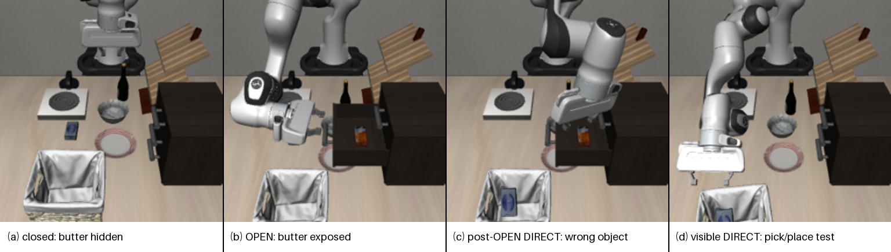
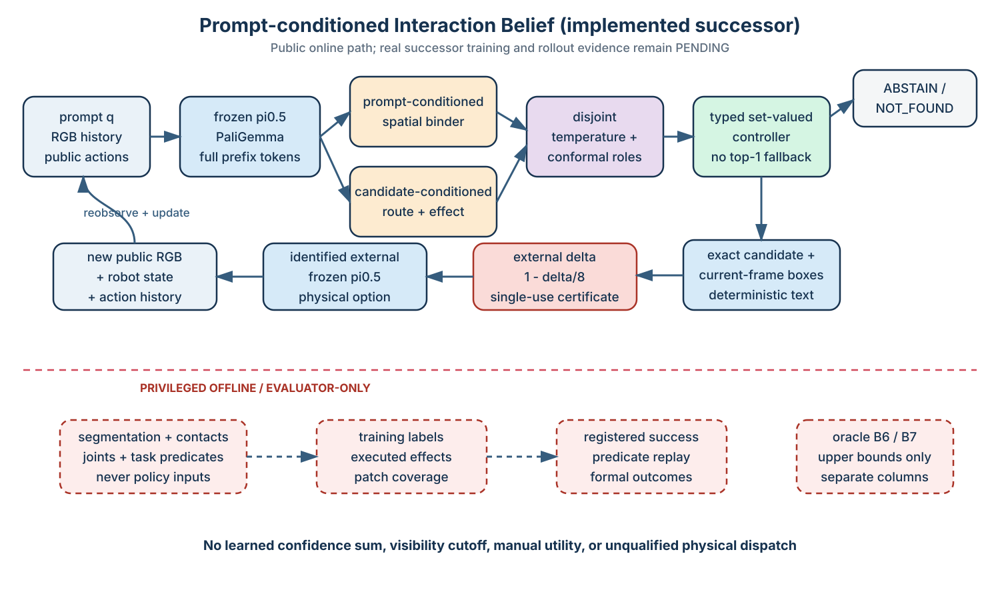
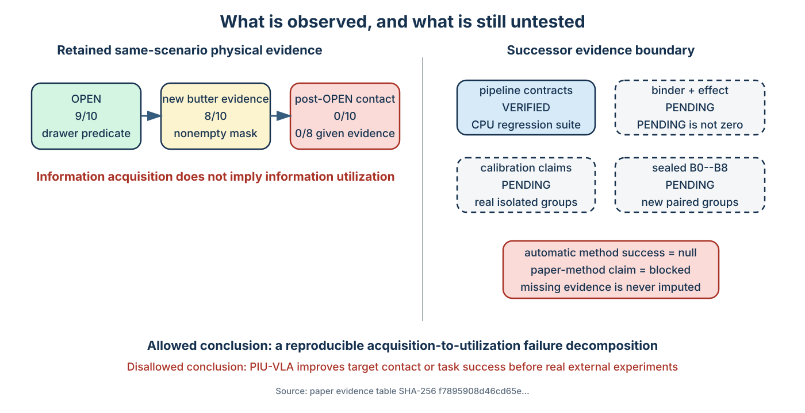

# When Looking Is Not Enough: Separating Information Acquisition from Information Utilization in Frozen-VLA Manipulation

**Anonymous internal manuscript — 2026-08-22**
**Status:** reproducible technical-report/workshop draft; not an ICRA submission

## Abstract

Interactive robot perception is commonly evaluated by whether an exploratory
action reveals hidden evidence, while long-horizon manipulation is evaluated
by final task success. This leaves an important failure mode unresolved: a
robot may execute a useful information action and expose the requested object,
yet its downstream policy may fail to use that evidence. We introduce a
leakage-controlled protocol that decomposes a frozen vision-language-action
(VLA) loop into route selection, physical option execution, task-relevant
information acquisition, information utilization, placement, and final task
success. The protocol retains public RGB and action history for the controller
while restricting segmentation, contacts, joints, and task predicates to a
separate replay evaluator. In an unchanged LIBERO drawer scenario with frozen
pi0.5, an OPEN option mechanically succeeds in 9/10 seeds and exposes the
hidden butter in 8/10, significantly more often than direct execution from the
paired closed state (exact paired p=0.0078). Nevertheless, post-OPEN DIRECT
execution grasps the butter in 0/10 seeds, including 0/8 states with acquired
target evidence. Direct execution on visible cream cheese reaches a grasp in
10/10 trials but remains at the destination in only 3/10. Executed counterfactual effect labels
reach 94.17% development cross-validation accuracy with a small public-input
CPU baseline, but effect supervision improves route macro F1 by exactly 0.00
across all five grouped folds because the two-prompt route problem is already
saturated. These results falsify our proposed effect-aware full-loop method in
this setting. The resulting contribution is a reproducible failure-decomposition
benchmark and a negative result: information acquisition, information
utilization, and manipulation completion must be measured separately.



**Figure 1.** Representative public agent-view trace for seed 1402. Privileged
segmentation is not overlaid and is used only by the offline evaluator. Panel
(c) shows the wrong visible package placed in the basket while the newly
exposed butter remains in the drawer.

## 1. Introduction

Foundation-model robot systems increasingly alternate between semantic
planning, perception, and continuous control. Capability-grounded planners
such as SayCan rank executable skills; feedback-based systems such as Inner
Monologue append observed outcomes to later decisions; pi0.5 exposes semantic
subtasks above a continuous action policy. Parallel work in mechanical search,
VLM-based control, and active perception shows that manipulation can reveal
occluded evidence. Calibration methods such as KnowNo provide a principled way
to abstain over discrete plans.

Combining these ingredients does not guarantee a successful closed loop. Three
events that are often conflated are logically distinct:

1. an information action achieves its intended mechanical effect;
2. the action produces prompt-relevant observable evidence;
3. the downstream executor converts that evidence into task progress.

Opening the correct drawer can satisfy the first event without satisfying the
second if the target remains occluded. Both can hold while the third fails if a
frozen VLA continues to act on a visually salient distractor. Reporting only
drawer-open rate overstates useful perception; reporting only final task
success hides whether routing, sensing, or control was responsible.

We study this distinction in one fixed, deliberately small scenario rather
than claim broad active-perception novelty. The original task asks the robot to
place butter hidden in a closed middle drawer into a basket; a cream-cheese
package is visible on the work surface. The candidate set is DIRECT, OPEN, and
STOP. Every same-state prompt/action fork is grouped, every public frame is
hashed, and all privileged evaluation is isolated from the controller.

The work makes four bounded contributions:

- a typed, leakage-controlled counterfactual schema for executed candidate
  effects with action forks grouped by initial simulator state;
- operational metrics that distinguish mechanical opening, target evidence,
  evidence utilization, target grasp, destination entry, terminal placement,
  and task success;
- a ten-seed frozen-pi0.5 experiment showing reliable information acquisition
  but zero conversion to target grasp;
- a documented negative method iteration in which executed effect supervision
  predicts supported factors but adds no route benefit over route-only
  training.

We do **not** claim scene generalization, multi-primitive active perception, a
new VLA architecture, formal safety, or a calibrated effect guarantee.

## 2. Related work

### Capability-grounded and feedback-based robot planning

SayCan combines language-plan plausibility with learned skill affordances, and
Code as Policies constrains language generation through exposed robot APIs.
Inner Monologue and ReAct demonstrate the value of feeding observations back
into later decisions. Our candidate registry and typed public history follow
that lineage. The difference examined here is diagnostic: we measure whether
an executed physical information option creates usable task evidence rather
than assuming that a successful primitive closes the loop.

### Physical information acquisition

Mechanical Search and Semantic Mechanical Search manipulate clutter to find
occluded targets. VLMPC predicts candidate-conditioned image futures and uses a
VLM cost; CNABU predicts action-conditioned belief changes in semantic maps.
ZS-IP and PROBE use manipulation as a visual reasoning tool, while LIBERO-Occ
studies occlusion in VLA evaluation. These works motivate action-conditioned
effects, but our one-scene study does not compete with their breadth. Its focus
is the interface failure between acquired evidence and a frozen continuous
executor.

### Decision uncertainty

KnowNo constructs conformal prediction sets over language plans and asks for
help when the set is ambiguous. Semantic entropy and VLA token entropy are
useful diagnostics but do not directly calibrate the finite executable
candidate set. Our earlier shared-VLM pilot applies temperature scaling and a
least-ambiguous-class conformal set to DIRECT/OPEN/STOP. The present executed
effect dataset is too small for a new paper-level conformal guarantee, so its
cross-validation result is reported as development evidence only.

## 3. Problem formulation

At decision time t, the controller observes a user prompt q, recent public RGB
frames I, public proprioception s, and public action-observation history h. A
capability registry provides candidates A={DIRECT, OPEN, STOP}. Privileged
simulator state z is unavailable to the controller.

A candidate-conditioned decoder forms an interaction representation

`c[t,j] = D(Embed(a[j]), F(q, I, s, h))`,

then predicts a route distribution and independent observable effect factors:

`p(a[j] | x[t])` and `p(y[f] | x[t], a[j])`,

where x contains only public inputs and y contains execution success, task
progress, task-relevant change, target reveal, post-action identity resolution,
candidate rejection, empty-region confirmation, and post-action information
sufficiency. Independent Bernoulli factors are used because these outcomes can
co-occur. A missing independent annotation is masked; a capability declaration
is never used as an effect label.

For a hidden-object trajectory, define nested stage events:

- R: the system routes to the relevant physical option;
- M: the option achieves its mechanical effect;
- A: new target evidence becomes publicly observable;
- U: the next policy grasps the requested target;
- P: the target remains at the destination after execution;
- S: the original task predicate holds.

The empirical chain is reported stage by stage. No independence assumption is
required: for example, U/A is measured only among seeds satisfying A. This
prevents a high value of M from being interpreted as a high value of S.

## 4. Leakage-controlled protocol

### Scenario and candidate serialization

All runs use the unchanged
`T01D_hidden_butter_retrieval.bddl`. The exact semantic commands are:

- DIRECT butter: `Place the butter in the basket`;
- DIRECT visible control: `Place the cream cheese in the basket`;
- OPEN: `Open the middle layer of the drawer`.

The frozen pi0.5 LIBERO policy replans every five simulator steps. DIRECT has a
400-step safety budget and OPEN has 300 steps, followed by a public
proprioception-only return-to-home controller. Seeds 1400--1409 are used for
the physical matrix. Each closed-state butter, cream-cheese, and OPEN rollout
starts from byte-identical public RGB within a seed.

### Controller/evaluator boundary

The controller receives stock agent-view RGB, wrist RGB, public
proprioception, the semantic subtask, and public action history. It receives no
segmentation, semantic instance ID, object pose, joint value, contact state, or
task predicate. A separate replay evaluator consumes the recorded continuous
actions after the controller terminates. Public keyframes and action histories
are hashed; evaluator-only relabels point back to the same source action hash.

### Metrics and provenance

Mechanical OPEN succeeds when the middle-drawer joint reaches at most -0.14,
the upper endpoint of LIBERO's declared `[-0.16,-0.14]` open range. Target
instance pixels are reported continuously. The historical matrix used 256 raw
pixels as an operational evidence marker, but this was not a calibrated
recognition threshold: all integer thresholds from 1 through 447 select the
same eight positive-visibility seeds. Future binary manipulation outcomes use
LIBERO's gripper/object grasp-contact predicate, while maximum lift remains a
continuous diagnostic. This replaces the historical unsupported rule that
combined contact at any time with at least 3 cm lift at any time. Destination
entry uses LIBERO's declared `in` predicate and terminal placement re-evaluates
it after return. We report Wilson 95% intervals for binomial rates and exact
two-sided paired binomial/McNemar tests for paired binary outcomes.

The old 8/10 pick, 7/10 placement, and 8/10 post-OPEN pick counts are retained
only as preregistered engineering qualification history. They are not
statistical paper acceptance thresholds. The full provenance and invariance
audit is machine checked by `configs/experiments/method_provenance_v1.yaml`.

### Executed effect dataset

Each of ten initial states contributes two identical-RGB task prompts and
three branches. DIRECT and OPEN use retained pi0.5 trajectories; STOP is an
exact deterministic null transition. The one physical OPEN trajectory per
seed is relabeled for butter and cream-cheese target semantics by replaying the
same action history in the evaluator. All six branches share one
`initial_state_id` and remain in one split.

The resulting 60-row artifact contains 40 executed DIRECT/OPEN branches and 20
null STOP branches. `candidate_rejected` and `region_confirmed_empty` have no
positive example because butter is always in the drawer; they are masked as
unsupported instead of trained as all-negative factors.

## 5. Model iterations and baselines

### Shared-VLM routing pilot

Our initial compact decoder uses frozen pi0.5 PaliGemma prefix features, then
hand-pools them into prompt-last, prompt-mean, agent-view global-mean, and
wrist-view global-mean vectors. Candidate text is a fixed average of two prompt
summaries. Thus the pilot shares encoder weights but not the complete prefix-KV
interface consumed by the pi0.5 action expert, and it discards spatial token
indices. One cross-attention block, a factorized effect head, and a route head
operate on this rejected low-capacity representation. Thirty-six
seed groups (72 same-RGB prompt samples) are split by seed into train,
development, calibration, and held-out test. This pilot uses real route labels
but only a repeated seed-1399 capability proxy for effects; it therefore tests
routing and calibration, not executed effect learning or spatial target
binding.

### Executed-effect development cross-validation

The new 10-group executed dataset cannot support a fresh conformal test. To
debug whether actual effects improve route learning under the 1.5 GB GPU
constraint, we use a deterministic CPU baseline: fixed resized RGB,
histograms, edge summaries, and signed feature hashing for prompts/candidates.
Five folds each use six seed groups for training, two for validation, and two
for test; the complete six-branch initial-state group stays intact. Three
initializations are selected by validation objective. B6 receives route loss
only; B7 receives route plus gradient-matched effect loss. This baseline is
explicitly not the shared frozen VLM main method.

### Action-causal binding successor (implemented, unvalidated)

The successor retains all valid frozen pre/post image and prompt tokens,
camera spans, patch coordinates, temporal order, and complete candidate-prompt
token sequences. A lightweight prompt-conditioned binder predicts a patch
distribution, target presence, and task sufficiency; its learned target token
feeds a candidate-conditioned route/effect decoder. Route-only,
stop-gradient-effect, and joint-effect variants separate representation benefit
from auxiliary-label regularization. Multi-task log variances are learned on
training groups instead of fixed loss or information-value weights.

Only current/interaction-post patches carry spatial localization targets;
pre-interaction tokens remain context. The route head consumes predicted effect
probabilities through learned weights rather than a hand-designed information
utility. For PICK/DIRECT, a nonempty calibrated current-frame patch set is
converted to its exact normalized enclosure per camera and serialized with the
public primitive/referent as deterministic text for frozen pi0.5.

Temperature fitting and conformal order statistics use disjoint calibration
groups. The controller executes only when the route set, relevant belief set,
and required execution/progress or execution/change factor sets are singleton.
STOP requires certified task completion. REPORT_NOT_FOUND requires certified
absence and exhaustive registered search; otherwise the system abstains. The
online join has no evaluator-label input. These interfaces pass synthetic CPU
regression tests. Live execution additionally requires an immutable exact
candidate/primitive certificate. The minimum rate is derived as `1-delta/8`
from an externally declared episode primitive-failure budget by a
dependence-free union bound, and the external contract also supplies the
power-design alternative and a positive-integer collection-resource cap per
primitive. Historical pilots, conformal alpha, action counts, and a CLI default
cannot set these values. Qualification binds new exact states, public decision
reports, serialized subtasks, single-use receipts, and registered simulator/task
predicate outcomes; the certificate covers the exact candidate payload and
serializer mode. OPEN may use a frozen model-free public probe solely to break
the pretraining/interaction-data cycle; it is not controller-selection evidence
and is forbidden for spatial PICK/DIRECT qualification. No real external risk
contract, full-prefix cache,
successor checkpoint, calibration artifact, or physical rollout exists, so
this subsection makes no performance claim.



**Figure 2.** Implemented public-input successor. Prompt, RGB history, and
public action history condition the frozen full prefix, lightweight binder,
candidate-effect decoder, and split calibration. The typed controller may
abstain; physical execution additionally requires an externally risk-derived,
single-use certificate for the exact candidate/serializer contract. The dashed
lower lane is evaluator-only and never enters online public methods.

## 6. Results

### Physical stage decomposition

| condition | mechanical / evidence | target grasp contact | wrong-object contact | destination predicate | final task |
|---|---:|---:|---:|---:|---:|
| DIRECT butter, closed | target evidence 0/10 | 0/10 | 9/10 | 0/10 | 0/10 |
| OPEN, closed | drawer 9/10; evidence 8/10 | n/a | n/a | n/a | n/a |
| DIRECT butter after actual OPEN | initial evidence 8/10 | 0/10 | 3/10 | 0/10 | 0/10 |
| DIRECT visible cream cheese | initially visible 10/10 | 10/10 | 0/10 | ever 3/10; terminal 3/10 | n/a for original butter predicate |

OPEN acquires target evidence in 8/10 paired seeds while closed-state DIRECT
does so in 0/10 (eight left-only discordances, exact two-sided p=0.0078125).
Mechanical success and information success also differ: one seed opens the
drawer but leaves butter at exactly zero visible pixels. Among the eight states
with post-OPEN butter evidence, downstream target grasp is 0/8. The post-OPEN
input-evidence versus grasp comparison has eight discordances (p=0.0078125).

The prospective privileged-mechanism follow-up is implemented but unexecuted.
Its pilot-sized `oracle_formal` cohort first attempts the exact formally
qualified OPEN stimulus on each new group, then hash-randomizes an evaluator
target-marker arm and raw post-OPEN DIRECT arm from the identical transported
state. Started OPEN/arm failures and interruptions remain false in the complete
intention-to-treat denominator. The exact paired result is regenerated from
hash-bound v2 evaluator reports under one session within each paired group;
identity-matched restarts may occur only between groups. It cannot be
used as public-method performance. No real plan, cohort, certificate, or formal
oracle result currently exists.

Opening changes the error mode without solving the task. Wrong cream-cheese
contact falls from 9/10 in paired closed DIRECT runs to 3/10 after OPEN (six
discordances, p=0.03125), yet butter grasp contact and task success remain zero.
This is the central failure: the action changes what is observable and what the
policy does, but does not produce the requested manipulation.

The visible-object control separates contact from destination completion. The
compound DIRECT rollout produces cream-cheese grasp contact in every seed but
the task destination predicate holds terminally in only 3/10. This endpoint
attrition has seven discordant pairs (exact two-sided p=0.015625). The old 7/10
placement and 8/10 post-OPEN butter-pick engineering gates both fail, but these
rollouts do not separately qualify PICK or PLACE primitives.

### Route and effect learning

| experiment | legacy route-only | legacy route+effect | effect-route delta macro F1 |
|---|---:|---:|---:|
| frozen shared-VLM held-out pilot | 95.83% +/- 2.95% accuracy | 93.75% +/- 0.00% | negative |
| executed-effect CPU group CV | 100.00% macro F1 | 100.00% macro F1 | 0.00 in all 5 folds |

The retained artifacts call these two columns B6/B7; they predate and must not
be confused with the frozen B0--B8 successor registry. In the shared-VLM pilot,
effect-proxy supervision does not improve route
quality. In the executed-effect development CV, B7 predicts the four supported
effect factors with 94.17% +/- 6.64% micro accuracy, 0.0579 +/- 0.0615 Brier,
and 86.67% +/- 13.54% candidate-level factor exact match. Nonetheless, route
macro F1 is identical to B6 in every fold. Removing prompt features reduces
route accuracy to 50%, and swapping the two same-RGB prompt features reduces it
to 0%, confirming that the solution is prompt-conditioned. The task has only
two fixed prompts, however, so this is evidence of a saturated route benchmark,
not compositional generalization.

The earlier calibrated B7 pilot attains 93.75% marginal route coverage on 16
held-out samples, with 68.75% abstention and 6.25% wrong execution. Those
figures remain route-pilot results because their effects are capability
proxies. We make no formal calibration claim for the 10-group executed-effect
dataset.

### Successor software verification

The full-prefix binder, label-free action-effect inference, isolated
temperature/conformal roles, five-way decision semantics, dynamic public
candidate generation, finite search memory, current-patch-to-text bridge,
certificate-gated external dispatcher, fair B0--B8 registry, and sealed
paired-analysis code execute end to end on synthetic CPU fixtures. This checks
shapes, hashes, split firewalls, unsupported-label behavior, and immutability.
It is not entered in the physical result table and cannot support a method
claim.

The successor result layout is generated directly from content-hashed reports
in `paper/generated/piu_evidence_tables_v1.md`. At this freeze, only the
retained fixed-scenario negative evidence is available; every real binder,
effect, calibration, and sealed B0--B8 cell remains explicitly `PENDING`.
The generator cannot promote development ablations to sealed evidence, keeps
B6/B7 in oracle-only columns, and exposes no automatic success threshold.

The corrected retrospective executor registry does not reinterpret endpoints
from one compound DIRECT rollout as separately evaluated PICK and PLACE
primitives. It reports OPEN 9/10 and DIRECT endpoint diagnostics (visible-object
contact 10/10, post-OPEN butter contact 0/10, terminal destination 3/10), while
leaving the target-conditioned PICK and PLACE primitives empirically
unevaluated and unauthorized.



**Figure 3.** Evidence and claim boundary generated from the hash-checked paper
table. The left side is observed same-scenario physical evidence; the right
side distinguishes verified software contracts from absent real successor
evidence. `PENDING` is missing evidence, never an encoded zero.

## 7. Discussion

### Why effect prediction did not help

The supported effect labels are learnable at development scale, but they do not
provide additional route discrimination. Butter always maps to OPEN and cream
cheese always maps to DIRECT; prompt text alone separates the routes. Adding an
effect objective cannot improve a ceiling metric and slightly worsens the
shared-VLM pilot. A meaningful test requires unseen primitive-target
compositions, variable target locations, and negative empty/rejected regions.

### Information acquisition is not utilization

The post-OPEN results rule out the simplest diagnosis that butter failure is
caused only by complete occlusion. In eight runs, the evaluator instance mask
is nonempty before DIRECT begins; no run produces butter grasp contact. The
historical 256-pixel marker is not used for this statement (and its retained
8/10 count is invariant over integer cutoffs 1--447). At the same time,
wrong-object contact decreases. Thus OPEN causally changes the observation and
downstream behavior, but the frozen semantic text bridge does not bind the
newly visible object strongly enough for successful control.

### Falsifiable executor-repair pilot

Before learning another router, we isolate the target-binding hypothesis with
an evaluator-only upper bound. Simulator instance segmentation is rendered as
a magenta box, point, or spotlight in the otherwise stock two-camera RGB input;
the mask and instance identifier are not serialized to the policy. Three
styles are screened on three post-OPEN groups and the selected style is frozen
before five disjoint development-pilot groups. Selection maximizes target
grasp contact and terminal destination, minimizes wrong-object contact, then
minimizes changed RGB pixels; there is no preferred-style tie breaker. The
former four-success/one-wrong-contact rule is deprecated because five groups
cannot support that automatic branch. The pilot instead estimates paired
grasp-contact effects and prospectively sizes a separate exact paired test on
new groups. Only that formal causal ceiling may motivate a public-RGB binder or
a target-conditioned primitive study. A policy-free packet preflight finds
eight groups with a nonempty target mask and excludes two exact zero-pixel
groups.

### Implication for active-perception evaluation

Benchmarks should report at least mechanical option success, prompt-relevant
evidence gain, utilization conditioned on evidence, target manipulation, and
final task success. A method can improve the first two while leaving the last
three unchanged. The distinction is especially important when an external VLM
or high-level router is paired with a frozen low-level VLA, because the two
modules may disagree about object identity or spatial reference.

## 8. Limitations and claim boundary

This study has one LIBERO scenario, one articulated container, two object
prompts, one information primitive, and ten inspected physical seed groups.
It does not establish out-of-distribution or real-robot performance. In the
retained main physical matrix, simulator segmentation and predicates are used
for labels but never online. The separately declared executor-repair upper
bound intentionally uses target instance segmentation online and cannot enter
any public-input method comparison.
Instance-pixel visibility is an operational evidence proxy, not a human
recognition measure. The CPU effect baseline is intentionally weak and is not
comparable to a frozen VLM encoder. Two effect factors have no positive support.
The physical matrix is retrospective development evidence, not an untouched
confirmatory split or a primitive-qualification study. Finally, compound DIRECT
produces zero post-OPEN butter contacts and only 3/10 terminal destination
events in the visible-object control, so the retained evidence cannot establish
full-loop success with this executor. Prospective PICK/PLACE reliability remains
unmeasured rather than inferred from those DIRECT endpoints.

These limitations force a narrow conclusion. The original broad
candidate-effect pilot is rejected for this experiment. A more constrained
action-causal binding successor is implemented but remains empirically
untested. The retained result is still the protocol, executed counterfactual
artifact, and observed acquisition-to-utilization gap.

## 9. Reproducibility

The experiment configuration is
`configs/experiments/original_drawer_paper_cycle_v2.yaml`. Physical reports and
public evidence are under `runs/paper_cycle_executor_v2/`; report and frame
hashes are validated during summarization. The executed dataset and manifest
are under `data/calibrated_interaction/original_drawer_executed_v2/`. No online
oracle input is present in the retained main-method reports. The separate
oracle qualification is configured in
`configs/experiments/original_drawer_oracle_target_prompt_pilot_v2.yaml`; its
policy-free packet preflight is
`results/diagnostics/original_drawer_oracle_prompt_preflight_v3.json`, and any
future policy report must use the explicit oracle claim scope.

The complete CPU analysis is:

```bash
.venv/bin/python scripts/evaluation/audit_original_drawer_thresholds.py \
  --output results/diagnostics/original_drawer_threshold_audit_v1.json --force

.venv/bin/python scripts/evaluation/summarize_original_drawer_paper_cycle.py \
  --output results/method/original_drawer_paper_cycle_v2.json --force

.venv/bin/python scripts/data/build_executed_counterfactual_dataset.py \
  --task-specific-relabel results/method/original_drawer_open_cream_relabel_v2.json \
  --direct-cream-relabel results/method/original_drawer_direct_cream_final_relabel_v2.json \
  --output data/calibrated_interaction/original_drawer_executed_v2/development.jsonl \
  --manifest data/calibrated_interaction/original_drawer_executed_v2/development.manifest.json \
  --force

CUDA_VISIBLE_DEVICES='' .venv/bin/python \
  scripts/training/evaluate_executed_effect_cv.py \
  --dataset data/calibrated_interaction/original_drawer_executed_v2/development.jsonl \
  --manifest data/calibrated_interaction/original_drawer_executed_v2/development.manifest.json \
  --candidates configs/experiments/original_drawer_candidate_set.yaml \
  --output results/method/original_drawer_executed_effect_cv_v1.json \
  --model checkpoints/calibrated_interaction/original_drawer_executed_effect_cv_v1.pt \
  --epochs 300 --force

PYTEST_DISABLE_PLUGIN_AUTOLOAD=1 .venv/bin/pytest -q

.venv/bin/python scripts/repro/check_piu_offline_pipeline.py \
  --reference results/diagnostics/piu_offline_repro_preflight_v1.json \
  --output runs/piu_offline_repro_check.json
```

The post-processing and learned successor use CPU only after external frozen
feature extraction. No local pi0.5 checkpoint or simulator-GPU job is started
by the successor pipeline.

## 10. Conclusion

In this frozen-VLA drawer task, physical interaction works as sensing but not
as task completion. OPEN usually exposes the hidden target; the subsequent VLA
still never grasps it. Executed effect supervision predicts supported outcomes
but cannot improve a route problem already solved by two fixed prompts. These
results reject the original full-loop pilot and motivate a stricter evaluation
standard: measure whether acquired evidence is actually used. The new
action-causal binding implementation remains a prospective hypothesis, not a
successful method result.

## References

1. Black et al., “pi0.5: a Vision-Language-Action Model with Open-World Generalization,” CoRL 2025. [PMLR](https://proceedings.mlr.press/v305/black25a.html)
2. Ren et al., “Robots That Ask for Help: Uncertainty Alignment for Large Language Model Planners,” CoRL 2023. [PMLR](https://proceedings.mlr.press/v229/ren23a.html)
3. Huang et al., “Inner Monologue: Embodied Reasoning through Planning with Language Models,” CoRL 2022. [PMLR](https://proceedings.mlr.press/v205/huang23c.html)
4. Chen et al., “VLMPC: Vision-Language Model Predictive Control for Robotic Manipulation,” RSS 2024. [RSS proceedings](https://www.roboticsproceedings.org/rss20/p106.pdf)
5. Danielczuk et al., “Mechanical Search,” ICRA 2019. [Project](https://ai.stanford.edu/mech-search/multistep/)
6. Song et al., “Semantic Mechanical Search with Large Vision and Language Models,” ICRA 2023. [Paper](https://arxiv.org/abs/2302.12915)
7. “Map Space Belief Prediction for Manipulation-Enhanced Mapping,” arXiv:2502.20606, 2025. [Paper](https://arxiv.org/abs/2502.20606)
8. “Zero-Shot Interactive Perception for Semantic Queries,” arXiv:2602.18374, 2026. [Paper](https://arxiv.org/abs/2602.18374)
9. “PROBE: Manipulation-Grounded Visual Reasoning,” arXiv:2608.17129, 2026. [Paper](https://arxiv.org/abs/2608.17129)
10. “LIBERO-Occ,” arXiv:2606.10862, 2026. [Paper/code](https://github.com/litsh/Libero-Occ)
